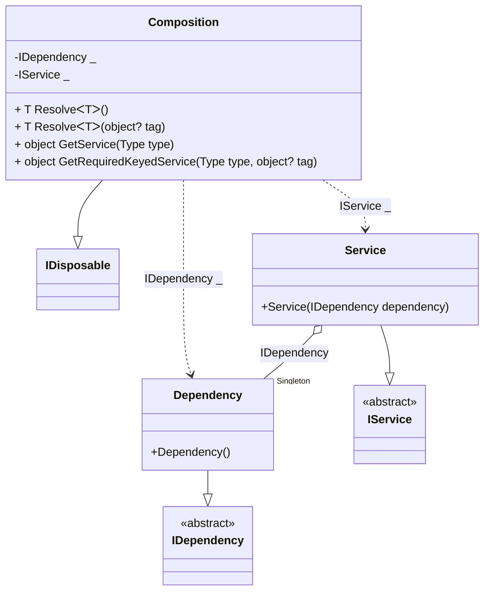

#### Service provider with scope

[](../tests/Pure.DI.UsageTests/BaseClassLibrary/ServiceProviderWithScopeScenario.cs)

```c#
interface IDependency;

class Dependency : IDependency;

interface IService: IDisposable
{
    IDependency Dependency { get; }
}

class Service(IDependency dependency) : IService
{
    public IDependency Dependency { get; } = dependency;

    public void Dispose() { }
}

partial class Composition
    : IKeyedServiceProvider, IServiceScopeFactory, IServiceScope
{
    void Setup() =>
        // The following hint overrides the name of the
        // "object Resolve(Type type)" method in "GetService",
        // which implements the "IServiceProvider" interface:

        DI.Setup(nameof(Composition))
            // The following hint overrides the name of the
            // "object Resolve(Type type)" method in "GetService",
            // which implements the "IServiceProvider" interface
            .Hint(Hint.ObjectResolveMethodName, "GetService")
            // The following hint overrides the name of the
            // "object Resolve(Type type, object tag)" method in "GetRequiredKeyedService",
            // which implements the "IKeyedServiceProvider" interface
            .Hint(Hint.ObjectResolveByTagMethodName, "GetRequiredKeyedService")
            .Bind<IDependency>().As(Lifetime.Singleton).To<Dependency>()
            .Bind<IService>().As(Lifetime.Scoped).To<Service>()

            // Composition roots
            .Root<IDependency>()
            .Root<IService>();

    public IServiceProvider ServiceProvider => this;

    public IServiceScope CreateScope() => new Composition(this);

    public object GetKeyedService(Type serviceType, object? serviceKey) =>
        GetRequiredKeyedService(serviceType, serviceKey);
}

using var composition = new Composition();
        
using var scope1 = composition.CreateScope();
var service1 = scope1.ServiceProvider.GetRequiredService<IService>();
var dependency1 = composition.GetRequiredService<IDependency>();
service1.Dependency.ShouldBe(dependency1);
service1.ShouldBe(scope1.ServiceProvider.GetRequiredService<IService>());
        
using var scope2 = composition.CreateScope();
var service2 = scope2.ServiceProvider.GetRequiredService<IService>();
var dependency2 = composition.GetRequiredService<IDependency>();
service2.Dependency.ShouldBe(dependency2);
service2.ShouldBe(scope2.ServiceProvider.GetRequiredService<IService>());
        
service1.ShouldNotBe(service2);
dependency1.ShouldBe(dependency2);
```

<details open>
<summary>Class Diagram</summary>



</details>

<details>
<summary>Pure.DI-generated partial class Composition</summary><blockquote>

```c#
partial class Composition: global::System.IDisposable
{
  private readonly Composition _rootM04D13di;
  private readonly object _lockM04D13di;
  private readonly global::System.IDisposable[] _disposablesM04D13di;
  private int _disposeIndexM04D13di;
  private Pure.DI.UsageTests.BCL.ServiceProviderWithScopeScenario.Dependency _singletonM04D13di36_Dependency;
  private Pure.DI.UsageTests.BCL.ServiceProviderWithScopeScenario.Service _scopedM04D13di37_Service;
  
  public Composition()
  {
    _rootM04D13di = this;
    _lockM04D13di = new object();
    _disposablesM04D13di = new global::System.IDisposable[1];
  }
  
  internal Composition(Composition baseComposition)
  {
    _rootM04D13di = baseComposition._rootM04D13di;
    _lockM04D13di = _rootM04D13di._lockM04D13di;
    _disposablesM04D13di = new global::System.IDisposable[1];
  }
  
  public Pure.DI.UsageTests.BCL.ServiceProviderWithScopeScenario.IDependency RootM04D13di0001
  {
    [global::System.Runtime.CompilerServices.MethodImpl((global::System.Runtime.CompilerServices.MethodImplOptions)0x100)]
    get
    {
      if (_rootM04D13di._singletonM04D13di36_Dependency == null)
      {
          lock (_lockM04D13di)
          {
              if (_rootM04D13di._singletonM04D13di36_Dependency == null)
              {
                  _singletonM04D13di36_Dependency = new Pure.DI.UsageTests.BCL.ServiceProviderWithScopeScenario.Dependency();
                  _rootM04D13di._singletonM04D13di36_Dependency = _singletonM04D13di36_Dependency;
              }
          }
      }
      return _rootM04D13di._singletonM04D13di36_Dependency;
    }
  }
  
  public Pure.DI.UsageTests.BCL.ServiceProviderWithScopeScenario.IService RootM04D13di0002
  {
    [global::System.Runtime.CompilerServices.MethodImpl((global::System.Runtime.CompilerServices.MethodImplOptions)0x100)]
    get
    {
      if (_scopedM04D13di37_Service == null)
      {
          lock (_lockM04D13di)
          {
              if (_scopedM04D13di37_Service == null)
              {
                  if (_rootM04D13di._singletonM04D13di36_Dependency == null)
                  {
                      _singletonM04D13di36_Dependency = new Pure.DI.UsageTests.BCL.ServiceProviderWithScopeScenario.Dependency();
                      _rootM04D13di._singletonM04D13di36_Dependency = _singletonM04D13di36_Dependency;
                  }
                  _scopedM04D13di37_Service = new Pure.DI.UsageTests.BCL.ServiceProviderWithScopeScenario.Service(_rootM04D13di._singletonM04D13di36_Dependency);
                  _disposablesM04D13di[_disposeIndexM04D13di++] = _scopedM04D13di37_Service;
              }
          }
      }
      return _scopedM04D13di37_Service;
    }
  }
  
  public T Resolve<T>()
  {
    return ResolverM04D13di<T>.Value.Resolve(this);
  }
  
  public T Resolve<T>(object? tag)
  {
    return ResolverM04D13di<T>.Value.ResolveByTag(this, tag);
  }
  
  [global::System.Runtime.CompilerServices.MethodImpl((global::System.Runtime.CompilerServices.MethodImplOptions)0x100)]
  public object GetService(global::System.Type type)
  {
    var index = (int)(_bucketSizeM04D13di * ((uint)global::System.Runtime.CompilerServices.RuntimeHelpers.GetHashCode(type) % 4));
    ref var pair = ref _bucketsM04D13di[index];
    return pair.Key == type ? pair.Value.Resolve(this) : ResolveM04D13di(type, index);
  }
  
  [global::System.Runtime.CompilerServices.MethodImpl((global::System.Runtime.CompilerServices.MethodImplOptions)0x8)]
  private object ResolveM04D13di(global::System.Type type, int index)
  {
    var finish = index + _bucketSizeM04D13di;
    while (++index < finish)
    {
      ref var pair = ref _bucketsM04D13di[index];
      if (pair.Key == type)
      {
        return pair.Value.Resolve(this);
      }
    }
    
    throw new global::System.InvalidOperationException($"Cannot resolve composition root of type {type}.");
  }
  
  [global::System.Runtime.CompilerServices.MethodImpl((global::System.Runtime.CompilerServices.MethodImplOptions)0x100)]
  public object GetRequiredKeyedService(global::System.Type type, object? tag)
  {
    var index = (int)(_bucketSizeM04D13di * ((uint)global::System.Runtime.CompilerServices.RuntimeHelpers.GetHashCode(type) % 4));
    ref var pair = ref _bucketsM04D13di[index];
    return pair.Key == type ? pair.Value.ResolveByTag(this, tag) : ResolveM04D13di(type, tag, index);
  }
  
  [global::System.Runtime.CompilerServices.MethodImpl((global::System.Runtime.CompilerServices.MethodImplOptions)0x8)]
  private object ResolveM04D13di(global::System.Type type, object? tag, int index)
  {
    var finish = index + _bucketSizeM04D13di;
    while (++index < finish)
    {
      ref var pair = ref _bucketsM04D13di[index];
      if (pair.Key == type)
      {
        return pair.Value.ResolveByTag(this, tag);
      }
    }
    
    throw new global::System.InvalidOperationException($"Cannot resolve composition root \"{tag}\" of type {type}.");
  }
  
  
  public void Dispose()
  {
    lock (_lockM04D13di)
    {
      while (_disposeIndexM04D13di > 0)
      {
        var disposableInstance = _disposablesM04D13di[--_disposeIndexM04D13di];
        try
        {
          disposableInstance.Dispose();
        }
        catch(Exception exception)
        {
          OnDisposeException(disposableInstance, exception);
        }
      }
      
      _singletonM04D13di36_Dependency = null;
      _scopedM04D13di37_Service = null;
    }
  }
  
  partial void OnDisposeException<T>(T disposableInstance, Exception exception) where T : global::System.IDisposable;
  
  public override string ToString()
  {
    return
      "classDiagram\n" +
        "  class Composition {\n" +
          "    -IDependency _\n" +
          "    -IService _\n" +
          "    + T ResolveᐸTᐳ()\n" +
          "    + T ResolveᐸTᐳ(object? tag)\n" +
          "    + object GetService(Type type)\n" +
          "    + object GetRequiredKeyedService(Type type, object? tag)\n" +
        "  }\n" +
        "  Composition --|> IDisposable\n" +
        "  Dependency --|> IDependency : \n" +
        "  class Dependency {\n" +
          "    +Dependency()\n" +
        "  }\n" +
        "  Service --|> IService : \n" +
        "  class Service {\n" +
          "    +Service(IDependency dependency)\n" +
        "  }\n" +
        "  class IDependency {\n" +
          "    <<abstract>>\n" +
        "  }\n" +
        "  class IService {\n" +
          "    <<abstract>>\n" +
        "  }\n" +
        "  Service o--  \"Singleton\" Dependency : IDependency\n" +
        "  Composition ..> Dependency : IDependency _\n" +
        "  Composition ..> Service : IService _";
  }
  
  private readonly static int _bucketSizeM04D13di;
  private readonly static global::Pure.DI.Pair<global::System.Type, global::Pure.DI.IResolver<Composition, object>>[] _bucketsM04D13di;
  
  static Composition()
  {
    var valResolverM04D13di_0000 = new ResolverM04D13di_0000();
    ResolverM04D13di<Pure.DI.UsageTests.BCL.ServiceProviderWithScopeScenario.IDependency>.Value = valResolverM04D13di_0000;
    var valResolverM04D13di_0001 = new ResolverM04D13di_0001();
    ResolverM04D13di<Pure.DI.UsageTests.BCL.ServiceProviderWithScopeScenario.IService>.Value = valResolverM04D13di_0001;
    _bucketsM04D13di = global::Pure.DI.Buckets<global::System.Type, global::Pure.DI.IResolver<Composition, object>>.Create(
      4,
      out _bucketSizeM04D13di,
      new global::Pure.DI.Pair<global::System.Type, global::Pure.DI.IResolver<Composition, object>>[2]
      {
         new global::Pure.DI.Pair<global::System.Type, global::Pure.DI.IResolver<Composition, object>>(typeof(Pure.DI.UsageTests.BCL.ServiceProviderWithScopeScenario.IDependency), valResolverM04D13di_0000)
        ,new global::Pure.DI.Pair<global::System.Type, global::Pure.DI.IResolver<Composition, object>>(typeof(Pure.DI.UsageTests.BCL.ServiceProviderWithScopeScenario.IService), valResolverM04D13di_0001)
      });
  }
  
  private sealed class ResolverM04D13di<T>: global::Pure.DI.IResolver<Composition, T>
  {
    public static global::Pure.DI.IResolver<Composition, T> Value = new ResolverM04D13di<T>();
    
    public T Resolve(Composition composite)
    {
      throw new global::System.InvalidOperationException($"Cannot resolve composition root of type {typeof(T)}.");
    }
    
    public T ResolveByTag(Composition composite, object tag)
    {
      throw new global::System.InvalidOperationException($"Cannot resolve composition root \"{tag}\" of type {typeof(T)}.");
    }
  }
  
  private sealed class ResolverM04D13di_0000: global::Pure.DI.IResolver<Composition, Pure.DI.UsageTests.BCL.ServiceProviderWithScopeScenario.IDependency>
  {
    public Pure.DI.UsageTests.BCL.ServiceProviderWithScopeScenario.IDependency Resolve(Composition composition)
    {
      return composition.RootM04D13di0001;
    }
    
    public Pure.DI.UsageTests.BCL.ServiceProviderWithScopeScenario.IDependency ResolveByTag(Composition composition, object tag)
    {
      switch (tag)
      {
        case null:
          return composition.RootM04D13di0001;
      }
      throw new global::System.InvalidOperationException($"Cannot resolve composition root \"{tag}\" of type Pure.DI.UsageTests.BCL.ServiceProviderWithScopeScenario.IDependency.");
    }
  }
  
  private sealed class ResolverM04D13di_0001: global::Pure.DI.IResolver<Composition, Pure.DI.UsageTests.BCL.ServiceProviderWithScopeScenario.IService>
  {
    public Pure.DI.UsageTests.BCL.ServiceProviderWithScopeScenario.IService Resolve(Composition composition)
    {
      return composition.RootM04D13di0002;
    }
    
    public Pure.DI.UsageTests.BCL.ServiceProviderWithScopeScenario.IService ResolveByTag(Composition composition, object tag)
    {
      switch (tag)
      {
        case null:
          return composition.RootM04D13di0002;
      }
      throw new global::System.InvalidOperationException($"Cannot resolve composition root \"{tag}\" of type Pure.DI.UsageTests.BCL.ServiceProviderWithScopeScenario.IService.");
    }
  }
}
```

</blockquote></details>

