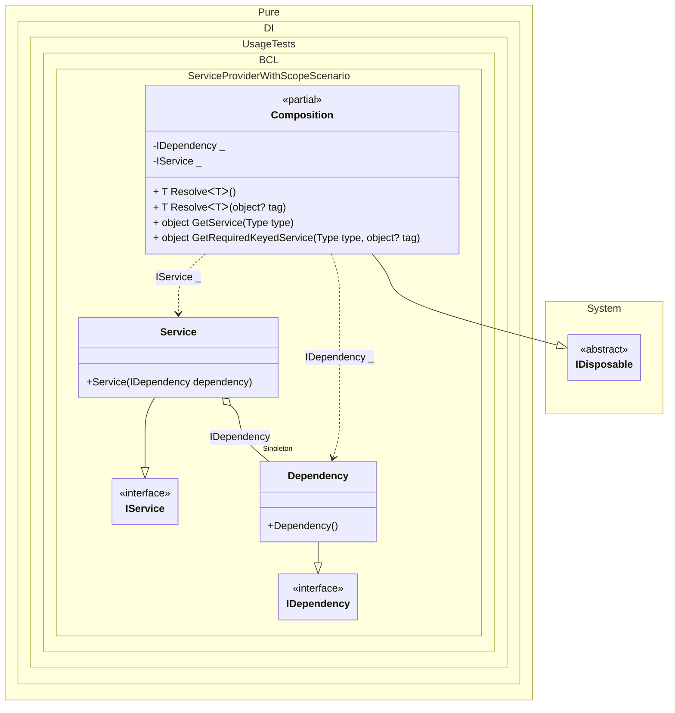

#### Service provider with scope

[](../tests/Pure.DI.UsageTests/BaseClassLibrary/ServiceProviderWithScopeScenario.cs)


```c#
using Pure.DI;
using Shouldly;
using Microsoft.Extensions.DependencyInjection;

using var composition = new Composition();

using var scope1 = composition.CreateScope();
var service1 = scope1.ServiceProvider.GetRequiredService<IService>();
var dependency1 = composition.GetRequiredService<IDependency>();
service1.Dependency.ShouldBe(dependency1);
service1.ShouldBe(scope1.ServiceProvider.GetRequiredService<IService>());

using var scope2 = composition.CreateScope();
var service2 = scope2.ServiceProvider.GetRequiredService<IService>();
var dependency2 = composition.GetRequiredService<IDependency>();
service2.Dependency.ShouldBe(dependency2);
service2.ShouldBe(scope2.ServiceProvider.GetRequiredService<IService>());

service1.ShouldNotBe(service2);
dependency1.ShouldBe(dependency2);

interface IDependency;

class Dependency : IDependency;

interface IService : IDisposable
{
    IDependency Dependency { get; }
}

class Service(IDependency dependency) : IService
{
    public IDependency Dependency { get; } = dependency;

    public void Dispose()
    {
    }
}

partial class Composition
    : IKeyedServiceProvider, IServiceScopeFactory, IServiceScope
{
    static void Setup() =>
        // The following hint overrides the name of the
        // "object Resolve(Type type)" method in "GetService",
        // which implements the "IServiceProvider" interface:
        DI.Setup()
            // The following hint overrides the name of the
            // "object Resolve(Type type)" method in "GetService",
            // which implements the "IServiceProvider" interface
            .Hint(Hint.ObjectResolveMethodName, "GetService")
            // The following hint overrides the name of the
            // "object Resolve(Type type, object tag)" method in "GetRequiredKeyedService",
            // which implements the "IKeyedServiceProvider" interface
            .Hint(Hint.ObjectResolveByTagMethodName, "GetRequiredKeyedService")
            .Bind<IDependency>().As(Lifetime.Singleton).To<Dependency>()
            .Bind<IService>().As(Lifetime.Scoped).To<Service>()

            // Composition roots
            .Root<IDependency>()
            .Root<IService>();

    public IServiceProvider ServiceProvider => this;

    public IServiceScope CreateScope() => new Composition(this);

    public object GetKeyedService(Type serviceType, object? serviceKey) =>
        GetRequiredKeyedService(serviceType, serviceKey);
}
```


Class diagram:



