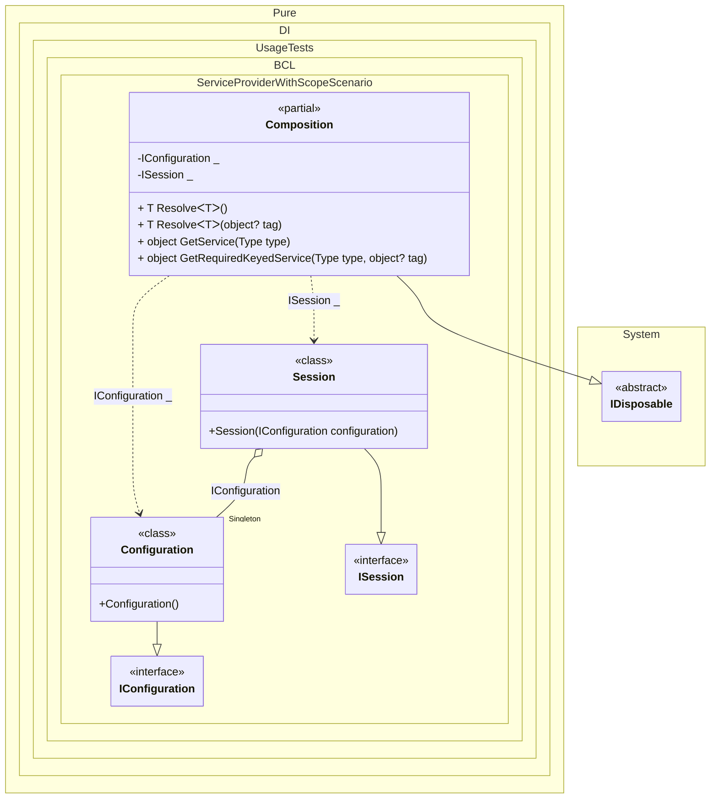

#### Service provider with scope

> [!IMPORTANT]
> Only composition roots (regular or anonymous) can be resolved through the `IServiceProvider` interface. These roots must be registered using `Root(...)` or `RootBind()` calls.


```c#
using Shouldly;
using Microsoft.Extensions.DependencyInjection;
using Pure.DI;

using var composition = new Composition();

// Creates the first scope (e.g., for a web request)
using var scope1 = composition.CreateScope();
var session1 = scope1.ServiceProvider.GetRequiredService<ISession>();
var config1 = composition.GetRequiredService<IConfiguration>();

// The session must use the global configuration
session1.Configuration.ShouldBe(config1);

// Within the same scope, the session instance must be the same
session1.ShouldBe(scope1.ServiceProvider.GetRequiredService<ISession>());

// Creates the second scope
using var scope2 = composition.CreateScope();
var session2 = scope2.ServiceProvider.GetRequiredService<ISession>();
var config2 = composition.GetRequiredService<IConfiguration>();

session2.Configuration.ShouldBe(config2);
session2.ShouldBe(scope2.ServiceProvider.GetRequiredService<ISession>());

// Sessions in different scopes are different instances
session1.ShouldNotBe(session2);

// Configuration is a singleton, so it's the same instance
config1.ShouldBe(config2);

// Represents a global configuration (Singleton)
interface IConfiguration;

class Configuration : IConfiguration;

// Represents a user session (Scoped)
interface ISession : IDisposable
{
    IConfiguration Configuration { get; }
}

class Session(IConfiguration configuration) : ISession
{
    public IConfiguration Configuration { get; } = configuration;

    public void Dispose() {}
}

partial class Composition
    : IKeyedServiceProvider, IServiceScopeFactory, IServiceScope
{
    static void Setup() =>
        // The following hint overrides the name of the
        // "object Resolve(Type type)" method in "GetService",
        // which implements the "IServiceProvider" interface:
        DI.Setup()
            // The following hint overrides the name of the
            // "object Resolve(Type type)" method in "GetService",
            // which implements the "IServiceProvider" interface
            .Hint(Hint.ObjectResolveMethodName, "GetService")
            // The following hint overrides the name of the
            // "object Resolve(Type type, object tag)" method in "GetRequiredKeyedService",
            // which implements the "IKeyedServiceProvider" interface
            .Hint(Hint.ObjectResolveByTagMethodName, "GetRequiredKeyedService")
            .Bind<IConfiguration>().As(Lifetime.Singleton).To<Configuration>()
            .Bind<ISession>().As(Lifetime.Scoped).To<Session>()

            // Composition roots
            .Root<IConfiguration>()
            .Root<ISession>();

    public IServiceProvider ServiceProvider => this;

    public IServiceScope CreateScope() => new Composition(this);

    public object GetKeyedService(Type serviceType, object? serviceKey) =>
        GetRequiredKeyedService(serviceType, serviceKey);
}
```

<details>
<summary>Running this code sample locally</summary>

- Make sure you have the [.NET SDK 10.0](https://dotnet.microsoft.com/en-us/download/dotnet/10.0) or later is installed
```bash
dotnet --list-sdk
```
- Create a net10.0 (or later) console application
```bash
dotnet new console -n Sample
```
- Add references to NuGet packages
  - [Pure.DI](https://www.nuget.org/packages/Pure.DI)
  - [Shouldly](https://www.nuget.org/packages/Shouldly)
  - [Microsoft.Extensions.DependencyInjection](https://www.nuget.org/packages/Microsoft.Extensions.DependencyInjection)
```bash
dotnet add package Pure.DI
dotnet add package Shouldly
dotnet add package Microsoft.Extensions.DependencyInjection
```
- Copy the example code into the _Program.cs_ file

You are ready to run the example 🚀
```bash
dotnet run
```

</details>

The following partial class will be generated:

```c#
partial class Composition: IDisposable
{
  private readonly Composition _root;
#if NET9_0_OR_GREATER
  private readonly Lock _lock;
#else
  private readonly Object _lock;
#endif
  private object[] _disposables;
  private int _disposeIndex;

  private Session? _scopedSession52;
  private Configuration? _singletonConfiguration51;

  [OrdinalAttribute(256)]
  public Composition()
  {
    _root = this;
#if NET9_0_OR_GREATER
    _lock = new Lock();
#else
    _lock = new Object();
#endif
    _disposables = new object[1];
  }

  internal Composition(Composition parentScope)
  {
    _root = (parentScope ?? throw new ArgumentNullException(nameof(parentScope)))._root;
    _lock = parentScope._lock;
    _disposables = new object[1];
  }

  private IConfiguration Root2
  {
    [MethodImpl(MethodImplOptions.AggressiveInlining)]
    get
    {
      EnsureConfigurationExists();
      return _root._singletonConfiguration51;
      [MethodImpl(MethodImplOptions.AggressiveInlining)]
      void EnsureConfigurationExists()
      {
        if (_root._singletonConfiguration51 is null)
          lock (_lock)
            if (_root._singletonConfiguration51 is null)
            {
              _root._singletonConfiguration51 = new Configuration();
            }
      }
    }
  }

  private ISession Root1
  {
    [MethodImpl(MethodImplOptions.AggressiveInlining)]
    get
    {
      if (_scopedSession52 is null)
        lock (_lock)
          if (_scopedSession52 is null)
          {
            EnsureConfigurationExists();
            _scopedSession52 = new Session(_root._singletonConfiguration51);
            _disposables[_disposeIndex++] = _scopedSession52;
          }

      return _scopedSession52;
      [MethodImpl(MethodImplOptions.AggressiveInlining)]
      void EnsureConfigurationExists()
      {
        if (_root._singletonConfiguration51 is null)
          lock (_lock)
            if (_root._singletonConfiguration51 is null)
            {
              _root._singletonConfiguration51 = new Configuration();
            }
      }
    }
  }

  [MethodImpl(MethodImplOptions.AggressiveInlining)]
  public T Resolve<T>()
  {
    return Resolver<T>.Value.Resolve(this);
  }

  [MethodImpl(MethodImplOptions.AggressiveInlining)]
  public T Resolve<T>(object? tag)
  {
    return Resolver<T>.Value.ResolveByTag(this, tag);
  }

  [MethodImpl(MethodImplOptions.AggressiveInlining)]
  public object GetService(Type type)
  {
    #if NETCOREAPP3_0_OR_GREATER
    var index = (int)(_bucketSize * (((uint)type.TypeHandle.GetHashCode()) % 4));
    #else
    var index = (int)(_bucketSize * (((uint)RuntimeHelpers.GetHashCode(type)) % 4));
    #endif
    ref var pair = ref _buckets[index];
    return pair.Key == type ? pair.Value.Resolve(this) : Resolve(type, index);
  }

  [MethodImpl(MethodImplOptions.NoInlining)]
  private object Resolve(Type type, int index)
  {
    var finish = index + _bucketSize;
    while (++index < finish)
    {
      ref var pair = ref _buckets[index];
      if (pair.Key == type)
      {
        return pair.Value.Resolve(this);
      }
    }

    throw new CannotResolveException($"{CannotResolveMessage} {OfTypeMessage} {type}.", type, null);
  }

  [MethodImpl(MethodImplOptions.AggressiveInlining)]
  public object GetRequiredKeyedService(Type type, object? tag)
  {
    #if NETCOREAPP3_0_OR_GREATER
    var index = (int)(_bucketSize * (((uint)type.TypeHandle.GetHashCode()) % 4));
    #else
    var index = (int)(_bucketSize * (((uint)RuntimeHelpers.GetHashCode(type)) % 4));
    #endif
    ref var pair = ref _buckets[index];
    return pair.Key == type ? pair.Value.ResolveByTag(this, tag) : Resolve(type, tag, index);
  }

  [MethodImpl(MethodImplOptions.NoInlining)]
  private object Resolve(Type type, object? tag, int index)
  {
    var finish = index + _bucketSize;
    while (++index < finish)
    {
      ref var pair = ref _buckets[index];
      if (pair.Key == type)
      {
        return pair.Value.ResolveByTag(this, tag);
      }
    }

    throw new CannotResolveException($"{CannotResolveMessage} \"{tag}\" {OfTypeMessage} {type}.", type, tag);
  }

  public void Dispose()
  {
    int disposeIndex;
    object[] disposables;
    lock (_lock)
    {
      disposeIndex = _disposeIndex;
      _disposeIndex = 0;
      disposables = _disposables;
      _disposables = new object[1];
      _scopedSession52 = null;
      _singletonConfiguration51 = null;
    }

    while (disposeIndex-- > 0)
    {
      switch (disposables[disposeIndex])
      {
        case IDisposable disposableInstance:
          try
          {
            disposableInstance.Dispose();
          }
          catch (Exception exception)
          {
            OnDisposeException(disposableInstance, exception);
          }
          break;
      }
    }
  }

  partial void OnDisposeException<T>(T disposableInstance, Exception exception) where T : IDisposable;

  private readonly static uint _bucketSize;
  private readonly static Pair<IResolver<Composition, object>>[] _buckets;

  static Composition()
  {
    var valResolver_0000 = new Resolver_0000();
    Resolver<IConfiguration>.Value = valResolver_0000;
    var valResolver_0001 = new Resolver_0001();
    Resolver<ISession>.Value = valResolver_0001;
    _buckets = Buckets<IResolver<Composition, object>>.Create(
      4,
      out _bucketSize,
      new Pair<IResolver<Composition, object>>[2]
      {
         new Pair<IResolver<Composition, object>>(typeof(IConfiguration), valResolver_0000)
        ,new Pair<IResolver<Composition, object>>(typeof(ISession), valResolver_0001)
      });
  }

  private const string CannotResolveMessage = "Cannot resolve composition root ";
  private const string OfTypeMessage = "of type ";

  private class Resolver<T>: IResolver<Composition, T>
  {
    public static IResolver<Composition, T> Value = new Resolver<T>();

    public virtual T Resolve(Composition composite)
    {
      throw new CannotResolveException($"{CannotResolveMessage}{OfTypeMessage}{typeof(T)}.", typeof(T), null);
    }

    public virtual T ResolveByTag(Composition composite, object tag)
    {
      throw new CannotResolveException($"{CannotResolveMessage}\"{tag}\" {OfTypeMessage}{typeof(T)}.", typeof(T), tag);
    }
  }

  private sealed class Resolver_0000: Resolver<IConfiguration>
  {
    public override IConfiguration Resolve(Composition composition)
    {
      return composition.Root2;
    }

    public override IConfiguration ResolveByTag(Composition composition, object tag)
    {
      switch (tag)
      {
        case null:
          return composition.Root2;

        default:
          return base.ResolveByTag(composition, tag);
      }
    }
  }

  private sealed class Resolver_0001: Resolver<ISession>
  {
    public override ISession Resolve(Composition composition)
    {
      return composition.Root1;
    }

    public override ISession ResolveByTag(Composition composition, object tag)
    {
      switch (tag)
      {
        case null:
          return composition.Root1;

        default:
          return base.ResolveByTag(composition, tag);
      }
    }
  }
}
```

Class diagram:



