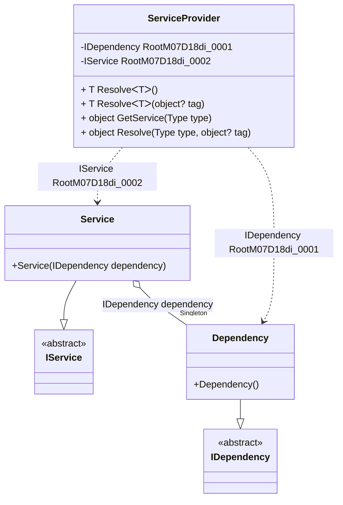

#### Service provider

[](../tests/Pure.DI.UsageTests/BaseClassLibrary/ServiceProviderScenario.cs)

The `// ObjectResolveMethodName = GetService` hint overrides the _object Resolve(Type type)_ method name in _GetService_, allowing the _IServiceProvider_ interface to be implemented in a partial class.

```c#
interface IDependency { }

class Dependency : IDependency { }

interface IService
{
    IDependency Dependency { get; }
}

class Service : IService
{
    public Service(IDependency dependency) =>
        Dependency = dependency;

    public IDependency Dependency { get; }
}

partial class ServiceProvider: IServiceProvider
{
    private void Setup() =>

        // The following hint overrides the name of the
        // "object Resolve(Type type)" method in "GetService",
        // which implements the "IServiceProvider" interface:

        // ObjectResolveMethodName = GetService
        DI.Setup(nameof(ServiceProvider))
            .Bind<IDependency>().As(Lifetime.Singleton).To<Dependency>()
            .Bind<IService>().To<Service>()
            .Root<IDependency>()
            .Root<IService>();
}

var serviceProvider = new ServiceProvider();
var service = (IService)serviceProvider.GetService(typeof(IService));
var dependency = serviceProvider.GetService(typeof(IDependency));
service.Dependency.ShouldBe(dependency);
```

<details open>
<summary>Class Diagram</summary>



</details>

<details>
<summary>ServiceProvider Code</summary>

```c#
partial class ServiceProvider
{
  private readonly System.IDisposable[] _disposableSingletonsM07D18di;
  private Pure.DI.UsageTests.BCL.ServiceProviderScenario.Dependency _singletonM07D18di_0022;
  
  public ServiceProvider()
  {
    _disposableSingletonsM07D18di = new System.IDisposable[0];
  }
  
  internal ServiceProvider(ServiceProvider parent)
  {
    _disposableSingletonsM07D18di = new System.IDisposable[0];
    lock (parent._disposableSingletonsM07D18di)
    {
      _singletonM07D18di_0022 = parent._singletonM07D18di_0022;
    }
  }
  
  #region Composition Roots
  private Pure.DI.UsageTests.BCL.ServiceProviderScenario.IDependency RootM07D18di_0001
  {
    [global::System.Runtime.CompilerServices.MethodImpl((global::System.Runtime.CompilerServices.MethodImplOptions)0x300)]
    get
    {
      if (global::System.Object.ReferenceEquals(_singletonM07D18di_0022, null))
      {
          lock (_disposableSingletonsM07D18di)
          {
              if (global::System.Object.ReferenceEquals(_singletonM07D18di_0022, null))
              {
                  _singletonM07D18di_0022 = new Pure.DI.UsageTests.BCL.ServiceProviderScenario.Dependency();
              }
          }
      }
      return _singletonM07D18di_0022;
    }
  }
  
  private Pure.DI.UsageTests.BCL.ServiceProviderScenario.IService RootM07D18di_0002
  {
    [global::System.Runtime.CompilerServices.MethodImpl((global::System.Runtime.CompilerServices.MethodImplOptions)0x300)]
    get
    {
      if (global::System.Object.ReferenceEquals(_singletonM07D18di_0022, null))
      {
          lock (_disposableSingletonsM07D18di)
          {
              if (global::System.Object.ReferenceEquals(_singletonM07D18di_0022, null))
              {
                  _singletonM07D18di_0022 = new Pure.DI.UsageTests.BCL.ServiceProviderScenario.Dependency();
              }
          }
      }
      Pure.DI.UsageTests.BCL.ServiceProviderScenario.Service transientM07D18di_0000 = new Pure.DI.UsageTests.BCL.ServiceProviderScenario.Service(_singletonM07D18di_0022);
      return transientM07D18di_0000;
    }
  }
  #endregion
  
  #region API
  #if NETSTANDARD2_0_OR_GREATER || NETCOREAPP || NET40_OR_GREATER
  [global::System.Diagnostics.Contracts.Pure]
  #endif
  [global::System.Runtime.CompilerServices.MethodImpl((global::System.Runtime.CompilerServices.MethodImplOptions)0x300)]
  public T Resolve<T>()
  {
    return ResolverM07D18di<T>.Value.Resolve(this);
  }
  
  #if NETSTANDARD2_0_OR_GREATER || NETCOREAPP || NET40_OR_GREATER
  [global::System.Diagnostics.Contracts.Pure]
  #endif
  [global::System.Runtime.CompilerServices.MethodImpl((global::System.Runtime.CompilerServices.MethodImplOptions)0x300)]
  public T Resolve<T>(object? tag)
  {
    return ResolverM07D18di<T>.Value.ResolveByTag(this, tag);
  }
  
  #if NETSTANDARD2_0_OR_GREATER || NETCOREAPP || NET40_OR_GREATER
  [global::System.Diagnostics.Contracts.Pure]
  #endif
  [global::System.Runtime.CompilerServices.MethodImpl((global::System.Runtime.CompilerServices.MethodImplOptions)0x300)]
  public object GetService(global::System.Type type)
  {
    int index = (int)(_bucketSizeM07D18di * ((uint)global::System.Runtime.CompilerServices.RuntimeHelpers.GetHashCode(type) % 4));
    ref var pair = ref _bucketsM07D18di[index];
    if (ReferenceEquals(pair.Key, type))
    {
      return pair.Value.Resolve(this);
    }
    
    int maxIndex = index + _bucketSizeM07D18di;
    for (int i = index + 1; i < maxIndex; i++)
    {
      pair = ref _bucketsM07D18di[i];
      if (ReferenceEquals(pair.Key, type))
      {
        return pair.Value.Resolve(this);
      }
    }
    
    throw new global::System.InvalidOperationException($"Cannot resolve composition root of type {type}.");
  }
  
  #if NETSTANDARD2_0_OR_GREATER || NETCOREAPP || NET40_OR_GREATER
  [global::System.Diagnostics.Contracts.Pure]
  #endif
  [global::System.Runtime.CompilerServices.MethodImpl((global::System.Runtime.CompilerServices.MethodImplOptions)0x300)]
  public object Resolve(global::System.Type type, object? tag)
  {
    int index = (int)(_bucketSizeM07D18di * ((uint)global::System.Runtime.CompilerServices.RuntimeHelpers.GetHashCode(type) % 4));
    ref var pair = ref _bucketsM07D18di[index];
    if (ReferenceEquals(pair.Key, type))
    {
      return pair.Value.ResolveByTag(this, tag);
    }
    
    int maxIndex = index + _bucketSizeM07D18di;
    for (int i = index + 1; i < maxIndex; i++)
    {
      pair = ref _bucketsM07D18di[i];
      if (ReferenceEquals(pair.Key, type))
      {
        return pair.Value.ResolveByTag(this, tag);
      }
    }
    
    throw new global::System.InvalidOperationException($"Cannot resolve composition root \"{tag}\" of type {type}.");
  }
  #endregion
  
  public override string ToString()
  {
    return
      "classDiagram\n" +
        "  class ServiceProvider {\n" +
          "    -IDependency RootM07D18di_0001\n" +
          "    -IService RootM07D18di_0002\n" +
          "    + T ResolveᐸTᐳ()\n" +
          "    + T ResolveᐸTᐳ(object? tag)\n" +
          "    + object GetService(Type type)\n" +
          "    + object Resolve(Type type, object? tag)\n" +
        "  }\n" +
        "  Service --|> IService : \n" +
        "  class Service {\n" +
          "    +Service(IDependency dependency)\n" +
        "  }\n" +
        "  Dependency --|> IDependency : \n" +
        "  class Dependency {\n" +
          "    +Dependency()\n" +
        "  }\n" +
        "  class IService {\n" +
          "    <<abstract>>\n" +
        "  }\n" +
        "  class IDependency {\n" +
          "    <<abstract>>\n" +
        "  }\n" +
        "  Service o--  \"Singleton\" Dependency : IDependency dependency\n" +
        "  ServiceProvider ..> Dependency : IDependency RootM07D18di_0001\n" +
        "  ServiceProvider ..> Service : IService RootM07D18di_0002";
  }
  
  private readonly static int _bucketSizeM07D18di;
  private readonly static global::Pure.DI.Pair<global::System.Type, global::Pure.DI.IResolver<ServiceProvider, object>>[] _bucketsM07D18di;
  
  static ServiceProvider()
  {
    ResolverM07D18di_0000 valResolverM07D18di_0000 = new ResolverM07D18di_0000();
    ResolverM07D18di<Pure.DI.UsageTests.BCL.ServiceProviderScenario.IDependency>.Value = valResolverM07D18di_0000;
    ResolverM07D18di_0001 valResolverM07D18di_0001 = new ResolverM07D18di_0001();
    ResolverM07D18di<Pure.DI.UsageTests.BCL.ServiceProviderScenario.IService>.Value = valResolverM07D18di_0001;
    _bucketsM07D18di = global::Pure.DI.Buckets<global::System.Type, global::Pure.DI.IResolver<ServiceProvider, object>>.Create(
      4,
      out _bucketSizeM07D18di,
      new global::Pure.DI.Pair<global::System.Type, global::Pure.DI.IResolver<ServiceProvider, object>>[2]
      {
         new global::Pure.DI.Pair<global::System.Type, global::Pure.DI.IResolver<ServiceProvider, object>>(typeof(Pure.DI.UsageTests.BCL.ServiceProviderScenario.IDependency), valResolverM07D18di_0000)
        ,new global::Pure.DI.Pair<global::System.Type, global::Pure.DI.IResolver<ServiceProvider, object>>(typeof(Pure.DI.UsageTests.BCL.ServiceProviderScenario.IService), valResolverM07D18di_0001)
      });
  }
  
  #region Resolvers
  private sealed class ResolverM07D18di<T>: global::Pure.DI.IResolver<ServiceProvider, T>
  {
    public static global::Pure.DI.IResolver<ServiceProvider, T> Value = new ResolverM07D18di<T>();
    
    public T Resolve(ServiceProvider composite)
    {
      throw new global::System.InvalidOperationException($"Cannot resolve composition root of type {typeof(T)}.");
    }
    
    public T ResolveByTag(ServiceProvider composite, object tag)
    {
      throw new global::System.InvalidOperationException($"Cannot resolve composition root \"{tag}\" of type {typeof(T)}.");
    }
  }
  
  private sealed class ResolverM07D18di_0000: global::Pure.DI.IResolver<ServiceProvider, Pure.DI.UsageTests.BCL.ServiceProviderScenario.IDependency>
  {
    [global::System.Runtime.CompilerServices.MethodImpl((global::System.Runtime.CompilerServices.MethodImplOptions)0x300)]
    public Pure.DI.UsageTests.BCL.ServiceProviderScenario.IDependency Resolve(ServiceProvider composition)
    {
      return composition.RootM07D18di_0001;
    }
    
    [global::System.Runtime.CompilerServices.MethodImpl((global::System.Runtime.CompilerServices.MethodImplOptions)0x300)]
    public Pure.DI.UsageTests.BCL.ServiceProviderScenario.IDependency ResolveByTag(ServiceProvider composition, object tag)
    {
      if (Equals(tag, null)) return composition.RootM07D18di_0001;
      throw new global::System.InvalidOperationException($"Cannot resolve composition root \"{tag}\" of type Pure.DI.UsageTests.BCL.ServiceProviderScenario.IDependency.");
    }
  }
  
  private sealed class ResolverM07D18di_0001: global::Pure.DI.IResolver<ServiceProvider, Pure.DI.UsageTests.BCL.ServiceProviderScenario.IService>
  {
    [global::System.Runtime.CompilerServices.MethodImpl((global::System.Runtime.CompilerServices.MethodImplOptions)0x300)]
    public Pure.DI.UsageTests.BCL.ServiceProviderScenario.IService Resolve(ServiceProvider composition)
    {
      return composition.RootM07D18di_0002;
    }
    
    [global::System.Runtime.CompilerServices.MethodImpl((global::System.Runtime.CompilerServices.MethodImplOptions)0x300)]
    public Pure.DI.UsageTests.BCL.ServiceProviderScenario.IService ResolveByTag(ServiceProvider composition, object tag)
    {
      if (Equals(tag, null)) return composition.RootM07D18di_0002;
      throw new global::System.InvalidOperationException($"Cannot resolve composition root \"{tag}\" of type Pure.DI.UsageTests.BCL.ServiceProviderScenario.IService.");
    }
  }
  #endregion
}
```

</details>

