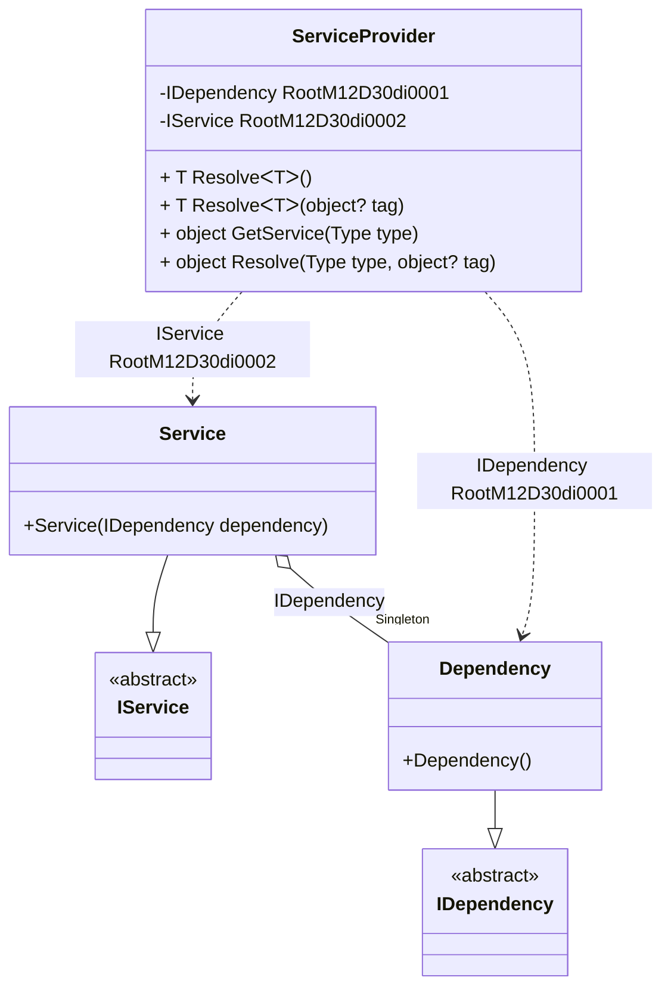

#### Service provider

[](../tests/Pure.DI.UsageTests/BaseClassLibrary/ServiceProviderScenario.cs)

The `// ObjectResolveMethodName = GetService` hint overrides the _object Resolve(Type type)_ method name in _GetService_, allowing the _IServiceProvider_ interface to be implemented in a partial class.

```c#
interface IDependency;

class Dependency : IDependency;

interface IService
{
    IDependency Dependency { get; }
}

class Service(IDependency dependency) : IService
{
    public IDependency Dependency { get; } = dependency;
}

partial class ServiceProvider: IServiceProvider
{
    private void Setup() =>
        // The following hint overrides the name of the
        // "object Resolve(Type type)" method in "GetService",
        // which implements the "IServiceProvider" interface:

        // ObjectResolveMethodName = GetService
        DI.Setup(nameof(ServiceProvider))
            .Bind<IDependency>().As(Lifetime.Singleton).To<Dependency>()
            .Bind<IService>().To<Service>()
            .Root<IDependency>()
            .Root<IService>();
}

var serviceProvider = new ServiceProvider();
var service = (IService)serviceProvider.GetService(typeof(IService));
var dependency = serviceProvider.GetService(typeof(IDependency));
service.Dependency.ShouldBe(dependency);
```

<details open>
<summary>Class Diagram</summary>



</details>

<details>
<summary>Pure.DI-generated partial class ServiceProvider</summary><blockquote>

```c#
partial class ServiceProvider
{
  private readonly global::System.IDisposable[] _disposableSingletonsM12D30di;
  private Pure.DI.UsageTests.BCL.ServiceProviderScenario.Dependency _singletonM12D30di21_Dependency;
  
  public ServiceProvider()
  {
    _disposableSingletonsM12D30di = new global::System.IDisposable[0];
  }
  
  internal ServiceProvider(ServiceProvider parent)
  {
    _disposableSingletonsM12D30di = new global::System.IDisposable[0];
    lock (parent._disposableSingletonsM12D30di)
    {
      _singletonM12D30di21_Dependency = parent._singletonM12D30di21_Dependency;
    }
  }
  
  #region Composition Roots
  public Pure.DI.UsageTests.BCL.ServiceProviderScenario.IDependency RootM12D30di0001
  {
    #if NETSTANDARD2_0_OR_GREATER || NETCOREAPP || NET40_OR_GREATER || NET
    [global::System.Diagnostics.Contracts.Pure]
    #endif
    get
    {
      if (object.ReferenceEquals(_singletonM12D30di21_Dependency, null))
      {
          _singletonM12D30di21_Dependency = new Pure.DI.UsageTests.BCL.ServiceProviderScenario.Dependency();
      }
      return _singletonM12D30di21_Dependency;
    }
  }
  
  public Pure.DI.UsageTests.BCL.ServiceProviderScenario.IService RootM12D30di0002
  {
    #if NETSTANDARD2_0_OR_GREATER || NETCOREAPP || NET40_OR_GREATER || NET
    [global::System.Diagnostics.Contracts.Pure]
    #endif
    get
    {
      if (object.ReferenceEquals(_singletonM12D30di21_Dependency, null))
      {
          _singletonM12D30di21_Dependency = new Pure.DI.UsageTests.BCL.ServiceProviderScenario.Dependency();
      }
      return new Pure.DI.UsageTests.BCL.ServiceProviderScenario.Service(_singletonM12D30di21_Dependency);
    }
  }
  #endregion
  
  #region API
  #if NETSTANDARD2_0_OR_GREATER || NETCOREAPP || NET40_OR_GREATER || NET
  [global::System.Diagnostics.Contracts.Pure]
  #endif
  public T Resolve<T>()
  {
    return ResolverM12D30di<T>.Value.Resolve(this);
  }
  
  #if NETSTANDARD2_0_OR_GREATER || NETCOREAPP || NET40_OR_GREATER || NET
  [global::System.Diagnostics.Contracts.Pure]
  #endif
  public T Resolve<T>(object? tag)
  {
    return ResolverM12D30di<T>.Value.ResolveByTag(this, tag);
  }
  
  #if NETSTANDARD2_0_OR_GREATER || NETCOREAPP || NET40_OR_GREATER || NET
  [global::System.Diagnostics.Contracts.Pure]
  #endif
  public object GetService(global::System.Type type)
  {
    var index = (int)(_bucketSizeM12D30di * ((uint)global::System.Runtime.CompilerServices.RuntimeHelpers.GetHashCode(type) % 4));
    var finish = index + _bucketSizeM12D30di;
    do {
      ref var pair = ref _bucketsM12D30di[index];
      if (ReferenceEquals(pair.Key, type))
      {
        return pair.Value.Resolve(this);
      }
    } while (++index < finish);
    
    throw new global::System.InvalidOperationException($"Cannot resolve composition root of type {type}.");
  }
  
  #if NETSTANDARD2_0_OR_GREATER || NETCOREAPP || NET40_OR_GREATER || NET
  [global::System.Diagnostics.Contracts.Pure]
  #endif
  public object Resolve(global::System.Type type, object? tag)
  {
    var index = (int)(_bucketSizeM12D30di * ((uint)global::System.Runtime.CompilerServices.RuntimeHelpers.GetHashCode(type) % 4));
    var finish = index + _bucketSizeM12D30di;
    do {
      ref var pair = ref _bucketsM12D30di[index];
      if (ReferenceEquals(pair.Key, type))
      {
        return pair.Value.ResolveByTag(this, tag);
      }
    } while (++index < finish);
    
    throw new global::System.InvalidOperationException($"Cannot resolve composition root \"{tag}\" of type {type}.");
  }
  #endregion
  
  public override string ToString()
  {
    return
      "classDiagram\n" +
        "  class ServiceProvider {\n" +
          "    -IDependency RootM12D30di0001\n" +
          "    -IService RootM12D30di0002\n" +
          "    + T ResolveᐸTᐳ()\n" +
          "    + T ResolveᐸTᐳ(object? tag)\n" +
          "    + object GetService(Type type)\n" +
          "    + object Resolve(Type type, object? tag)\n" +
        "  }\n" +
        "  Service --|> IService : \n" +
        "  class Service {\n" +
          "    +Service(IDependency dependency)\n" +
        "  }\n" +
        "  Dependency --|> IDependency : \n" +
        "  class Dependency {\n" +
          "    +Dependency()\n" +
        "  }\n" +
        "  class IService {\n" +
          "    <<abstract>>\n" +
        "  }\n" +
        "  class IDependency {\n" +
          "    <<abstract>>\n" +
        "  }\n" +
        "  Service o--  \"Singleton\" Dependency : IDependency\n" +
        "  ServiceProvider ..> Dependency : IDependency RootM12D30di0001\n" +
        "  ServiceProvider ..> Service : IService RootM12D30di0002";
  }
  
  private readonly static int _bucketSizeM12D30di;
  private readonly static global::Pure.DI.Pair<global::System.Type, global::Pure.DI.IResolver<ServiceProvider, object>>[] _bucketsM12D30di;
  
  static ServiceProvider()
  {
    var valResolverM12D30di_0000 = new ResolverM12D30di_0000();
    ResolverM12D30di<Pure.DI.UsageTests.BCL.ServiceProviderScenario.IDependency>.Value = valResolverM12D30di_0000;
    var valResolverM12D30di_0001 = new ResolverM12D30di_0001();
    ResolverM12D30di<Pure.DI.UsageTests.BCL.ServiceProviderScenario.IService>.Value = valResolverM12D30di_0001;
    _bucketsM12D30di = global::Pure.DI.Buckets<global::System.Type, global::Pure.DI.IResolver<ServiceProvider, object>>.Create(
      4,
      out _bucketSizeM12D30di,
      new global::Pure.DI.Pair<global::System.Type, global::Pure.DI.IResolver<ServiceProvider, object>>[2]
      {
         new global::Pure.DI.Pair<global::System.Type, global::Pure.DI.IResolver<ServiceProvider, object>>(typeof(Pure.DI.UsageTests.BCL.ServiceProviderScenario.IDependency), valResolverM12D30di_0000)
        ,new global::Pure.DI.Pair<global::System.Type, global::Pure.DI.IResolver<ServiceProvider, object>>(typeof(Pure.DI.UsageTests.BCL.ServiceProviderScenario.IService), valResolverM12D30di_0001)
      });
  }
  
  #region Resolvers
  private sealed class ResolverM12D30di<T>: global::Pure.DI.IResolver<ServiceProvider, T>
  {
    public static global::Pure.DI.IResolver<ServiceProvider, T> Value = new ResolverM12D30di<T>();
    
    public T Resolve(ServiceProvider composite)
    {
      throw new global::System.InvalidOperationException($"Cannot resolve composition root of type {typeof(T)}.");
    }
    
    public T ResolveByTag(ServiceProvider composite, object tag)
    {
      throw new global::System.InvalidOperationException($"Cannot resolve composition root \"{tag}\" of type {typeof(T)}.");
    }
  }
  
  private sealed class ResolverM12D30di_0000: global::Pure.DI.IResolver<ServiceProvider, Pure.DI.UsageTests.BCL.ServiceProviderScenario.IDependency>
  {
    public Pure.DI.UsageTests.BCL.ServiceProviderScenario.IDependency Resolve(ServiceProvider composition)
    {
      return composition.RootM12D30di0001;
    }
    
    public Pure.DI.UsageTests.BCL.ServiceProviderScenario.IDependency ResolveByTag(ServiceProvider composition, object tag)
    {
      switch (tag)
      {
        case null:
          return composition.RootM12D30di0001;
      }
      throw new global::System.InvalidOperationException($"Cannot resolve composition root \"{tag}\" of type Pure.DI.UsageTests.BCL.ServiceProviderScenario.IDependency.");
    }
  }
  
  private sealed class ResolverM12D30di_0001: global::Pure.DI.IResolver<ServiceProvider, Pure.DI.UsageTests.BCL.ServiceProviderScenario.IService>
  {
    public Pure.DI.UsageTests.BCL.ServiceProviderScenario.IService Resolve(ServiceProvider composition)
    {
      return composition.RootM12D30di0002;
    }
    
    public Pure.DI.UsageTests.BCL.ServiceProviderScenario.IService ResolveByTag(ServiceProvider composition, object tag)
    {
      switch (tag)
      {
        case null:
          return composition.RootM12D30di0002;
      }
      throw new global::System.InvalidOperationException($"Cannot resolve composition root \"{tag}\" of type Pure.DI.UsageTests.BCL.ServiceProviderScenario.IService.");
    }
  }
  #endregion
}
```

</blockquote></details>

