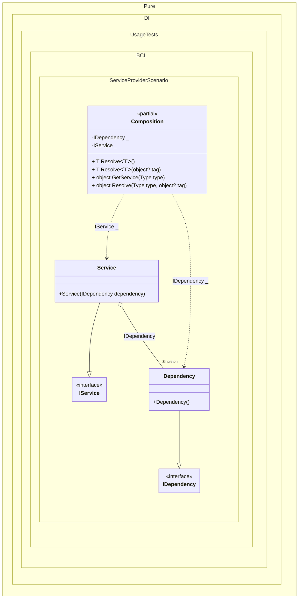

#### Service provider

[](../tests/Pure.DI.UsageTests/BaseClassLibrary/ServiceProviderScenario.cs)

The `// ObjectResolveMethodName = GetService` hint overrides the _object Resolve(Type type)_ method name in _GetService_, allowing the _IServiceProvider_ interface to be implemented in a partial class.


```c#
using Shouldly;
using Microsoft.Extensions.DependencyInjection;
using Pure.DI;

var serviceProvider = new Composition();
var service = serviceProvider.GetRequiredService<IService>();
var dependency = serviceProvider.GetRequiredService<IDependency>();
service.Dependency.ShouldBe(dependency);

interface IDependency;

class Dependency : IDependency;

interface IService
{
    IDependency Dependency { get; }
}

class Service(IDependency dependency) : IService
{
    public IDependency Dependency { get; } = dependency;
}

partial class Composition : IServiceProvider
{
    static void Setup() =>
        DI.Setup()
            // The following hint overrides the name of the
            // "object Resolve(Type type)" method in "GetService",
            // which implements the "IServiceProvider" interface
            .Hint(Hint.ObjectResolveMethodName, "GetService")
            .Bind<IDependency>().As(Lifetime.Singleton).To<Dependency>()
            .Bind<IService>().To<Service>()
            .Root<IDependency>()
            .Root<IService>();
}
```

<details>
<summary>Running this code sample locally</summary>

- Make sure you have the [.NET SDK 9.0](https://dotnet.microsoft.com/en-us/download/dotnet/9.0) or later is installed
- Create a net9.0 (or later) console application
- Add references to NuGet packages
  - [Pure.DI](https://www.nuget.org/packages/Pure.DI)
  - [Shouldly](https://www.nuget.org/packages/Shouldly)
  - [Microsoft.Extensions.DependencyInjection](https://www.nuget.org/packages/Microsoft.Extensions.DependencyInjection)
- Copy the example code into the _Program.cs_ file

You are ready to run the example!

</details>


Class diagram:



