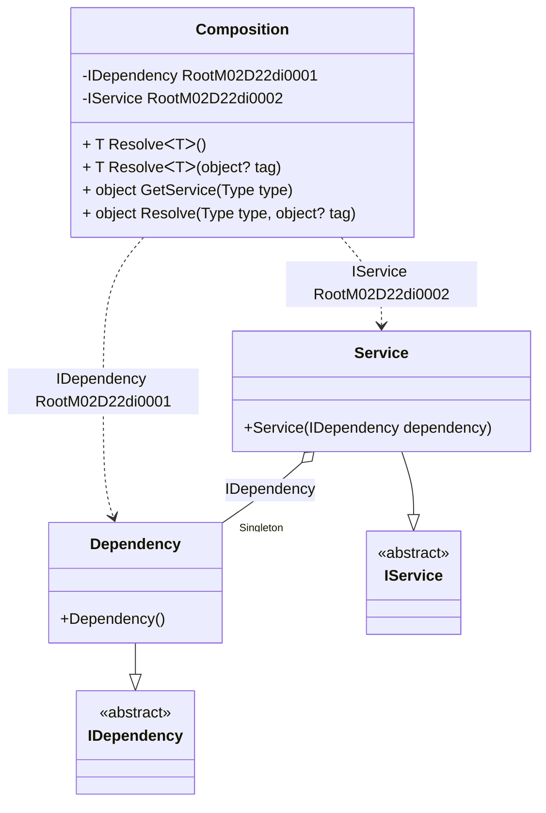

#### Service provider

[](../tests/Pure.DI.UsageTests/BaseClassLibrary/ServiceProviderScenario.cs)

The `// ObjectResolveMethodName = GetService` hint overrides the _object Resolve(Type type)_ method name in _GetService_, allowing the _IServiceProvider_ interface to be implemented in a partial class.

```c#
interface IDependency;

class Dependency : IDependency;

interface IService
{
    IDependency Dependency { get; }
}

class Service(IDependency dependency) : IService
{
    public IDependency Dependency { get; } = dependency;
}

partial class Composition: IServiceProvider
{
    private void Setup() =>
        DI.Setup(nameof(Composition))
            // The following hint overrides the name of the
            // "object Resolve(Type type)" method in "GetService",
            // which implements the "IServiceProvider" interface
            .Hint(Hint.ObjectResolveMethodName, "GetService")
            .Bind<IDependency>().As(Lifetime.Singleton).To<Dependency>()
            .Bind<IService>().To<Service>()
            .Root<IDependency>()
            .Root<IService>();
}

var serviceProvider = new Composition();
var service = serviceProvider.GetRequiredService<IService>();
var dependency = serviceProvider.GetRequiredService<IDependency>();
service.Dependency.ShouldBe(dependency);
```

<details open>
<summary>Class Diagram</summary>



</details>

<details>
<summary>Pure.DI-generated partial class Composition</summary><blockquote>

```c#
/// <para>
/// Composition roots:<br/>
/// <list type="table">
/// <listheader>
/// <term>Root</term>
/// <description>Description</description>
/// </listheader>
/// <item>
/// <term>
/// <see cref="Pure.DI.UsageTests.BCL.ServiceProviderScenario.Dependency"/> is a private composition root that can be resolved by methods like <see cref="Resolve{T}()"/>.
/// </term>
/// <description>
/// </description>
/// </item>
/// <item>
/// <term>
/// <see cref="Pure.DI.UsageTests.BCL.ServiceProviderScenario.Service"/> is a private composition root that can be resolved by methods like <see cref="Resolve{T}()"/>.
/// </term>
/// <description>
/// </description>
/// </item>
/// </list>
/// </para>
/// <a href="https://mermaid.live/view#pako:eNqNk7FugzAQhl_l5LkDJUPabAXSqkOXhNGLg0_ULdgI3EhRlHfIu3Tp6-RNCpgU4xDS5WR8_91__tDtSaI4kgVJMlZVkWBpyXJaUtl-Q6jyQlVCCyWBfnnePGhyzcmPXiMsUHKUyQ5WSum3-s73ufA8795SrbHcigRdif8nCSCGFVYq2-Lp-BOfjt_t9UMbH2_K1OYDE92cZ8-gWXpRZgTwgrobxdTFuwJB1-FaQWc2pg5h2nUeNSeLj2HRx3nYli7BhthePUFP38lZ8IM-NQbL-J_JXze3FQNnO2HbDgjas_PhPM4kpqn71r7xzEwUsk2lS9ZxXXZxrNP4fP9vc65XNhsAStZCphlqJSlx8deArBc0Xdzt8FsvE2u8k_WjK3OjofO7JleL3JEcy5wJXi_3nhL9jjlSsqCEs_KTkgM5_AIhLlSb">Class diagram</a><br/>
/// This class was created by <a href="https://github.com/DevTeam/Pure.DI">Pure.DI</a> source code generator.
/// </summary>
/// <seealso cref="Pure.DI.DI.Setup"/>
[global::System.Diagnostics.CodeAnalysis.ExcludeFromCodeCoverage]
partial class Composition
{
  private readonly Composition _rootM02D22di;
  private readonly object _lockM02D22di;
  private Pure.DI.UsageTests.BCL.ServiceProviderScenario.Dependency _singletonM02D22di34_Dependency;
  
  /// <summary>
  /// This constructor creates a new instance of <see cref="Composition"/>.
  /// </summary>
  public Composition()
  {
    _rootM02D22di = this;
    _lockM02D22di = new object();
  }
  
  /// <summary>
  /// This constructor creates a new instance of <see cref="Composition"/> scope based on <paramref name="baseComposition"/>. This allows the <see cref="Lifetime.Scoped"/> life time to be applied.
  /// </summary>
  /// <param name="baseComposition">Base composition.</param>
  internal Composition(Composition baseComposition)
  {
    _rootM02D22di = baseComposition._rootM02D22di;
    _lockM02D22di = _rootM02D22di._lockM02D22di;
  }
  
  #region Composition Roots
  public Pure.DI.UsageTests.BCL.ServiceProviderScenario.IDependency RootM02D22di0001
  {
    #if NETSTANDARD2_0_OR_GREATER || NETCOREAPP || NET40_OR_GREATER || NET
    [global::System.Diagnostics.Contracts.Pure]
    #endif
    get
    {
      if (ReferenceEquals(_rootM02D22di._singletonM02D22di34_Dependency, null))
      {
          lock (_lockM02D22di)
          {
              if (ReferenceEquals(_rootM02D22di._singletonM02D22di34_Dependency, null))
              {
                  _singletonM02D22di34_Dependency = new Pure.DI.UsageTests.BCL.ServiceProviderScenario.Dependency();
                  _rootM02D22di._singletonM02D22di34_Dependency = _singletonM02D22di34_Dependency;
              }
          }
      }
      return _rootM02D22di._singletonM02D22di34_Dependency;
    }
  }
  
  public Pure.DI.UsageTests.BCL.ServiceProviderScenario.IService RootM02D22di0002
  {
    #if NETSTANDARD2_0_OR_GREATER || NETCOREAPP || NET40_OR_GREATER || NET
    [global::System.Diagnostics.Contracts.Pure]
    #endif
    get
    {
      if (ReferenceEquals(_rootM02D22di._singletonM02D22di34_Dependency, null))
      {
          lock (_lockM02D22di)
          {
              if (ReferenceEquals(_rootM02D22di._singletonM02D22di34_Dependency, null))
              {
                  _singletonM02D22di34_Dependency = new Pure.DI.UsageTests.BCL.ServiceProviderScenario.Dependency();
                  _rootM02D22di._singletonM02D22di34_Dependency = _singletonM02D22di34_Dependency;
              }
          }
      }
      return new Pure.DI.UsageTests.BCL.ServiceProviderScenario.Service(_rootM02D22di._singletonM02D22di34_Dependency);
    }
  }
  #endregion
  
  #region API
  /// <summary>
  /// Resolves the composition root.
  /// </summary>
  /// <typeparam name="T">The type of the composition root.</typeparam>
  /// <returns>A composition root.</returns>
  #if NETSTANDARD2_0_OR_GREATER || NETCOREAPP || NET40_OR_GREATER || NET
  [global::System.Diagnostics.Contracts.Pure]
  #endif
  public T Resolve<T>()
  {
    return ResolverM02D22di<T>.Value.Resolve(this);
  }
  
  /// <summary>
  /// Resolves the composition root by tag.
  /// </summary>
  /// <typeparam name="T">The type of the composition root.</typeparam>
  /// <param name="tag">The tag of a composition root.</param>
  /// <returns>A composition root.</returns>
  #if NETSTANDARD2_0_OR_GREATER || NETCOREAPP || NET40_OR_GREATER || NET
  [global::System.Diagnostics.Contracts.Pure]
  #endif
  public T Resolve<T>(object? tag)
  {
    return ResolverM02D22di<T>.Value.ResolveByTag(this, tag);
  }
  
  /// <summary>
  /// Resolves the composition root.
  /// </summary>
  /// <param name="type">The type of the composition root.</param>
  /// <returns>A composition root.</returns>
  #if NETSTANDARD2_0_OR_GREATER || NETCOREAPP || NET40_OR_GREATER || NET
  [global::System.Diagnostics.Contracts.Pure]
  #endif
  public object GetService(global::System.Type type)
  {
    var index = (int)(_bucketSizeM02D22di * ((uint)global::System.Runtime.CompilerServices.RuntimeHelpers.GetHashCode(type) % 4));
    var finish = index + _bucketSizeM02D22di;
    do {
      ref var pair = ref _bucketsM02D22di[index];
      if (ReferenceEquals(pair.Key, type))
      {
        return pair.Value.Resolve(this);
      }
    } while (++index < finish);
    
    throw new global::System.InvalidOperationException($"Cannot resolve composition root of type {type}.");
  }
  
  /// <summary>
  /// Resolves the composition root by tag.
  /// </summary>
  /// <param name="type">The type of the composition root.</param>
  /// <param name="tag">The tag of a composition root.</param>
  /// <returns>A composition root.</returns>
  #if NETSTANDARD2_0_OR_GREATER || NETCOREAPP || NET40_OR_GREATER || NET
  [global::System.Diagnostics.Contracts.Pure]
  #endif
  public object Resolve(global::System.Type type, object? tag)
  {
    var index = (int)(_bucketSizeM02D22di * ((uint)global::System.Runtime.CompilerServices.RuntimeHelpers.GetHashCode(type) % 4));
    var finish = index + _bucketSizeM02D22di;
    do {
      ref var pair = ref _bucketsM02D22di[index];
      if (ReferenceEquals(pair.Key, type))
      {
        return pair.Value.ResolveByTag(this, tag);
      }
    } while (++index < finish);
    
    throw new global::System.InvalidOperationException($"Cannot resolve composition root \"{tag}\" of type {type}.");
  }
  #endregion
  
  /// <summary>
  /// This method provides a class diagram in mermaid format. To see this diagram, simply call the method and copy the text to this site https://mermaid.live/.
  /// </summary>
  public override string ToString()
  {
    return
      "classDiagram\n" +
        "  class Composition {\n" +
          "    -IDependency RootM02D22di0001\n" +
          "    -IService RootM02D22di0002\n" +
          "    + T ResolveᐸTᐳ()\n" +
          "    + T ResolveᐸTᐳ(object? tag)\n" +
          "    + object GetService(Type type)\n" +
          "    + object Resolve(Type type, object? tag)\n" +
        "  }\n" +
        "  Dependency --|> IDependency : \n" +
        "  class Dependency {\n" +
          "    +Dependency()\n" +
        "  }\n" +
        "  Service --|> IService : \n" +
        "  class Service {\n" +
          "    +Service(IDependency dependency)\n" +
        "  }\n" +
        "  class IDependency {\n" +
          "    <<abstract>>\n" +
        "  }\n" +
        "  class IService {\n" +
          "    <<abstract>>\n" +
        "  }\n" +
        "  Service o--  \"Singleton\" Dependency : IDependency\n" +
        "  Composition ..> Dependency : IDependency RootM02D22di0001\n" +
        "  Composition ..> Service : IService RootM02D22di0002";
  }
  
  private readonly static int _bucketSizeM02D22di;
  private readonly static global::Pure.DI.Pair<global::System.Type, global::Pure.DI.IResolver<Composition, object>>[] _bucketsM02D22di;
  
  static Composition()
  {
    var valResolverM02D22di_0000 = new ResolverM02D22di_0000();
    ResolverM02D22di<Pure.DI.UsageTests.BCL.ServiceProviderScenario.IDependency>.Value = valResolverM02D22di_0000;
    var valResolverM02D22di_0001 = new ResolverM02D22di_0001();
    ResolverM02D22di<Pure.DI.UsageTests.BCL.ServiceProviderScenario.IService>.Value = valResolverM02D22di_0001;
    _bucketsM02D22di = global::Pure.DI.Buckets<global::System.Type, global::Pure.DI.IResolver<Composition, object>>.Create(
      4,
      out _bucketSizeM02D22di,
      new global::Pure.DI.Pair<global::System.Type, global::Pure.DI.IResolver<Composition, object>>[2]
      {
         new global::Pure.DI.Pair<global::System.Type, global::Pure.DI.IResolver<Composition, object>>(typeof(Pure.DI.UsageTests.BCL.ServiceProviderScenario.IDependency), valResolverM02D22di_0000)
        ,new global::Pure.DI.Pair<global::System.Type, global::Pure.DI.IResolver<Composition, object>>(typeof(Pure.DI.UsageTests.BCL.ServiceProviderScenario.IService), valResolverM02D22di_0001)
      });
  }
  
  #region Resolvers
  private sealed class ResolverM02D22di<T>: global::Pure.DI.IResolver<Composition, T>
  {
    public static global::Pure.DI.IResolver<Composition, T> Value = new ResolverM02D22di<T>();
    
    public T Resolve(Composition composite)
    {
      throw new global::System.InvalidOperationException($"Cannot resolve composition root of type {typeof(T)}.");
    }
    
    public T ResolveByTag(Composition composite, object tag)
    {
      throw new global::System.InvalidOperationException($"Cannot resolve composition root \"{tag}\" of type {typeof(T)}.");
    }
  }
  
  private sealed class ResolverM02D22di_0000: global::Pure.DI.IResolver<Composition, Pure.DI.UsageTests.BCL.ServiceProviderScenario.IDependency>
  {
    public Pure.DI.UsageTests.BCL.ServiceProviderScenario.IDependency Resolve(Composition composition)
    {
      return composition.RootM02D22di0001;
    }
    
    public Pure.DI.UsageTests.BCL.ServiceProviderScenario.IDependency ResolveByTag(Composition composition, object tag)
    {
      switch (tag)
      {
        case null:
          return composition.RootM02D22di0001;
      }
      throw new global::System.InvalidOperationException($"Cannot resolve composition root \"{tag}\" of type Pure.DI.UsageTests.BCL.ServiceProviderScenario.IDependency.");
    }
  }
  
  private sealed class ResolverM02D22di_0001: global::Pure.DI.IResolver<Composition, Pure.DI.UsageTests.BCL.ServiceProviderScenario.IService>
  {
    public Pure.DI.UsageTests.BCL.ServiceProviderScenario.IService Resolve(Composition composition)
    {
      return composition.RootM02D22di0002;
    }
    
    public Pure.DI.UsageTests.BCL.ServiceProviderScenario.IService ResolveByTag(Composition composition, object tag)
    {
      switch (tag)
      {
        case null:
          return composition.RootM02D22di0002;
      }
      throw new global::System.InvalidOperationException($"Cannot resolve composition root \"{tag}\" of type Pure.DI.UsageTests.BCL.ServiceProviderScenario.IService.");
    }
  }
  #endregion
}
```

</blockquote></details>

