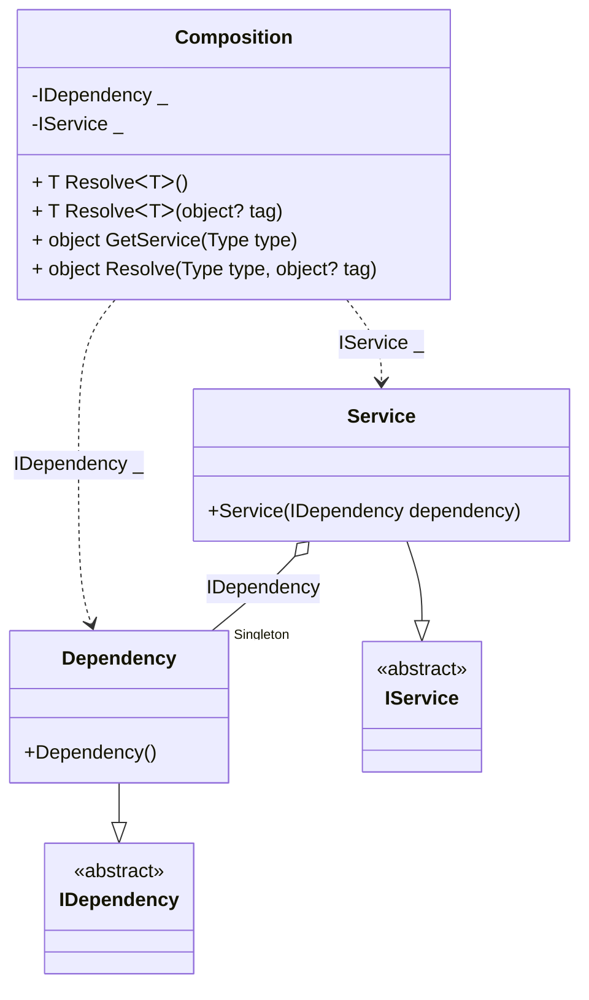

#### Service provider

[](../tests/Pure.DI.UsageTests/BaseClassLibrary/ServiceProviderScenario.cs)

The `// ObjectResolveMethodName = GetService` hint overrides the _object Resolve(Type type)_ method name in _GetService_, allowing the _IServiceProvider_ interface to be implemented in a partial class.

```c#
interface IDependency;

class Dependency : IDependency;

interface IService
{
    IDependency Dependency { get; }
}

class Service(IDependency dependency) : IService
{
    public IDependency Dependency { get; } = dependency;
}

partial class Composition: IServiceProvider
{
    void Setup() =>
        DI.Setup(nameof(Composition))
            // The following hint overrides the name of the
            // "object Resolve(Type type)" method in "GetService",
            // which implements the "IServiceProvider" interface
            .Hint(Hint.ObjectResolveMethodName, "GetService")
            .Bind<IDependency>().As(Lifetime.Singleton).To<Dependency>()
            .Bind<IService>().To<Service>()
            .Root<IDependency>()
            .Root<IService>();
}

var serviceProvider = new Composition();
var service = serviceProvider.GetRequiredService<IService>();
var dependency = serviceProvider.GetRequiredService<IDependency>();
service.Dependency.ShouldBe(dependency);
```

<details open>
<summary>Class Diagram</summary>



</details>

<details>
<summary>Pure.DI-generated partial class Composition</summary><blockquote>

```c#
partial class Composition
{
  private readonly Composition _rootM03D28di;
  private readonly object _lockM03D28di;
  private Pure.DI.UsageTests.BCL.ServiceProviderScenario.Dependency _singletonM03D28di36_Dependency;
  
  public Composition()
  {
    _rootM03D28di = this;
    _lockM03D28di = new object();
  }
  
  internal Composition(Composition baseComposition)
  {
    _rootM03D28di = baseComposition._rootM03D28di;
    _lockM03D28di = _rootM03D28di._lockM03D28di;
  }
  
  public Pure.DI.UsageTests.BCL.ServiceProviderScenario.IDependency RootM03D28di0001
  {
    get
    {
      if (ReferenceEquals(_rootM03D28di._singletonM03D28di36_Dependency, null))
      {
          lock (_lockM03D28di)
          {
              if (ReferenceEquals(_rootM03D28di._singletonM03D28di36_Dependency, null))
              {
                  _singletonM03D28di36_Dependency = new Pure.DI.UsageTests.BCL.ServiceProviderScenario.Dependency();
                  _rootM03D28di._singletonM03D28di36_Dependency = _singletonM03D28di36_Dependency;
              }
          }
      }
      return _rootM03D28di._singletonM03D28di36_Dependency;
    }
  }
  
  public Pure.DI.UsageTests.BCL.ServiceProviderScenario.IService RootM03D28di0002
  {
    get
    {
      if (ReferenceEquals(_rootM03D28di._singletonM03D28di36_Dependency, null))
      {
          lock (_lockM03D28di)
          {
              if (ReferenceEquals(_rootM03D28di._singletonM03D28di36_Dependency, null))
              {
                  _singletonM03D28di36_Dependency = new Pure.DI.UsageTests.BCL.ServiceProviderScenario.Dependency();
                  _rootM03D28di._singletonM03D28di36_Dependency = _singletonM03D28di36_Dependency;
              }
          }
      }
      return new Pure.DI.UsageTests.BCL.ServiceProviderScenario.Service(_rootM03D28di._singletonM03D28di36_Dependency);
    }
  }
  
  public T Resolve<T>()
  {
    return ResolverM03D28di<T>.Value.Resolve(this);
  }
  
  public T Resolve<T>(object? tag)
  {
    return ResolverM03D28di<T>.Value.ResolveByTag(this, tag);
  }
  
  public object GetService(global::System.Type type)
  {
    var index = (int)(_bucketSizeM03D28di * ((uint)global::System.Runtime.CompilerServices.RuntimeHelpers.GetHashCode(type) % 4));
    var finish = index + _bucketSizeM03D28di;
    do {
      ref var pair = ref _bucketsM03D28di[index];
      if (ReferenceEquals(pair.Key, type))
      {
        return pair.Value.Resolve(this);
      }
    } while (++index < finish);
    
    throw new global::System.InvalidOperationException($"Cannot resolve composition root of type {type}.");
  }
  
  public object Resolve(global::System.Type type, object? tag)
  {
    var index = (int)(_bucketSizeM03D28di * ((uint)global::System.Runtime.CompilerServices.RuntimeHelpers.GetHashCode(type) % 4));
    var finish = index + _bucketSizeM03D28di;
    do {
      ref var pair = ref _bucketsM03D28di[index];
      if (ReferenceEquals(pair.Key, type))
      {
        return pair.Value.ResolveByTag(this, tag);
      }
    } while (++index < finish);
    
    throw new global::System.InvalidOperationException($"Cannot resolve composition root \"{tag}\" of type {type}.");
  }
  
  public override string ToString()
  {
    return
      "classDiagram\n" +
        "  class Composition {\n" +
          "    -IDependency _\n" +
          "    -IService _\n" +
          "    + T ResolveᐸTᐳ()\n" +
          "    + T ResolveᐸTᐳ(object? tag)\n" +
          "    + object GetService(Type type)\n" +
          "    + object Resolve(Type type, object? tag)\n" +
        "  }\n" +
        "  Dependency --|> IDependency : \n" +
        "  class Dependency {\n" +
          "    +Dependency()\n" +
        "  }\n" +
        "  Service --|> IService : \n" +
        "  class Service {\n" +
          "    +Service(IDependency dependency)\n" +
        "  }\n" +
        "  class IDependency {\n" +
          "    <<abstract>>\n" +
        "  }\n" +
        "  class IService {\n" +
          "    <<abstract>>\n" +
        "  }\n" +
        "  Service o--  \"Singleton\" Dependency : IDependency\n" +
        "  Composition ..> Dependency : IDependency _\n" +
        "  Composition ..> Service : IService _";
  }
  
  private readonly static int _bucketSizeM03D28di;
  private readonly static global::Pure.DI.Pair<global::System.Type, global::Pure.DI.IResolver<Composition, object>>[] _bucketsM03D28di;
  
  static Composition()
  {
    var valResolverM03D28di_0000 = new ResolverM03D28di_0000();
    ResolverM03D28di<Pure.DI.UsageTests.BCL.ServiceProviderScenario.IDependency>.Value = valResolverM03D28di_0000;
    var valResolverM03D28di_0001 = new ResolverM03D28di_0001();
    ResolverM03D28di<Pure.DI.UsageTests.BCL.ServiceProviderScenario.IService>.Value = valResolverM03D28di_0001;
    _bucketsM03D28di = global::Pure.DI.Buckets<global::System.Type, global::Pure.DI.IResolver<Composition, object>>.Create(
      4,
      out _bucketSizeM03D28di,
      new global::Pure.DI.Pair<global::System.Type, global::Pure.DI.IResolver<Composition, object>>[2]
      {
         new global::Pure.DI.Pair<global::System.Type, global::Pure.DI.IResolver<Composition, object>>(typeof(Pure.DI.UsageTests.BCL.ServiceProviderScenario.IDependency), valResolverM03D28di_0000)
        ,new global::Pure.DI.Pair<global::System.Type, global::Pure.DI.IResolver<Composition, object>>(typeof(Pure.DI.UsageTests.BCL.ServiceProviderScenario.IService), valResolverM03D28di_0001)
      });
  }
  
  private sealed class ResolverM03D28di<T>: global::Pure.DI.IResolver<Composition, T>
  {
    public static global::Pure.DI.IResolver<Composition, T> Value = new ResolverM03D28di<T>();
    
    public T Resolve(Composition composite)
    {
      throw new global::System.InvalidOperationException($"Cannot resolve composition root of type {typeof(T)}.");
    }
    
    public T ResolveByTag(Composition composite, object tag)
    {
      throw new global::System.InvalidOperationException($"Cannot resolve composition root \"{tag}\" of type {typeof(T)}.");
    }
  }
  
  private sealed class ResolverM03D28di_0000: global::Pure.DI.IResolver<Composition, Pure.DI.UsageTests.BCL.ServiceProviderScenario.IDependency>
  {
    public Pure.DI.UsageTests.BCL.ServiceProviderScenario.IDependency Resolve(Composition composition)
    {
      return composition.RootM03D28di0001;
    }
    
    public Pure.DI.UsageTests.BCL.ServiceProviderScenario.IDependency ResolveByTag(Composition composition, object tag)
    {
      switch (tag)
      {
        case null:
          return composition.RootM03D28di0001;
      }
      throw new global::System.InvalidOperationException($"Cannot resolve composition root \"{tag}\" of type Pure.DI.UsageTests.BCL.ServiceProviderScenario.IDependency.");
    }
  }
  
  private sealed class ResolverM03D28di_0001: global::Pure.DI.IResolver<Composition, Pure.DI.UsageTests.BCL.ServiceProviderScenario.IService>
  {
    public Pure.DI.UsageTests.BCL.ServiceProviderScenario.IService Resolve(Composition composition)
    {
      return composition.RootM03D28di0002;
    }
    
    public Pure.DI.UsageTests.BCL.ServiceProviderScenario.IService ResolveByTag(Composition composition, object tag)
    {
      switch (tag)
      {
        case null:
          return composition.RootM03D28di0002;
      }
      throw new global::System.InvalidOperationException($"Cannot resolve composition root \"{tag}\" of type Pure.DI.UsageTests.BCL.ServiceProviderScenario.IService.");
    }
  }
}
```

</blockquote></details>

