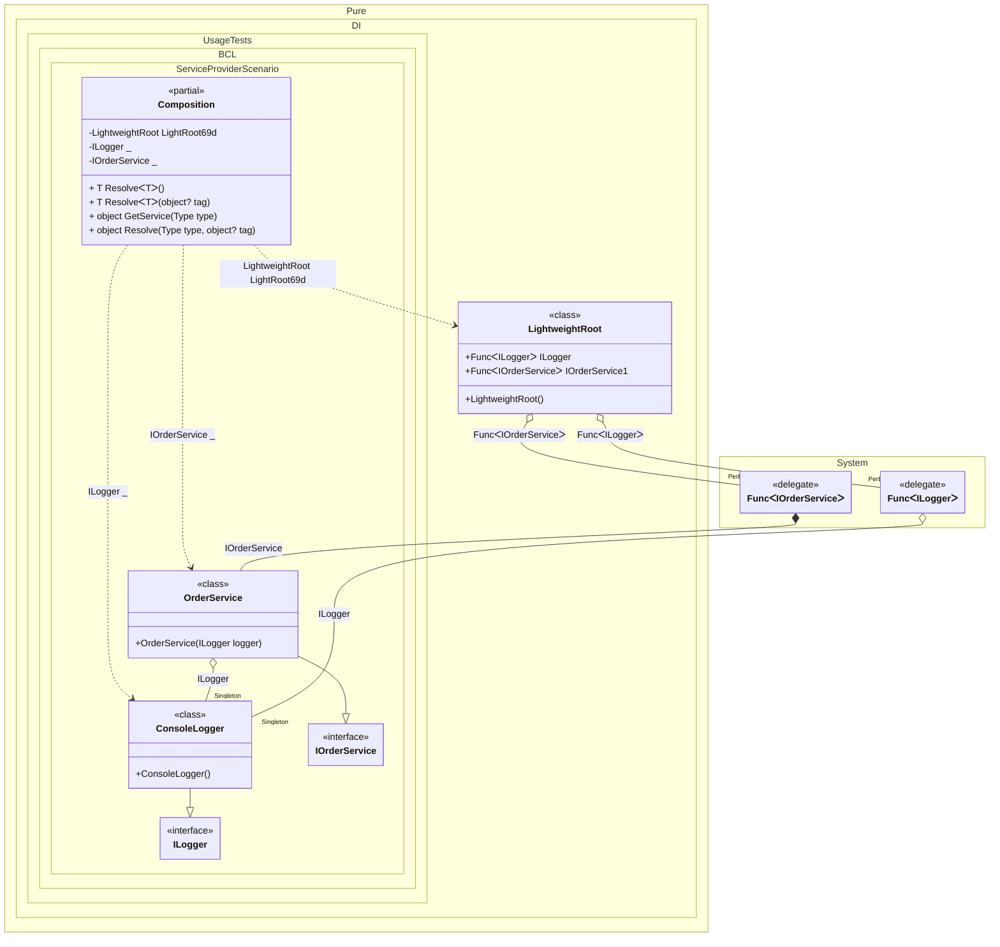

#### Service provider

The `// ObjectResolveMethodName = GetService` hint overriding the `object Resolve(Type type)` method name in `GetService()`, allowing the `IServiceProvider` interface to be implemented in a partial class.
>[!IMPORTANT]
>Only composition roots (regular or anonymous) can be resolved through the `IServiceProvider` interface. These roots must be registered using `Root(...)` or `RootBind()` calls.

This example shows how to implement a custom `IServiceProvider` using a partial class, utilizing a specific hint to override the default `Resolve()` method name:


```c#
using Shouldly;
using Microsoft.Extensions.DependencyInjection;
using Pure.DI;

var serviceProvider = new Composition();
var orderService = serviceProvider.GetRequiredService<IOrderService>();
var logger = serviceProvider.GetRequiredService<ILogger>();

// Check that the singleton instance is correctly injected
orderService.Logger.ShouldBe(logger);

// Represents a dependency, e.g., a logging service
interface ILogger;

class ConsoleLogger : ILogger;

// Represents a service that depends on ILogger
interface IOrderService
{
    ILogger Logger { get; }
}

class OrderService(ILogger logger) : IOrderService
{
    public ILogger Logger { get; } = logger;
}

partial class Composition : IServiceProvider
{
    static void Setup() =>
        DI.Setup()
            // The following hint overrides the name of the
            // "object Resolve(Type type)" method in "GetService",
            // which implements the "IServiceProvider" interface
            .Hint(Hint.ObjectResolveMethodName, "GetService")
            .Bind<ILogger>().As(Lifetime.Singleton).To<ConsoleLogger>()
            .Bind<IOrderService>().To<OrderService>()

            // Roots are required for resolution via IServiceProvider
            .Root<ILogger>()
            .Root<IOrderService>();
}
```

<details>
<summary>Running this code sample locally</summary>

- Make sure you have the [.NET SDK 10.0](https://dotnet.microsoft.com/en-us/download/dotnet/10.0) or later installed
```bash
dotnet --list-sdk
```
- Create a net10.0 (or later) console application
```bash
dotnet new console -n Sample
```
- Add references to the NuGet packages
  - [Pure.DI](https://www.nuget.org/packages/Pure.DI)
  - [Shouldly](https://www.nuget.org/packages/Shouldly)
  - [Microsoft.Extensions.DependencyInjection](https://www.nuget.org/packages/Microsoft.Extensions.DependencyInjection)
```bash
dotnet add package Pure.DI
dotnet add package Shouldly
dotnet add package Microsoft.Extensions.DependencyInjection
```
- Copy the example code into the _Program.cs_ file

You are ready to run the example 🚀
```bash
dotnet run
```

</details>

Important Notes:
- Hint Overriding: The `ObjectResolveMethodName = GetService` hint overrides the default object `Resolve(Type type)` method name to implement `IServiceProvider` interface
- Roots: Only roots can be resolved. Use `Root(...)` or `RootBind()` calls for registration

The following partial class will be generated:

```c#
partial class Composition
{
#if NET9_0_OR_GREATER
  private readonly Lock _lock = new Lock();
#else
  private readonly Object _lock = new Object();
#endif

  private ConsoleLogger? _singletonConsoleLogger51;

  private LightweightRoot LightRoot
  {
    [MethodImpl(MethodImplOptions.AggressiveInlining)]
    get
    {
      Func<ILogger> perBlockFunc399 = new Func<ILogger>(
      [MethodImpl(MethodImplOptions.AggressiveInlining)]
      () =>
      {
        EnsureConsoleLoggerExists();
        return _singletonConsoleLogger51;
      });
      Func<IOrderService> perBlockFunc400 = new Func<IOrderService>(
      [MethodImpl(MethodImplOptions.AggressiveInlining)]
      () =>
      {
        EnsureConsoleLoggerExists();
        return new OrderService(_singletonConsoleLogger51);
      });
      return new LightweightRoot()
      {
        ILogger = perBlockFunc399,
        IOrderService1 = perBlockFunc400
      };
      [MethodImpl(MethodImplOptions.AggressiveInlining)]
      void EnsureConsoleLoggerExists()
      {
        if (_singletonConsoleLogger51 is null)
          lock (_lock)
            if (_singletonConsoleLogger51 is null)
            {
              _singletonConsoleLogger51 = new ConsoleLogger();
            }
      }
    }
  }

  private ILogger Root2
  {
    [MethodImpl(MethodImplOptions.AggressiveInlining)]
    get
    {
      return LightRoot.ILogger();
    }
  }

  private IOrderService Root1
  {
    [MethodImpl(MethodImplOptions.AggressiveInlining)]
    get
    {
      return LightRoot.IOrderService1();
    }
  }

  [MethodImpl(MethodImplOptions.AggressiveInlining)]
  public T Resolve<T>()
  {
    return Resolver<T>.Value.Resolve(this);
  }

  [MethodImpl(MethodImplOptions.AggressiveInlining)]
  public T Resolve<T>(object? tag)
  {
    return Resolver<T>.Value.ResolveByTag(this, tag);
  }

  [MethodImpl(MethodImplOptions.AggressiveInlining)]
  public object GetService(Type type)
  {
    #if NETCOREAPP3_0_OR_GREATER
    var index = (int)(_bucketSize * (((uint)type.TypeHandle.GetHashCode()) % 4));
    #else
    var index = (int)(_bucketSize * (((uint)RuntimeHelpers.GetHashCode(type)) % 4));
    #endif
    ref var pair = ref _buckets[index];
    return Object.ReferenceEquals(pair.Key, type) ? pair.Value.Resolve(this) : Resolve(type, index);
  }

  [MethodImpl(MethodImplOptions.NoInlining)]
  private object Resolve(Type type, int index)
  {
    var finish = index + _bucketSize;
    while (++index < finish)
    {
      ref var pair = ref _buckets[index];
      if (Object.ReferenceEquals(pair.Key, type))
      {
        return pair.Value.Resolve(this);
      }
    }

    throw new CannotResolveException($"{CannotResolveMessage} {OfTypeMessage} {type}.", type, null);
  }

  [MethodImpl(MethodImplOptions.AggressiveInlining)]
  public object Resolve(Type type, object? tag)
  {
    #if NETCOREAPP3_0_OR_GREATER
    var index = (int)(_bucketSize * (((uint)type.TypeHandle.GetHashCode()) % 4));
    #else
    var index = (int)(_bucketSize * (((uint)RuntimeHelpers.GetHashCode(type)) % 4));
    #endif
    ref var pair = ref _buckets[index];
    return Object.ReferenceEquals(pair.Key, type) ? pair.Value.ResolveByTag(this, tag) : Resolve(type, tag, index);
  }

  [MethodImpl(MethodImplOptions.NoInlining)]
  private object Resolve(Type type, object? tag, int index)
  {
    var finish = index + _bucketSize;
    while (++index < finish)
    {
      ref var pair = ref _buckets[index];
      if (Object.ReferenceEquals(pair.Key, type))
      {
        return pair.Value.ResolveByTag(this, tag);
      }
    }

    throw new CannotResolveException($"{CannotResolveMessage} \"{tag}\" {OfTypeMessage} {type}.", type, tag);
  }

  private readonly static uint _bucketSize;
  private readonly static Pair<IResolver<Composition, object>>[] _buckets;

  static Composition()
  {
    var valResolver_0000 = new Resolver_0000();
    Resolver<ILogger>.Value = valResolver_0000;
    var valResolver_0001 = new Resolver_0001();
    Resolver<IOrderService>.Value = valResolver_0001;
    _buckets = Buckets<IResolver<Composition, object>>.Create(
      4,
      out _bucketSize,
      new Pair<IResolver<Composition, object>>[2]
      {
         new Pair<IResolver<Composition, object>>(typeof(ILogger), valResolver_0000)
        ,new Pair<IResolver<Composition, object>>(typeof(IOrderService), valResolver_0001)
      });
  }

  private const string CannotResolveMessage = "Cannot resolve composition root ";
  private const string OfTypeMessage = "of type ";

  private class Resolver<T>: IResolver<Composition, T>
  {
    public static IResolver<Composition, T> Value = new Resolver<T>();

    public virtual T Resolve(Composition composite)
    {
      throw new CannotResolveException($"{CannotResolveMessage}{OfTypeMessage}{typeof(T)}.", typeof(T), null);
    }

    public virtual T ResolveByTag(Composition composite, object tag)
    {
      throw new CannotResolveException($"{CannotResolveMessage}\"{tag}\" {OfTypeMessage}{typeof(T)}.", typeof(T), tag);
    }
  }

  private sealed class Resolver_0000: Resolver<ILogger>
  {
    public override ILogger Resolve(Composition composition)
    {
      return composition.Root2;
    }

    public override ILogger ResolveByTag(Composition composition, object tag)
    {
      switch (tag)
      {
        case null:
          return composition.Root2;

        default:
          return base.ResolveByTag(composition, tag);
      }
    }
  }

  private sealed class Resolver_0001: Resolver<IOrderService>
  {
    public override IOrderService Resolve(Composition composition)
    {
      return composition.Root1;
    }

    public override IOrderService ResolveByTag(Composition composition, object tag)
    {
      switch (tag)
      {
        case null:
          return composition.Root1;

        default:
          return base.ResolveByTag(composition, tag);
      }
    }
  }

  #pragma warning disable CS0649
  private sealed class LightweightRoot: LightweightRoot
  {
    [OrdinalAttribute()] public Func<ILogger> ILogger;
    [OrdinalAttribute()] public Func<IOrderService> IOrderService1;
  }
}
```

Class diagram:


```mermaid
---
 config:
  maxTextSize: 2147483647
  maxEdges: 2147483647
  class:
   hideEmptyMembersBox: true
---
classDiagram
	ConsoleLogger --|> ILogger
	OrderService --|> IOrderService
	Composition ..> LightweightRoot : LightweightRoot LightRoot69d
	Composition ..> OrderService : IOrderService _
	Composition ..> ConsoleLogger : ILogger _
	OrderService o-- "Singleton" ConsoleLogger : ILogger
	LightweightRoot o-- "PerBlock" FuncᐸILoggerᐳ : FuncᐸILoggerᐳ
	LightweightRoot o-- "PerBlock" FuncᐸIOrderServiceᐳ : FuncᐸIOrderServiceᐳ
	FuncᐸILoggerᐳ o-- "Singleton" ConsoleLogger : ILogger
	FuncᐸIOrderServiceᐳ *--  OrderService : IOrderService
	namespace Pure.DI {
		class LightweightRoot {
				<<class>>
			+LightweightRoot()
			+FuncᐸILoggerᐳ ILogger
			+FuncᐸIOrderServiceᐳ IOrderService1
		}
	}
	namespace Pure.DI.UsageTests.BCL.ServiceProviderScenario {
		class Composition {
		<<partial>>
		-LightweightRoot LightRoot69d
		-ILogger _
		-IOrderService _
		+ T ResolveᐸTᐳ()
		+ T ResolveᐸTᐳ(object? tag)
		+ object GetService(Type type)
		+ object Resolve(Type type, object? tag)
		}
		class ConsoleLogger {
				<<class>>
			+ConsoleLogger()
		}
		class ILogger {
			<<interface>>
		}
		class IOrderService {
			<<interface>>
		}
		class OrderService {
				<<class>>
			+OrderService(ILogger logger)
		}
	}
	namespace System {
		class FuncᐸILoggerᐳ {
				<<delegate>>
		}
		class FuncᐸIOrderServiceᐳ {
				<<delegate>>
		}
	}
```

