#### Service provider

The `// ObjectResolveMethodName = GetService` hint overriding the `object Resolve(Type type)` method name in `GetService()`, allowing the `IServiceProvider` interface to be implemented in a partial class.
> [!IMPORTANT]
> Only composition roots (regular or anonymous) can be resolved through the `IServiceProvider` interface. These roots must be registered using `Root(...)` or `RootBind()` calls.

This example demonstrates how to implement a custom `IServiceProvider` using a partial class, utilizing a specific hint to override the default `Resolve()` method name:


```c#
using Shouldly;
using Microsoft.Extensions.DependencyInjection;
using Pure.DI;

var serviceProvider = new Composition();
var service = serviceProvider.GetRequiredService<IService>();
var dependency = serviceProvider.GetRequiredService<IDependency>();
service.Dependency.ShouldBe(dependency);

interface IDependency;

class Dependency : IDependency;

interface IService
{
    IDependency Dependency { get; }
}

class Service(IDependency dependency) : IService
{
    public IDependency Dependency { get; } = dependency;
}

partial class Composition : IServiceProvider
{
    static void Setup() =>
        DI.Setup()
            // The following hint overrides the name of the
            // "object Resolve(Type type)" method in "GetService",
            // which implements the "IServiceProvider" interface
            .Hint(Hint.ObjectResolveMethodName, "GetService")
            .Bind<IDependency>().As(Lifetime.Singleton).To<Dependency>()
            .Bind<IService>().To<Service>()
            .Root<IDependency>()
            .Root<IService>();
}
```

<details>
<summary>Running this code sample locally</summary>

- Make sure you have the [.NET SDK 9.0](https://dotnet.microsoft.com/en-us/download/dotnet/9.0) or later is installed
```bash
dotnet --list-sdk
```
- Create a net9.0 (or later) console application
```bash
dotnet new console -n Sample
```
- Add references to NuGet packages
  - [Pure.DI](https://www.nuget.org/packages/Pure.DI)
  - [Shouldly](https://www.nuget.org/packages/Shouldly)
  - [Microsoft.Extensions.DependencyInjection](https://www.nuget.org/packages/Microsoft.Extensions.DependencyInjection)
```bash
dotnet add package Pure.DI
dotnet add package Shouldly
dotnet add package Microsoft.Extensions.DependencyInjection
```
- Copy the example code into the _Program.cs_ file

You are ready to run the example 🚀
```bash
dotnet run
```

</details>

Important Notes:
- Hint Overriding: The `ObjectResolveMethodName = GetService` hint overrides the default object `Resolve(Type type)` method name to implement `IServiceProvider` interface
- Roots: Only roots can be resolved. Use `Root(...)` or `RootBind()` calls for registration

The following partial class will be generated:

```c#
partial class Composition
{
  private readonly Composition _root;
#if NET9_0_OR_GREATER
  private readonly Lock _lock;
#else
  private readonly Object _lock;
#endif

  private Dependency? _singleDependency51;

  [OrdinalAttribute(256)]
  public Composition()
  {
    _root = this;
#if NET9_0_OR_GREATER
    _lock = new Lock();
#else
    _lock = new Object();
#endif
  }

  internal Composition(Composition parentScope)
  {
    _root = (parentScope ?? throw new ArgumentNullException(nameof(parentScope)))._root;
    _lock = parentScope._lock;
  }

  private IDependency Root2
  {
    [MethodImpl(MethodImplOptions.AggressiveInlining)]
    get
    {
      EnsureDependencyExists();
      return _root._singleDependency51;
      [MethodImpl(MethodImplOptions.AggressiveInlining)]
      void EnsureDependencyExists()
      {
        if (_root._singleDependency51 is null)
          lock (_lock)
            if (_root._singleDependency51 is null)
            {
              _root._singleDependency51 = new Dependency();
            }
      }
    }
  }

  private IService Root1
  {
    [MethodImpl(MethodImplOptions.AggressiveInlining)]
    get
    {
      EnsureDependencyExists();
      return new Service(_root._singleDependency51);
      [MethodImpl(MethodImplOptions.AggressiveInlining)]
      void EnsureDependencyExists()
      {
        if (_root._singleDependency51 is null)
          lock (_lock)
            if (_root._singleDependency51 is null)
            {
              _root._singleDependency51 = new Dependency();
            }
      }
    }
  }

  [MethodImpl(MethodImplOptions.AggressiveInlining)]
  public T Resolve<T>()
  {
    return Resolver<T>.Value.Resolve(this);
  }

  [MethodImpl(MethodImplOptions.AggressiveInlining)]
  public T Resolve<T>(object? tag)
  {
    return Resolver<T>.Value.ResolveByTag(this, tag);
  }

  [MethodImpl(MethodImplOptions.AggressiveInlining)]
  public object GetService(Type type)
  {
    var index = (int)(_bucketSize * ((uint)RuntimeHelpers.GetHashCode(type) % 4));
    ref var pair = ref _buckets[index];
    return pair.Key == type ? pair.Value.Resolve(this) : Resolve(type, index);
  }

  [MethodImpl(MethodImplOptions.NoInlining)]
  private object Resolve(Type type, int index)
  {
    var finish = index + _bucketSize;
    while (++index < finish)
    {
      ref var pair = ref _buckets[index];
      if (pair.Key == type)
      {
        return pair.Value.Resolve(this);
      }
    }

    throw new CannotResolveException($"{CannotResolveMessage} {OfTypeMessage} {type}.", type, null);
  }

  [MethodImpl(MethodImplOptions.AggressiveInlining)]
  public object Resolve(Type type, object? tag)
  {
    var index = (int)(_bucketSize * ((uint)RuntimeHelpers.GetHashCode(type) % 4));
    ref var pair = ref _buckets[index];
    return pair.Key == type ? pair.Value.ResolveByTag(this, tag) : Resolve(type, tag, index);
  }

  [MethodImpl(MethodImplOptions.NoInlining)]
  private object Resolve(Type type, object? tag, int index)
  {
    var finish = index + _bucketSize;
    while (++index < finish)
    {
      ref var pair = ref _buckets[index];
      if (pair.Key == type)
      {
        return pair.Value.ResolveByTag(this, tag);
      }
    }

    throw new CannotResolveException($"{CannotResolveMessage} \"{tag}\" {OfTypeMessage} {type}.", type, tag);
  }

  private readonly static uint _bucketSize;
  private readonly static Pair<IResolver<Composition, object>>[] _buckets;

  static Composition()
  {
    var valResolver_0000 = new Resolver_0000();
    Resolver<IDependency>.Value = valResolver_0000;
    var valResolver_0001 = new Resolver_0001();
    Resolver<IService>.Value = valResolver_0001;
    _buckets = Buckets<IResolver<Composition, object>>.Create(
      4,
      out _bucketSize,
      new Pair<IResolver<Composition, object>>[2]
      {
         new Pair<IResolver<Composition, object>>(typeof(IDependency), valResolver_0000)
        ,new Pair<IResolver<Composition, object>>(typeof(IService), valResolver_0001)
      });
  }

  private const string CannotResolveMessage = "Cannot resolve composition root ";
  private const string OfTypeMessage = "of type ";

  private class Resolver<T>: IResolver<Composition, T>
  {
    public static IResolver<Composition, T> Value = new Resolver<T>();

    public virtual T Resolve(Composition composite)
    {
      throw new CannotResolveException($"{CannotResolveMessage}{OfTypeMessage}{typeof(T)}.", typeof(T), null);
    }

    public virtual T ResolveByTag(Composition composite, object tag)
    {
      throw new CannotResolveException($"{CannotResolveMessage}\"{tag}\" {OfTypeMessage}{typeof(T)}.", typeof(T), tag);
    }
  }

  private sealed class Resolver_0000: Resolver<IDependency>
  {
    public override IDependency Resolve(Composition composition)
    {
      return composition.Root2;
    }

    public override IDependency ResolveByTag(Composition composition, object tag)
    {
      switch (tag)
      {
        case null:
          return composition.Root2;

        default:
          return base.ResolveByTag(composition, tag);
      }
    }
  }

  private sealed class Resolver_0001: Resolver<IService>
  {
    public override IService Resolve(Composition composition)
    {
      return composition.Root1;
    }

    public override IService ResolveByTag(Composition composition, object tag)
    {
      switch (tag)
      {
        case null:
          return composition.Root1;

        default:
          return base.ResolveByTag(composition, tag);
      }
    }
  }
}
```

Class diagram:

```mermaid
---
 config:
  maxTextSize: 2147483647
  maxEdges: 2147483647
  class:
   hideEmptyMembersBox: true
---
classDiagram
	Dependency --|> IDependency
	Service --|> IService
	Composition ..> Service : IService _
	Composition ..> Dependency : IDependency _
	Service o-- "Singleton" Dependency : IDependency
	namespace Pure.DI.UsageTests.BCL.ServiceProviderScenario {
		class Composition {
		<<partial>>
		-IDependency _
		-IService _
		+ T ResolveᐸTᐳ()
		+ T ResolveᐸTᐳ(object? tag)
		+ object GetService(Type type)
		+ object Resolve(Type type, object? tag)
		}
		class Dependency {
				<<class>>
			+Dependency()
		}
		class IDependency {
			<<interface>>
		}
		class IService {
			<<interface>>
		}
		class Service {
				<<class>>
			+Service(IDependency dependency)
		}
	}
```



