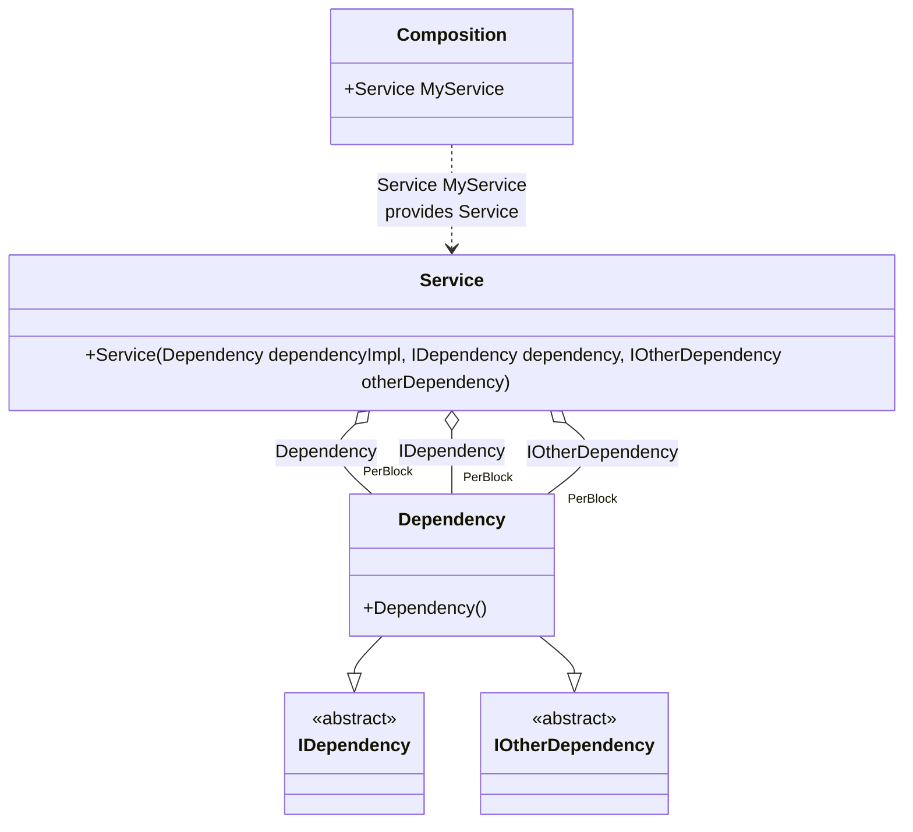

#### Simplified binding

[](../tests/Pure.DI.UsageTests/Basics/SimplifiedBindingScenario.cs)

You can use the `Bind(...)` method without type parameters. In this case binding will be performed for the implementation type itself, and if the implementation is not an abstract type or structure, for all abstract but NOT special types that are directly implemented.

```c#
interface IDependency;

interface IOtherDependency;

class Dependency: IDependency, IOtherDependency;

class Service(
    Dependency dependencyImpl,
    IDependency dependency,
    IOtherDependency otherDependency);

// Specifies to create a partial class "Composition"
DI.Setup("Composition")
    // Begins the binding definition for the implementation type itself,
    // and if the implementation is not an abstract class or structure,
    // for all abstract but NOT special types that are directly implemented.
    // So that's the equivalent of the following:
    // .Bind<IDependency, IOtherDependency, Dependency>()
    //  .As(Lifetime.PerBlock)
    //  .To<Dependency>()
    .Bind().As(Lifetime.PerBlock).To<Dependency>()
    // Specifies to create a property "MyService"
    .Root<Service>("MyService");
        
var composition = new Composition();
var service = composition.MyService;
```

Special types from the list above will not be added to bindings:

- `System.Object`
- `System.Enum`
- `System.MulticastDelegate`
- `System.Delegate`
- `System.Collections.IEnumerable`
- `System.Collections.Generic.IEnumerable<T>`
- `System.Collections.Generic.IList<T>`
- `System.Collections.Generic.ICollection<T>`
- `System.Collections.IEnumerator`
- `System.Collections.Generic.IEnumerator<T>`
- `System.Collections.Generic.IIReadOnlyList<T>`
- `System.Collections.Generic.IReadOnlyCollection<T>`
- `System.IDisposable`
- `System.IAsyncResult`
- `System.AsyncCallback`

<details open>
<summary>Class Diagram</summary>



</details>

<details>
<summary>Pure.DI-generated partial class Composition</summary><blockquote>

```c#
/// <para>
/// Specifies to create a partial class "Composition"
/// </para>
/// <para>
/// <b>Composition roots</b><br/>
/// <list type="table">
/// <listheader>
/// <term>Root</term>
/// <description>Description</description>
/// </listheader>
/// <item>
/// <term>
/// <see cref="Pure.DI.UsageTests.Basics.SimplifiedBindingScenario.Service"/> <see cref="MyService"/><br/>or using <see cref="Resolve{T}()"/> method: <c>Resolve&lt;Pure.DI.UsageTests.Basics.SimplifiedBindingScenario.Service&gt;()</c>
/// </term>
/// <description>
/// Specifies to create a property "MyService"
/// </description>
/// </item>
/// </list>
/// </para>
/// </summary>
/// <example>
/// This shows how to get an instance of type <see cref="Pure.DI.UsageTests.Basics.SimplifiedBindingScenario.Service"/> using the composition root <see cref="MyService"/>:
/// <code>
/// var composition = new Composition();
/// var instance = composition.MyService;
/// </code>
/// </example>
/// <a href="https://mermaid.live/view#pako:eNqlU8FqwzAM_RWj82ClPaTrbUl2yGFssKsvri02szgOSlYopf8-x25ax01hdBch5UnPz8_RAaRVCBuQtei6UotPEoYTb3zNCmta2-le24bxn8UiywdsyJb5B9JOS2Sv-1M2Qll5IRibbgz7Yl1ii43CRu6ZOqeVaWsPF6yabRjBt_4LKeqw09q3PU21Rd0eLi8xK4a4epkc6j89sz-PppKi-WBLgsXOJMrXc_oDSXWTZRWUFGLb9SRkH3Sd4hzTnOB76MbntrE3jHF4R8prK785sGtfoivfzRGZ8Q-SxIeBKV2Bpb94iO6t4x_cMVwvhXduS_wxDLRkd1rheTOGI-ABDJIRWrlFPHBwIgxy2HBQgpzSIxx_ASxZPQ8">Class diagram</a><br/>
/// This class was created by <a href="https://github.com/DevTeam/Pure.DI">Pure.DI</a> source code generator.
/// <seealso cref="Pure.DI.DI.Setup"/>
/// <seealso cref="Pure.DI.IConfiguration.Bind(object[])"/>
/// <seealso cref="Pure.DI.IConfiguration.Bind{T}(object[])"/>
[global::System.Diagnostics.CodeAnalysis.ExcludeFromCodeCoverage]
partial class Composition
{
  private readonly Composition _rootM03D14di;
  
  /// <summary>
  /// This constructor creates a new instance of <see cref="Composition"/>.
  /// </summary>
  public Composition()
  {
    _rootM03D14di = this;
  }
  
  /// <summary>
  /// This constructor creates a new instance of <see cref="Composition"/> scope based on <paramref name="baseComposition"/>. This allows the <see cref="Lifetime.Scoped"/> life time to be applied.
  /// </summary>
  /// <param name="baseComposition">Base composition.</param>
  internal Composition(Composition baseComposition)
  {
    _rootM03D14di = baseComposition._rootM03D14di;
  }
  
  #region Composition Roots
  /// <summary>
  /// Specifies to create a property "MyService"
  /// </summary>
  /// <example>
  /// This shows how to get an instance of type <see cref="Pure.DI.UsageTests.Basics.SimplifiedBindingScenario.Service"/>:
  /// <code>
  /// var composition = new Composition();
  /// var instance = composition.MyService;
  /// </code>
  /// </example>
  public Pure.DI.UsageTests.Basics.SimplifiedBindingScenario.Service MyService
  {
    #if NETSTANDARD2_0_OR_GREATER || NETCOREAPP || NET40_OR_GREATER || NET
    [global::System.Diagnostics.Contracts.Pure]
    #endif
    get
    {
      var perBlockM03D14di1_Dependency = new Pure.DI.UsageTests.Basics.SimplifiedBindingScenario.Dependency();
      return new Pure.DI.UsageTests.Basics.SimplifiedBindingScenario.Service(perBlockM03D14di1_Dependency, perBlockM03D14di1_Dependency, perBlockM03D14di1_Dependency);
    }
  }
  #endregion
  
  /// <summary>
  /// This method provides a class diagram in mermaid format. To see this diagram, simply call the method and copy the text to this site https://mermaid.live/.
  /// </summary>
  public override string ToString()
  {
    return
      "classDiagram\n" +
        "  class Composition {\n" +
          "    +Service MyService\n" +
        "  }\n" +
        "  class Service {\n" +
          "    +Service(Dependency dependencyImpl, IDependency dependency, IOtherDependency otherDependency)\n" +
        "  }\n" +
        "  Dependency --|> IDependency : \n" +
        "  Dependency --|> IOtherDependency : \n" +
        "  class Dependency {\n" +
          "    +Dependency()\n" +
        "  }\n" +
        "  class IDependency {\n" +
          "    <<abstract>>\n" +
        "  }\n" +
        "  class IOtherDependency {\n" +
          "    <<abstract>>\n" +
        "  }\n" +
        "  Service o--  \"PerBlock\" Dependency : Dependency\n" +
        "  Service o--  \"PerBlock\" Dependency : IDependency\n" +
        "  Service o--  \"PerBlock\" Dependency : IOtherDependency\n" +
        "  Composition ..> Service : Service MyService<br/>provides Service";
  }
}
```

</blockquote></details>

