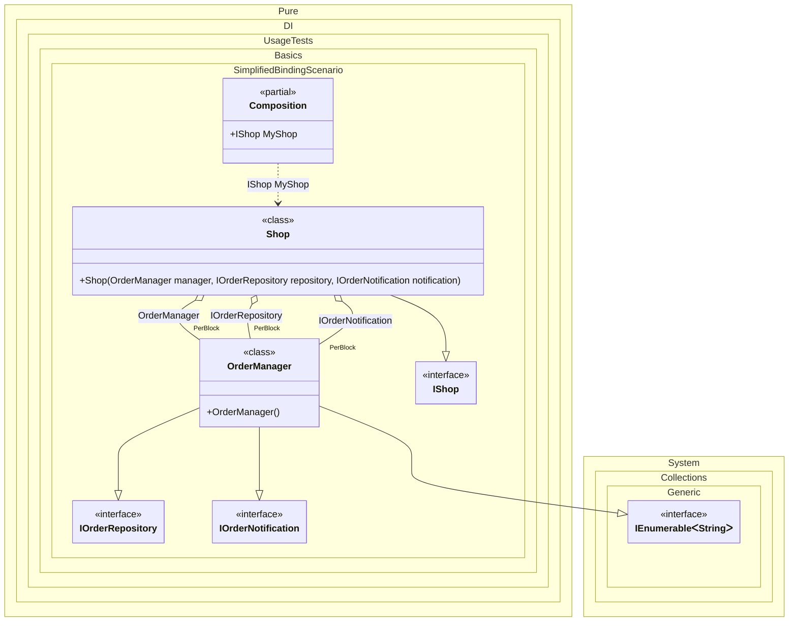

#### Simplified binding

You can use the `Bind(...)` method without type parameters. In this case binding will be performed for the implementation type itself, and if the implementation is not an abstract type or structure, for all abstract but NOT special types that are directly implemented.


```c#
using System.Collections;
using Pure.DI;

// Specifies to create a partial class "Composition"
DI.Setup(nameof(Composition))
    // Begins the binding definition for the implementation type itself,
    // and if the implementation is not an abstract class or structure,
    // for all abstract but NOT special types that are directly implemented.
    // So that's the equivalent of the following:
    // .Bind<IOrderRepository, IOrderNotification, OrderManager>()
    //   .As(Lifetime.PerBlock)
    //   .To<OrderManager>()
    .Bind().As(Lifetime.PerBlock).To<OrderManager>()
    .Bind().To<Shop>()

    // Specifies to create a property "MyShop"
    .Root<IShop>("MyShop");

var composition = new Composition();
var shop = composition.MyShop;

interface IManager;

class ManagerBase : IManager;

interface IOrderRepository;

interface IOrderNotification;

class OrderManager :
    ManagerBase,
    IOrderRepository,
    IOrderNotification,
    IDisposable,
    IEnumerable<string>
{
    public void Dispose() {}

    public IEnumerator<string> GetEnumerator() =>
        new List<string> { "Order #1", "Order #2" }.GetEnumerator();

    IEnumerator IEnumerable.GetEnumerator() => GetEnumerator();
}

interface IShop;

class Shop(
    OrderManager manager,
    IOrderRepository repository,
    IOrderNotification notification)
    : IShop;
```

<details>
<summary>Running this code sample locally</summary>

- Make sure you have the [.NET SDK 10.0](https://dotnet.microsoft.com/en-us/download/dotnet/10.0) or later is installed
```bash
dotnet --list-sdk
```
- Create a net10.0 (or later) console application
```bash
dotnet new console -n Sample
```
- Add reference to NuGet package
  - [Pure.DI](https://www.nuget.org/packages/Pure.DI)
```bash
dotnet add package Pure.DI
```
- Copy the example code into the _Program.cs_ file

You are ready to run the example 🚀
```bash
dotnet run
```

</details>

As practice has shown, in most cases it is possible to define abstraction types in bindings automatically. That's why we added API `Bind()` method without type parameters to define abstractions in bindings. It is the `Bind()` method that performs the binding:

- with the implementation type itself
- and if it is NOT an abstract type or structure
  - with all abstract types that it directly implements
  - exceptions are special types

Special types will not be added to bindings:

- `System.Object`
- `System.Enum`
- `System.MulticastDelegate`
- `System.Delegate`
- `System.Collections.IEnumerable`
- `System.Collections.Generic.IEnumerable<T>`
- `System.Collections.Generic.IList<T>`
- `System.Collections.Generic.ICollection<T>`
- `System.Collections.IEnumerator`
- `System.Collections.Generic.IEnumerator<T>`
- `System.Collections.Generic.IReadOnlyList<T>`
- `System.Collections.Generic.IReadOnlyCollection<T>`
- `System.IDisposable`
- `System.IAsyncResult`
- `System.AsyncCallback`

For class `OrderManager`, the `Bind().To<OrderManager>()` binding will be equivalent to the `Bind<IOrderRepository, IOrderNotification, OrderManager>().To<OrderManager>()` binding. The types `IDisposable`, `IEnumerable<string>` did not get into the binding because they are special from the list above. `ManagerBase` did not get into the binding because it is not abstract. `IManager` is not included because it is not implemented directly by class `OrderManager`.

|    |                       |                                                   |
|----|-----------------------|---------------------------------------------------|
| ✅ | `OrderManager`        | implementation type itself                        |
| ✅ | `IOrderRepository`    | directly implements                               |
| ✅ | `IOrderNotification`  | directly implements                               |
| ❌ | `IDisposable`         | special type                                      |
| ❌ | `IEnumerable<string>` | special type                                      |
| ❌ | `ManagerBase`         | non-abstract                                      |
| ❌ | `IManager`            | is not directly implemented by class OrderManager |

The following partial class will be generated:

```c#
partial class Composition
{
  public IShop MyShop
  {
    [MethodImpl(MethodImplOptions.AggressiveInlining)]
    get
    {
      var perBlockOrderManager1 = new OrderManager();
      return new Shop(perBlockOrderManager1, perBlockOrderManager1, perBlockOrderManager1);
    }
  }
}
```

Class diagram:



