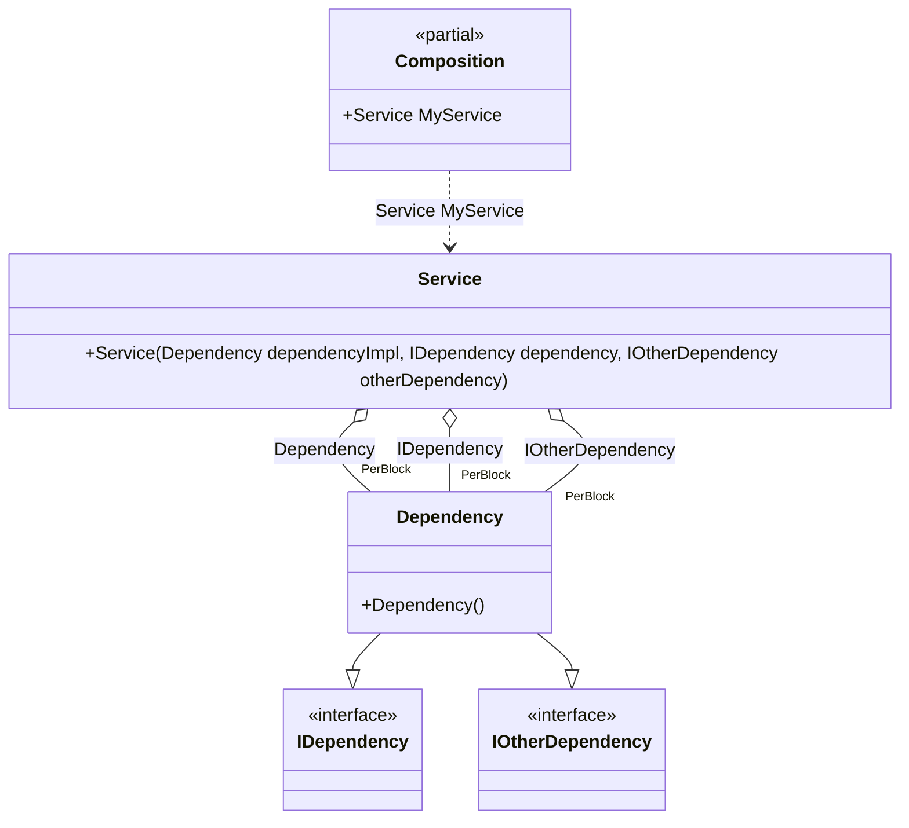

#### Simplified binding

[](../tests/Pure.DI.UsageTests/Basics/SimplifiedBindingScenario.cs)

You can use the `Bind(...)` method without type parameters. In this case binding will be performed for the implementation type itself, and if the implementation is not an abstract type or structure, for all abstract but NOT special types that are directly implemented.


```c#
interface IDependency;

interface IOtherDependency;

class Dependency: IDependency, IOtherDependency;

class Service(
    Dependency dependencyImpl,
    IDependency dependency,
    IOtherDependency otherDependency);

// Specifies to create a partial class "Composition"
DI.Setup("Composition")
    // Begins the binding definition for the implementation type itself,
    // and if the implementation is not an abstract class or structure,
    // for all abstract but NOT special types that are directly implemented.
    // So that's the equivalent of the following:
    // .Bind<IDependency, IOtherDependency, Dependency>()
    //  .As(Lifetime.PerBlock)
    //  .To<Dependency>()
    .Bind().As(Lifetime.PerBlock).To<Dependency>()

    // Specifies to create a property "MyService"
    .Root<Service>("MyService");
        
var composition = new Composition();
var service = composition.MyService;
```

Special types from the list above will not be added to bindings:

- `System.Object`
- `System.Enum`
- `System.MulticastDelegate`
- `System.Delegate`
- `System.Collections.IEnumerable`
- `System.Collections.Generic.IEnumerable<T>`
- `System.Collections.Generic.IList<T>`
- `System.Collections.Generic.ICollection<T>`
- `System.Collections.IEnumerator`
- `System.Collections.Generic.IEnumerator<T>`
- `System.Collections.Generic.IIReadOnlyList<T>`
- `System.Collections.Generic.IReadOnlyCollection<T>`
- `System.IDisposable`
- `System.IAsyncResult`
- `System.AsyncCallback`

The following partial class will be generated:

```c#
partial class Composition
{
  private readonly Composition _root;

  public Composition()
  {
    _root = this;
  }

  internal Composition(Composition parentScope)
  {
    _root = (parentScope ?? throw new ArgumentNullException(nameof(parentScope)))._root;
  }

  public Service MyService
  {
    [MethodImpl(MethodImplOptions.AggressiveInlining)]
    get
    {
      Dependency perBlock1_Dependency = new Dependency();
      return new Service(perBlock1_Dependency, perBlock1_Dependency, perBlock1_Dependency);
    }
  }
}
```

Class diagram:



