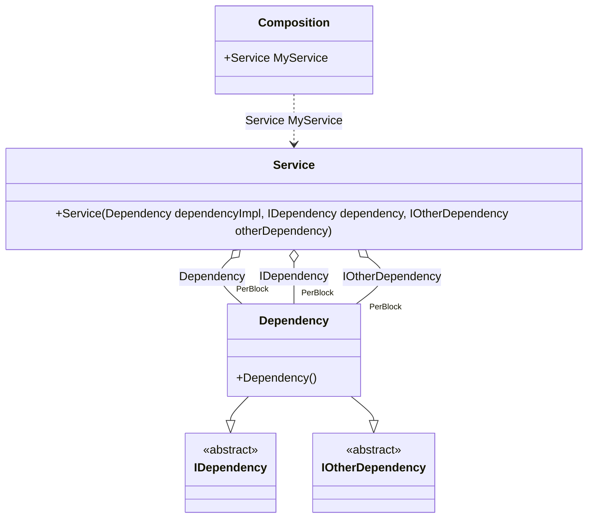

#### Simplified binding

[](../tests/Pure.DI.UsageTests/Basics/SimplifiedBindingScenario.cs)

You can use the `Bind(...)` method without type parameters. In this case binding will be performed for the implementation type itself, and if the implementation is not an abstract type or structure, for all abstract but NOT special types that are directly implemented.

```c#
interface IDependency;

interface IOtherDependency;

class Dependency: IDependency, IOtherDependency;

class Service(
    Dependency dependencyImpl,
    IDependency dependency,
    IOtherDependency otherDependency);

// Specifies to create a partial class "Composition"
DI.Setup("Composition")
    // Begins the binding definition for the implementation type itself,
    // and if the implementation is not an abstract class or structure,
    // for all abstract but NOT special types that are directly implemented.
    // So that's the equivalent of the following:
    // .Bind<IDependency, IOtherDependency, Dependency>()
    //  .As(Lifetime.PerBlock)
    //  .To<Dependency>()
    .Bind().As(Lifetime.PerBlock).To<Dependency>()

    // Specifies to create a property "MyService"
    .Root<Service>("MyService");
        
var composition = new Composition();
var service = composition.MyService;
```

Special types from the list above will not be added to bindings:

- `System.Object`
- `System.Enum`
- `System.MulticastDelegate`
- `System.Delegate`
- `System.Collections.IEnumerable`
- `System.Collections.Generic.IEnumerable<T>`
- `System.Collections.Generic.IList<T>`
- `System.Collections.Generic.ICollection<T>`
- `System.Collections.IEnumerator`
- `System.Collections.Generic.IEnumerator<T>`
- `System.Collections.Generic.IIReadOnlyList<T>`
- `System.Collections.Generic.IReadOnlyCollection<T>`
- `System.IDisposable`
- `System.IAsyncResult`
- `System.AsyncCallback`

<details open>
<summary>Class Diagram</summary>



</details>

<details>
<summary>Pure.DI-generated partial class Composition</summary><blockquote>

```c#
partial class Composition
{
  private readonly Composition _rootM03D27di;
  
  public Composition()
  {
    _rootM03D27di = this;
  }
  
  internal Composition(Composition baseComposition)
  {
    _rootM03D27di = baseComposition._rootM03D27di;
  }
  
  public Pure.DI.UsageTests.Basics.SimplifiedBindingScenario.Service MyService
  {
    get
    {
      Pure.DI.UsageTests.Basics.SimplifiedBindingScenario.Dependency perBlockM03D27di1_Dependency = new Pure.DI.UsageTests.Basics.SimplifiedBindingScenario.Dependency();
      return new Pure.DI.UsageTests.Basics.SimplifiedBindingScenario.Service(perBlockM03D27di1_Dependency, perBlockM03D27di1_Dependency, perBlockM03D27di1_Dependency);
    }
  }
  
  public override string ToString()
  {
    return
      "classDiagram\n" +
        "  class Composition {\n" +
          "    +Service MyService\n" +
        "  }\n" +
        "  class Service {\n" +
          "    +Service(Dependency dependencyImpl, IDependency dependency, IOtherDependency otherDependency)\n" +
        "  }\n" +
        "  Dependency --|> IDependency : \n" +
        "  Dependency --|> IOtherDependency : \n" +
        "  class Dependency {\n" +
          "    +Dependency()\n" +
        "  }\n" +
        "  class IDependency {\n" +
          "    <<abstract>>\n" +
        "  }\n" +
        "  class IOtherDependency {\n" +
          "    <<abstract>>\n" +
        "  }\n" +
        "  Service o--  \"PerBlock\" Dependency : Dependency\n" +
        "  Service o--  \"PerBlock\" Dependency : IDependency\n" +
        "  Service o--  \"PerBlock\" Dependency : IOtherDependency\n" +
        "  Composition ..> Service : Service MyService";
  }
}
```

</blockquote></details>

