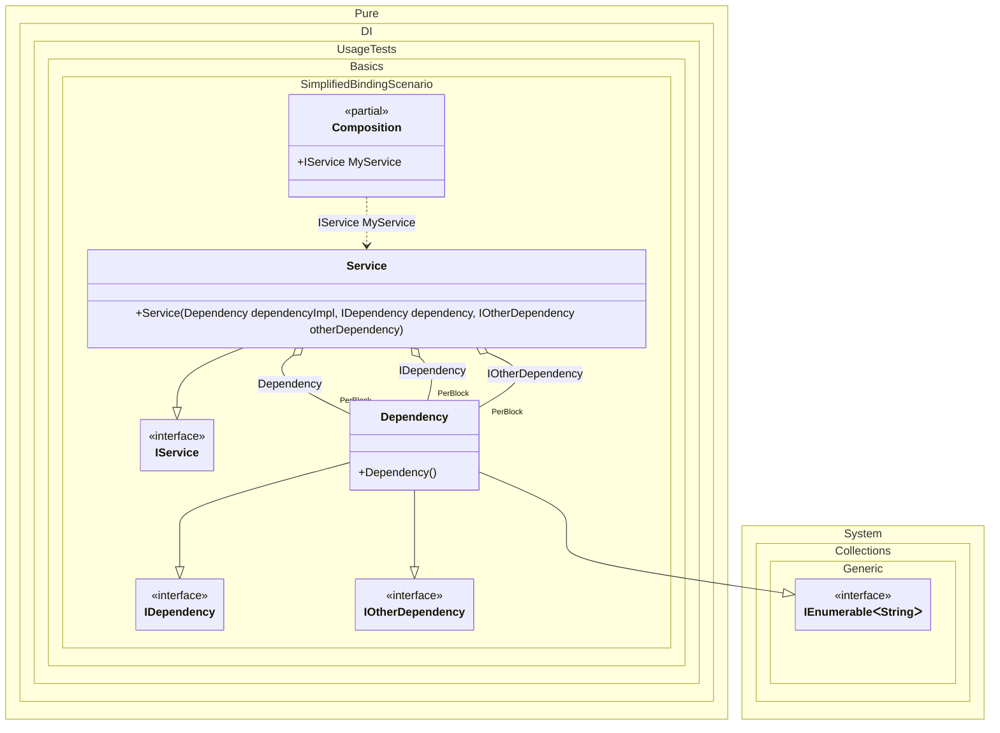

#### Simplified binding

[](../tests/Pure.DI.UsageTests/Basics/SimplifiedBindingScenario.cs)

You can use the `Bind(...)` method without type parameters. In this case binding will be performed for the implementation type itself, and if the implementation is not an abstract type or structure, for all abstract but NOT special types that are directly implemented.


```c#
using System.Collections;
using Pure.DI;

// Specifies to create a partial class "Composition"
DI.Setup(nameof(Composition))
    // Begins the binding definition for the implementation type itself,
    // and if the implementation is not an abstract class or structure,
    // for all abstract but NOT special types that are directly implemented.
    // So that's the equivalent of the following:
    // .Bind<IDependency, IOtherDependency, Dependency>()
    //   .As(Lifetime.PerBlock)
    //   .To<Dependency>()
    .Bind().As(Lifetime.PerBlock).To<Dependency>()
    .Bind().To<Service>()

    // Specifies to create a property "MyService"
    .Root<IService>("MyService");

var composition = new Composition();
var service = composition.MyService;

interface IDependencyBase;

class DependencyBase : IDependencyBase;

interface IDependency;

interface IOtherDependency;

class Dependency :
    DependencyBase,
    IDependency,
    IOtherDependency,
    IDisposable,
    IEnumerable<string>
{
    public void Dispose() { }

    public IEnumerator<string> GetEnumerator() =>
        new List<string> { "abc" }.GetEnumerator();

    IEnumerator IEnumerable.GetEnumerator() => GetEnumerator();
}

interface IService;

class Service(
    Dependency dependencyImpl,
    IDependency dependency,
    IOtherDependency otherDependency)
    : IService;
```

<details>
<summary>Running this code sample locally</summary>

- Make sure you have the [.NET SDK 9.0](https://dotnet.microsoft.com/en-us/download/dotnet/9.0) or later is installed
- Create a net9.0 (or later) console application
- Add reference to NuGet package
  - [Pure.DI](https://www.nuget.org/packages/Pure.DI)
- Copy the example code into the _Program.cs_ file

You are ready to run the example!

</details>

As practice has shown, in most cases it is possible to define abstraction types in bindings automatically. That's why we added API `Bind()` method without type parameters to define abstractions in bindings. It is the `Bind()` method that performs the binding:

- with the implementation type itself
- and if it is NOT an abstract type or structure
  - with all abstract types that it directly implements
  - exceptions are special types

Special types will not be added to bindings:

- `System.Object`
- `System.Enum`
- `System.MulticastDelegate`
- `System.Delegate`
- `System.Collections.IEnumerable`
- `System.Collections.Generic.IEnumerable<T>`
- `System.Collections.Generic.IList<T>`
- `System.Collections.Generic.ICollection<T>`
- `System.Collections.IEnumerator`
- `System.Collections.Generic.IEnumerator<T>`
- `System.Collections.Generic.IIReadOnlyList<T>`
- `System.Collections.Generic.IReadOnlyCollection<T>`
- `System.IDisposable`
- `System.IAsyncResult`
- `System.AsyncCallback`

For class `Dependency`, the `Bind().To<Dependency>()` binding will be equivalent to the `Bind<IDependency, IOtherDependency, Dependency>().To<Dependency>()` binding. The types `IDisposable`, `IEnumerable<string>` did not get into the binding because they are special from the list above. `DependencyBase` did not get into the binding because it is not abstract. `IDependencyBase` is not included because it is not implemented directly by class `Dependency`.

|   |                       |                                                 |
|---|-----------------------|-------------------------------------------------|
| ✅ | `Dependency`          | implementation type itself                      |
| ✅ | `IDependency`         | directly implements                             |
| ✅ | `IOtherDependency`    | directly implements                             |
| ❌ | `IDisposable`         | special type                                    |
| ❌ | `IEnumerable<string>` | special type                                    |
| ❌ | `DependencyBase`      | non-abstract                                    |
| ❌ | `IDependencyBase`     | is not directly implemented by class Dependency |

The following partial class will be generated:

```c#
partial class Composition
{
  private readonly Composition _root;

  [OrdinalAttribute(256)]
  public Composition()
  {
    _root = this;
  }

  internal Composition(Composition parentScope)
  {
    _root = (parentScope ?? throw new ArgumentNullException(nameof(parentScope)))._root;
  }

  public IService MyService
  {
    [MethodImpl(MethodImplOptions.AggressiveInlining)]
    get
    {
      Dependency perBlockDependency1 = new Dependency();
      return new Service(perBlockDependency1, perBlockDependency1, perBlockDependency1);
    }
  }
}
```

Class diagram:



