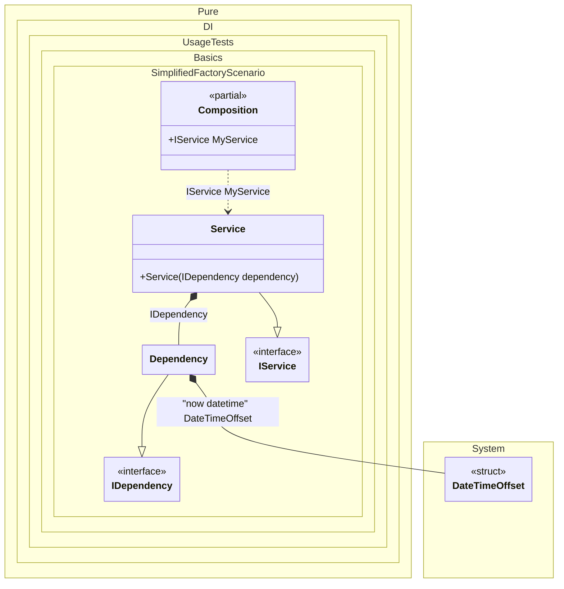

#### Simplified factory

This example shows how to create and initialize an instance manually in a simplified form. When you use a lambda function to specify custom instance initialization logic, each parameter of that function represents an injection of a dependency. Starting with C# 10, you can also put the `Tag(...)` attribute in front of the parameter to specify the tag of the injected dependency.


```c#
using Shouldly;
using Pure.DI;

DI.Setup(nameof(Composition))
    .Bind("now datetime").To(_ => DateTimeOffset.Now)
    // Injects Dependency and DateTimeOffset instances
    // and performs further initialization logic
    // defined in the lambda function
    .Bind<IDependency>().To((
        Dependency dependency,
        [Tag("now datetime")] DateTimeOffset time) =>
    {
        dependency.Initialize(time);
        return dependency;
    })
    .Bind().To<Service>()

    // Composition root
    .Root<IService>("MyService");

var composition = new Composition();
var service = composition.MyService;
service.Dependency.IsInitialized.ShouldBeTrue();

interface IDependency
{
    DateTimeOffset Time { get; }

    bool IsInitialized { get; }
}

class Dependency : IDependency
{
    public DateTimeOffset Time { get; private set; }

    public bool IsInitialized { get; private set; }

    public void Initialize(DateTimeOffset time)
    {
        Time = time;
        IsInitialized = true;
    }
}

interface IService
{
    IDependency Dependency { get; }
}

class Service(IDependency dependency) : IService
{
    public IDependency Dependency { get; } = dependency;
}
```

<details>
<summary>Running this code sample locally</summary>

- Make sure you have the [.NET SDK 9.0](https://dotnet.microsoft.com/en-us/download/dotnet/9.0) or later is installed
```bash
dotnet --list-sdk
```
- Create a net9.0 (or later) console application
```bash
dotnet new console -n Sample
```
- Add references to NuGet packages
  - [Pure.DI](https://www.nuget.org/packages/Pure.DI)
  - [Shouldly](https://www.nuget.org/packages/Shouldly)
```bash
dotnet add package Pure.DI
dotnet add package Shouldly
```
- Copy the example code into the _Program.cs_ file

You are ready to run the example 🚀
```bash
dotnet run
```

</details>

The following partial class will be generated:

```c#
partial class Composition
{
  private readonly Composition _root;

  [OrdinalAttribute(256)]
  public Composition()
  {
    _root = this;
  }

  internal Composition(Composition parentScope)
  {
    _root = (parentScope ?? throw new ArgumentNullException(nameof(parentScope)))._root;
  }

  public IService MyService
  {
    [MethodImpl(MethodImplOptions.AggressiveInlining)]
    get
    {
      DateTimeOffset transientDateTimeOffset3 = DateTimeOffset.Now;
      Dependency transientDependency1;
      Dependency localDependency102 = new Dependency();
      DateTimeOffset localTime103 = transientDateTimeOffset3;
      localDependency102.Initialize(localTime103);
      transientDependency1 = localDependency102;
      return new Service(transientDependency1);
    }
  }
}
```

Class diagram:



