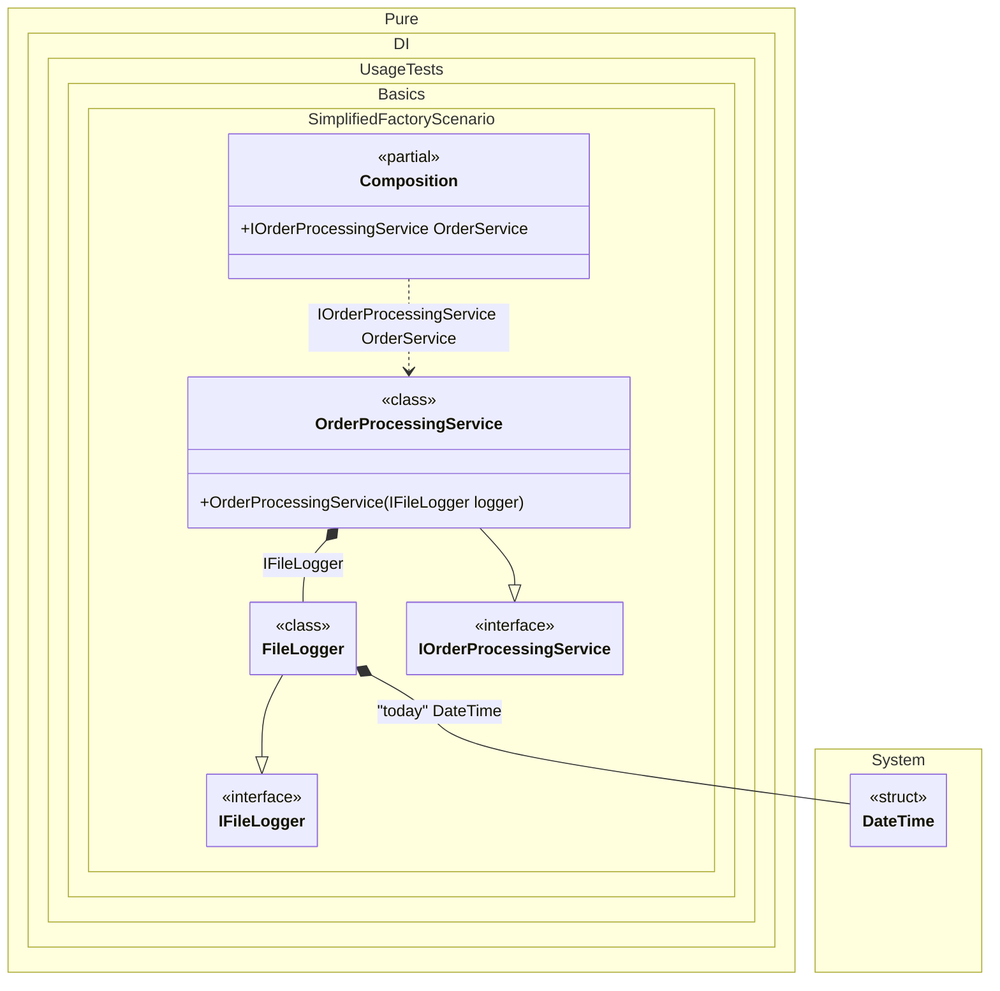

#### Simplified factory

This example shows how to create and initialize an instance manually in a simplified form. When you use a lambda function to specify custom instance initialization logic, each parameter of that function represents an injection of a dependency. Starting with C# 10, you can also put the `Tag(...)` attribute in front of the parameter to specify the tag of the injected dependency.


```c#
using Shouldly;
using Pure.DI;

DI.Setup(nameof(Composition))
    .Bind("today").To(_ => DateTime.Today)
    // Injects FileLogger and DateTime instances
    // and performs further initialization logic
    // defined in the lambda function to set up the log file name
    .Bind<IFileLogger>().To((
        FileLogger logger,
        [Tag("today")] DateTime date) => {
        logger.Init($"app-{date:yyyy-MM-dd}.log");
        return logger;
    })
    .Bind().To<OrderProcessingService>()

    // Composition root
    .Root<IOrderProcessingService>("OrderService");

var composition = new Composition();
var service = composition.OrderService;

service.Logger.FileName.ShouldBe($"app-{DateTime.Today:yyyy-MM-dd}.log");

interface IFileLogger
{
    string FileName { get; }

    void Log(string message);
}

class FileLogger : IFileLogger
{
    public string FileName { get; private set; } = "";

    public void Init(string fileName) => FileName = fileName;

    public void Log(string message)
    {
        // Write to file
    }
}

interface IOrderProcessingService
{
    IFileLogger Logger { get; }
}

class OrderProcessingService(IFileLogger logger) : IOrderProcessingService
{
    public IFileLogger Logger { get; } = logger;
}
```

<details>
<summary>Running this code sample locally</summary>

- Make sure you have the [.NET SDK 10.0](https://dotnet.microsoft.com/en-us/download/dotnet/10.0) or later is installed
```bash
dotnet --list-sdk
```
- Create a net10.0 (or later) console application
```bash
dotnet new console -n Sample
```
- Add references to NuGet packages
  - [Pure.DI](https://www.nuget.org/packages/Pure.DI)
  - [Shouldly](https://www.nuget.org/packages/Shouldly)
```bash
dotnet add package Pure.DI
dotnet add package Shouldly
```
- Copy the example code into the _Program.cs_ file

You are ready to run the example 🚀
```bash
dotnet run
```

</details>

The example creates a `service` that depends on a `logger` initialized with a specific file name based on the current date. The `Tag` attribute allows specifying named dependencies for more complex scenarios.

The following partial class will be generated:

```c#
partial class Composition
{
  public IOrderProcessingService OrderService
  {
    [MethodImpl(MethodImplOptions.AggressiveInlining)]
    get
    {
      FileLogger transientFileLogger1;
      FileLogger localLogger4 = new FileLogger();
      DateTime transientDateTime3 = DateTime.Today;
      DateTime localDate = transientDateTime3;
      localLogger4.Init($"app-{localDate:yyyy-MM-dd}.log");
      transientFileLogger1 = localLogger4;
      return new OrderProcessingService(transientFileLogger1);
    }
  }
}
```

Class diagram:



