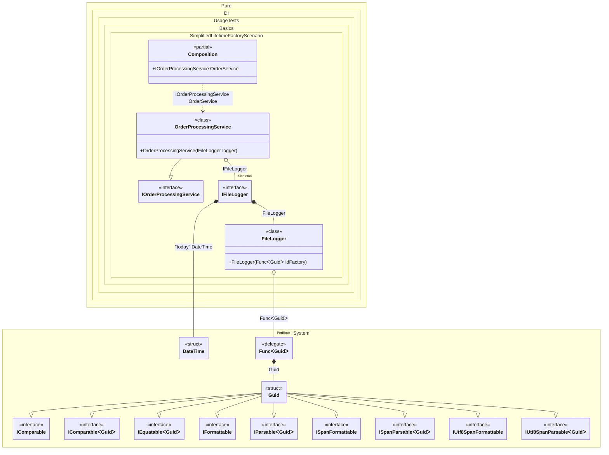

#### Simplified lifetime-specific factory

Lifetime-named shortcuts such as `Transient(...)` and `Singleton(...)` register a factory and its lifetime in a single call, replacing the longer `Bind().As(...).To(...)` chain.
Overloads accept a plain lambda (optionally with a tag, like `Transient(() => DateTime.Today, "today")`) or a lambda whose parameters are injected dependencies — parameters may carry attributes such as `[Tag]` — so you can initialize the instance before returning it, as `Singleton<FileLogger, DateTime, IFileLogger>` does when setting up the log file name.


```c#
using Shouldly;
using Pure.DI;

DI.Setup(nameof(Composition))
    .Transient(Guid.NewGuid)
    .Transient(() => DateTime.Today, "today")
    // Injects FileLogger and DateTime instances
    // and performs further initialization logic
    // defined in the lambda function to set up the log file name
    .Singleton<FileLogger, DateTime, IFileLogger>((
        logger,
        [Tag("today")] date) => {
        logger.Init($"app-{date:yyyy-MM-dd}.log");
        return logger;
    })
    .Transient<OrderProcessingService>()

    // Composition root
    .Root<IOrderProcessingService>("OrderService");

var composition = new Composition();
var service = composition.OrderService;

service.Logger.FileName.ShouldBe($"app-{DateTime.Today:yyyy-MM-dd}.log");

interface IFileLogger
{
    string FileName { get; }

    void Log(string message);
}

class FileLogger(Func<Guid> idFactory) : IFileLogger
{
    public string FileName { get; private set; } = "";

    public void Init(string fileName) => FileName = fileName;

    public void Log(string message)
    {
        var id = idFactory();
        // Write to file
    }
}

interface IOrderProcessingService
{
    IFileLogger Logger { get; }
}

class OrderProcessingService(IFileLogger logger) : IOrderProcessingService
{
    public IFileLogger Logger { get; } = logger;
}
```

<details>
<summary>Running this code sample locally</summary>

- Make sure you have the [.NET SDK 10.0](https://dotnet.microsoft.com/en-us/download/dotnet/10.0) or later installed
```bash
dotnet --list-sdk
```
- Create a net10.0 (or later) console application
```bash
dotnet new console -n Sample
```
- Add references to the NuGet packages
  - [Pure.DI](https://www.nuget.org/packages/Pure.DI)
  - [Shouldly](https://www.nuget.org/packages/Shouldly)
```bash
dotnet add package Pure.DI
dotnet add package Shouldly
```
- Copy the example code into the _Program.cs_ file

You are ready to run the example 🚀
```bash
dotnet run
```

</details>

>[!NOTE]
>Lifetime-specific factories combine the convenience of simplified syntax with explicit lifetime control for optimal performance and correctness.

<details>
<summary>The following partial class will be generated</summary>

```c#
partial class Composition
{
#if NET9_0_OR_GREATER
  private readonly Lock _lock = new Lock();
#else
  private readonly Object _lock = new Object();
#endif

  private IFileLogger? _singletonIFileLogger73;

  public IOrderProcessingService OrderService
  {
    [MethodImpl(MethodImplOptions.AggressiveInlining)]
    get
    {
      if (_singletonIFileLogger73 is null)
        lock (_lock)
          if (_singletonIFileLogger73 is null)
          {
            Func<Guid> perBlockFuncGuid = new Func<Guid>(
            [MethodImpl(MethodImplOptions.AggressiveInlining)]
            () =>
            {
              // Creates a deferred value
              Guid transientGuid = Guid.NewGuid();
              return transientGuid;
            });
            FileLogger localLogger = new FileLogger(perBlockFuncGuid);
            DateTime transientDateTime = DateTime.Today;
            DateTime localDate = transientDateTime;
            localLogger.Init($"app-{localDate:yyyy-MM-dd}.log");
            _singletonIFileLogger73 = localLogger;
          }

      return new OrderProcessingService(_singletonIFileLogger73);
    }
  }
}
```

</details>

Class diagram:


```mermaid
---
 config:
  class:
   hideEmptyMembersBox: true
---
classDiagram
	Guid --|> IComparable
	Guid --|> IComparableᐸGuidᐳ
	Guid --|> IEquatableᐸGuidᐳ
	Guid --|> IFormattable
	Guid --|> IParsableᐸGuidᐳ
	Guid --|> ISpanFormattable
	Guid --|> ISpanParsableᐸGuidᐳ
	Guid --|> IUtf8SpanFormattable
	Guid --|> IUtf8SpanParsableᐸGuidᐳ
	OrderProcessingService --|> IOrderProcessingService
	Composition ..> OrderProcessingService : IOrderProcessingService OrderService
	IFileLogger *-- DateTime : "today" DateTime
	IFileLogger *-- FileLogger : FileLogger
	OrderProcessingService o-- "Singleton" IFileLogger : IFileLogger
	FileLogger o-- "PerBlock" FuncᐸGuidᐳ : FuncᐸGuidᐳ
	FuncᐸGuidᐳ *-- Guid : Guid
	namespace Pure.DI.UsageTests.Basics.SimplifiedLifetimeFactoryScenario {
		class Composition {
		<<partial>>
		+IOrderProcessingService OrderService
		}
		class FileLogger {
				<<class>>
			+FileLogger(FuncᐸGuidᐳ idFactory)
		}
		class IFileLogger {
				<<interface>>
		}
		class IOrderProcessingService {
			<<interface>>
		}
		class OrderProcessingService {
				<<class>>
			+OrderProcessingService(IFileLogger logger)
		}
	}
	namespace System {
		class DateTime {
				<<struct>>
		}
		class FuncᐸGuidᐳ {
				<<delegate>>
		}
		class Guid {
				<<struct>>
		}
		class IComparable {
			<<interface>>
		}
		class IComparableᐸGuidᐳ {
			<<interface>>
		}
		class IEquatableᐸGuidᐳ {
			<<interface>>
		}
		class IFormattable {
			<<interface>>
		}
		class IParsableᐸGuidᐳ {
			<<interface>>
		}
		class ISpanFormattable {
			<<interface>>
		}
		class ISpanParsableᐸGuidᐳ {
			<<interface>>
		}
		class IUtf8SpanFormattable {
			<<interface>>
		}
		class IUtf8SpanParsableᐸGuidᐳ {
			<<interface>>
		}
	}
```

See also:

- [Simplified factory](simplified-factory.md)
- [Simplified lifetime-specific bindings](simplified-lifetime-specific-bindings.md)

