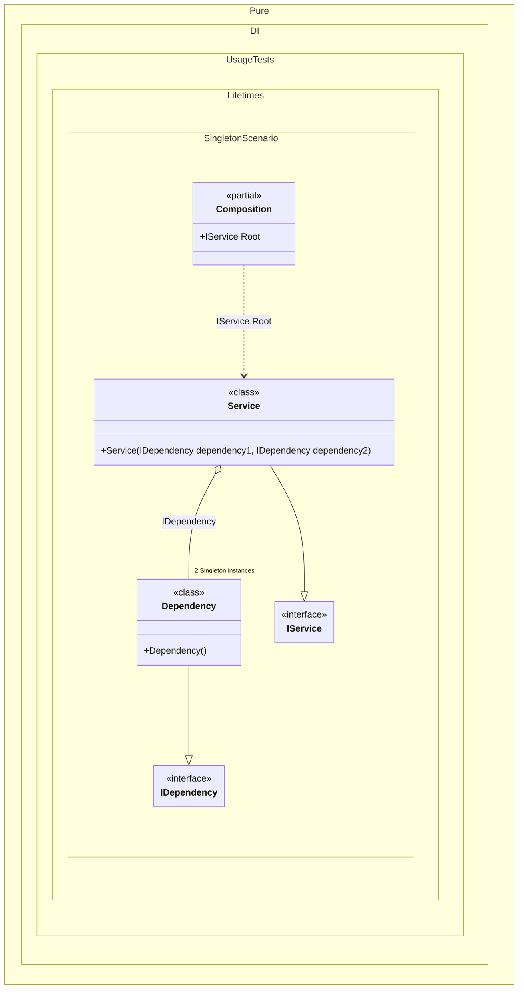

#### Singleton

The _Singleton_ lifetime ensures that there will be a single instance of the dependency for each composition.


```c#
using Shouldly;
using Pure.DI;
using static Pure.DI.Lifetime;

DI.Setup(nameof(Composition))
    .Bind().As(Singleton).To<Dependency>()
    .Bind().To<Service>()
    .Root<IService>("Root");

var composition = new Composition();
var service1 = composition.Root;
var service2 = composition.Root;
service1.Dependency1.ShouldBe(service1.Dependency2);
service2.Dependency1.ShouldBe(service1.Dependency1);

interface IDependency;

class Dependency : IDependency;

interface IService
{
    public IDependency Dependency1 { get; }

    public IDependency Dependency2 { get; }
}

class Service(
    IDependency dependency1,
    IDependency dependency2)
    : IService
{
    public IDependency Dependency1 { get; } = dependency1;

    public IDependency Dependency2 { get; } = dependency2;
}
```

<details>
<summary>Running this code sample locally</summary>

- Make sure you have the [.NET SDK 9.0](https://dotnet.microsoft.com/en-us/download/dotnet/9.0) or later is installed
```bash
dotnet --list-sdk
```
- Create a net9.0 (or later) console application
```bash
dotnet new console -n Sample
```
- Add references to NuGet packages
  - [Pure.DI](https://www.nuget.org/packages/Pure.DI)
  - [Shouldly](https://www.nuget.org/packages/Shouldly)
```bash
dotnet add package Pure.DI
dotnet add package Shouldly
```
- Copy the example code into the _Program.cs_ file

You are ready to run the example 🚀
```bash
dotnet run
```

</details>

Some articles advise using objects with a _Singleton_ lifetime as often as possible, but the following details must be considered:

- For .NET the default behavior is to create a new instance of the type each time it is needed, other behavior requires, additional logic that is not free and requires additional resources.

- The use of _Singleton_, adds a requirement for thread-safety controls on their use, since singletons are more likely to share their state between different threads without even realizing it.

- The thread-safety control should be automatically extended to all dependencies that _Singleton_ uses, since their state is also now shared.

- Logic for thread-safety control can be resource-costly, error-prone, interlocking, and difficult to test.

- _Singleton_ can retain dependency references longer than their expected lifetime, this is especially significant for objects that hold "non-renewable" resources, such as the operating system Handler.

- Sometimes additional logic is required to dispose of _Singleton_.

The following partial class will be generated:

```c#
partial class Composition
{
  private readonly Composition _root;
  private readonly Lock _lock;

  private Dependency? _singletonDependency51;

  [OrdinalAttribute(256)]
  public Composition()
  {
    _root = this;
    _lock = new Lock();
  }

  internal Composition(Composition parentScope)
  {
    _root = (parentScope ?? throw new ArgumentNullException(nameof(parentScope)))._root;
    _lock = _root._lock;
  }

  public IService Root
  {
    [MethodImpl(MethodImplOptions.AggressiveInlining)]
    get
    {
      if (_root._singletonDependency51 is null)
      {
        using (_lock.EnterScope())
        {
          if (_root._singletonDependency51 is null)
          {
            _root._singletonDependency51 = new Dependency();
          }
        }
      }

      return new Service(_root._singletonDependency51, _root._singletonDependency51);
    }
  }
}
```

Class diagram:



