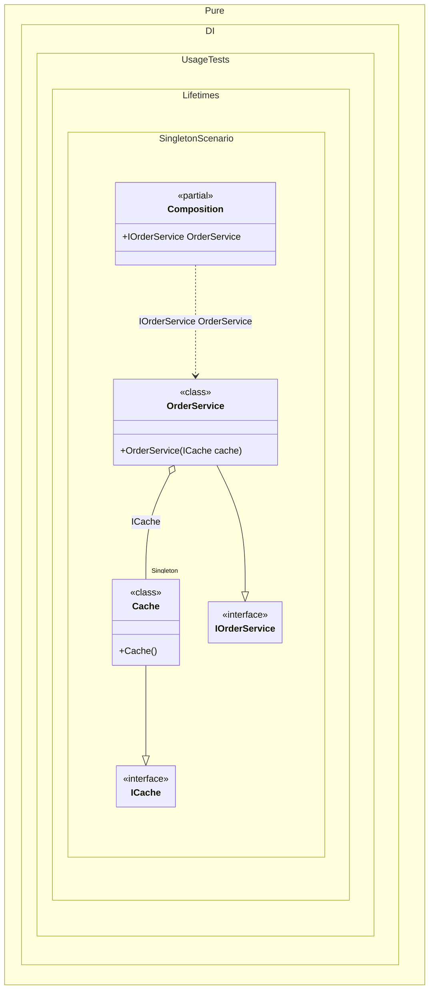

#### Singleton

The _Singleton_ lifetime ensures that there will be a single instance of the dependency for each composition.


```c#
using Shouldly;
using Pure.DI;
using System.Diagnostics.CodeAnalysis;
using static Pure.DI.Lifetime;

DI.Setup(nameof(Composition))
    // Bind the cache as Singleton to share it across all services
    .Bind().As(Singleton).To<Cache>()
    // Bind the order service as Transient (default) for per-request instances
    .Bind().To<OrderService>()
    .Root<IOrderService>("OrderService");

var composition = new Composition();
var orderService1 = composition.OrderService; // First order service instance
var orderService2 = composition.OrderService; // Second order service instance

// Verify that both services share the same cache instance (Singleton behavior)
orderService1.Cache.ShouldBe(orderService2.Cache);
// Simulate real-world usage: add data to cache via one service and check via another
orderService1.AddToCache("Order123", "Processed");
orderService2.GetFromCache("Order123").ShouldBe("Processed");

// Interface for a shared cache (e.g., for storing order statuses)
interface ICache
{
    void Add(string key, string value);

    bool TryGet(string key, [MaybeNullWhen(false)] out string value);
}

// Implementation of a simple in-memory cache (must be thread-safe in real apps)
class Cache : ICache
{
    private readonly Dictionary<string, string> _data = new();

    public void Add(string key, string value) =>
        _data[key] = value;

    public bool TryGet(string key, [MaybeNullWhen(false)] out string value) =>
        _data.TryGetValue(key, out value);
}

// Interface for order processing service
interface IOrderService
{
    ICache Cache { get; }

    void AddToCache(string orderId, string status);

    string GetFromCache(string orderId);
}

// Order service that uses the shared cache
class OrderService(ICache cache) : IOrderService
{
    // The cache is injected and shared (Singleton)
    public ICache Cache { get; } = cache;

    // Real-world method: add order status to cache
    public void AddToCache(string orderId, string status) =>
        Cache.Add(orderId, status);

    // Real-world method: retrieve order status from cache
    public string GetFromCache(string orderId) =>
        Cache.TryGet(orderId, out var status) ? status : "unknown";
}
```

<details>
<summary>Running this code sample locally</summary>

- Make sure you have the [.NET SDK 10.0](https://dotnet.microsoft.com/en-us/download/dotnet/10.0) or later is installed
```bash
dotnet --list-sdk
```
- Create a net10.0 (or later) console application
```bash
dotnet new console -n Sample
```
- Add references to NuGet packages
  - [Pure.DI](https://www.nuget.org/packages/Pure.DI)
  - [Shouldly](https://www.nuget.org/packages/Shouldly)
```bash
dotnet add package Pure.DI
dotnet add package Shouldly
```
- Copy the example code into the _Program.cs_ file

You are ready to run the example 🚀
```bash
dotnet run
```

</details>

Some articles advise using objects with a _Singleton_ lifetime as often as possible, but the following details must be considered:

- For .NET the default behavior is to create a new instance of the type each time it is needed, other behavior requires, additional logic that is not free and requires additional resources.

- The use of _Singleton_, adds a requirement for thread-safety controls on their use, since singletons are more likely to share their state between different threads without even realizing it.

- The thread-safety control should be automatically extended to all dependencies that _Singleton_ uses, since their state is also now shared.

- Logic for thread-safety control can be resource-costly, error-prone, interlocking, and difficult to test.

- _Singleton_ can retain dependency references longer than their expected lifetime, this is especially significant for objects that hold "non-renewable" resources, such as the operating system Handler.

- Sometimes additional logic is required to dispose of _Singleton_.

The following partial class will be generated:

```c#
partial class Composition
{
#if NET9_0_OR_GREATER
  private readonly Lock _lock = new Lock();
#else
  private readonly Object _lock = new Object();
#endif

  private Cache? _singletonCache51;

  public IOrderService OrderService
  {
    [MethodImpl(MethodImplOptions.AggressiveInlining)]
    get
    {
      if (_singletonCache51 is null)
        lock (_lock)
          if (_singletonCache51 is null)
          {
            _singletonCache51 = new Cache();
          }

      return new OrderService(_singletonCache51);
    }
  }
}
```

Class diagram:



