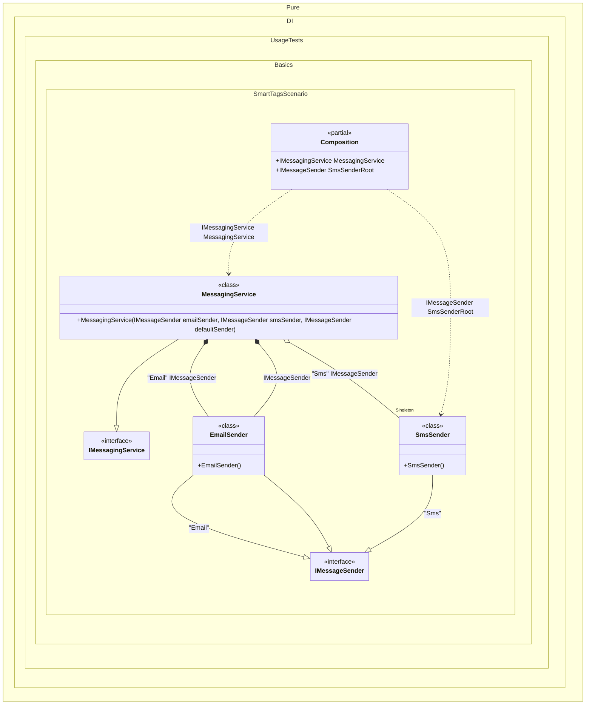

#### Smart tags

When you have a large graph of objects, you may need a lot of tags to neatly define all the dependencies in it. Strings or other constant values are not always convenient to use, because they have too much variability. And there are often cases when you specify one tag in the binding, but the same tag in the dependency, but with a typo, which leads to a compilation error when checking the dependency graph. The solution to this problem is to create an `Enum` type and use its values as tags. Pure.DI makes it easier to solve this problem.

When you specify a tag in a binding and the compiler can't determine what that value is, Pure.DI will automatically create a constant for it inside the `Pure.DI.Tag` type. For the example below, the set of constants would look like this:

```c#
namespace Pure.DI
{
  internal partial class Tag
  {
    public const string Abc = "Abc";
    public const string Xyz = "Xyz";
  }
}
```
So you can apply refactoring in the development environment. And also tag changes in bindings will be automatically checked by the compiler. This will reduce the number of errors.


The example below also uses the `using static Pure.DI.Tag;` directive to access tags in `Pure.DI.Tag` without specifying a type name:


```c#
using Shouldly;
using Pure.DI;

using static Pure.DI.Tag;
using static Pure.DI.Lifetime;

DI.Setup(nameof(Composition))
    // The `default` tag is used to resolve dependencies
    // when the tag was not specified by the consumer
    .Bind<IMessageSender>(Email, default).To<EmailSender>()
    .Bind<IMessageSender>(Sms).As(Singleton).To<SmsSender>()
    .Bind<IMessagingService>().To<MessagingService>()

    // "SmsSenderRoot" is root name, Sms is tag
    .Root<IMessageSender>("SmsSenderRoot", Sms)

    // Specifies to create the composition root named "Root"
    .Root<IMessagingService>("MessagingService");

var composition = new Composition();
var messagingService = composition.MessagingService;
messagingService.EmailSender.ShouldBeOfType<EmailSender>();
messagingService.SmsSender.ShouldBeOfType<SmsSender>();
messagingService.SmsSender.ShouldBe(composition.SmsSenderRoot);
messagingService.DefaultSender.ShouldBeOfType<EmailSender>();

interface IMessageSender;

class EmailSender : IMessageSender;

class SmsSender : IMessageSender;

interface IMessagingService
{
    IMessageSender EmailSender { get; }

    IMessageSender SmsSender { get; }

    IMessageSender DefaultSender { get; }
}

class MessagingService(
    [Tag(Email)] IMessageSender emailSender,
    [Tag(Sms)] IMessageSender smsSender,
    IMessageSender defaultSender)
    : IMessagingService
{
    public IMessageSender EmailSender { get; } = emailSender;

    public IMessageSender SmsSender { get; } = smsSender;

    public IMessageSender DefaultSender { get; } = defaultSender;
}
```

<details>
<summary>Running this code sample locally</summary>

- Make sure you have the [.NET SDK 10.0](https://dotnet.microsoft.com/en-us/download/dotnet/10.0) or later is installed
```bash
dotnet --list-sdk
```
- Create a net10.0 (or later) console application
```bash
dotnet new console -n Sample
```
- Add references to NuGet packages
  - [Pure.DI](https://www.nuget.org/packages/Pure.DI)
  - [Shouldly](https://www.nuget.org/packages/Shouldly)
```bash
dotnet add package Pure.DI
dotnet add package Shouldly
```
- Copy the example code into the _Program.cs_ file

You are ready to run the example 🚀
```bash
dotnet run
```

</details>

The following partial class will be generated:

```c#
partial class Composition
{
  private readonly Composition _root;
#if NET9_0_OR_GREATER
  private readonly Lock _lock;
#else
  private readonly Object _lock;
#endif

  private SmsSender? _singletonSmsSender52;

  [OrdinalAttribute(256)]
  public Composition()
  {
    _root = this;
#if NET9_0_OR_GREATER
    _lock = new Lock();
#else
    _lock = new Object();
#endif
  }

  internal Composition(Composition parentScope)
  {
    _root = (parentScope ?? throw new ArgumentNullException(nameof(parentScope)))._root;
    _lock = parentScope._lock;
  }

  public IMessageSender SmsSenderRoot
  {
    [MethodImpl(MethodImplOptions.AggressiveInlining)]
    get
    {
      EnsureSmsSenderSmsExists();
      return _root._singletonSmsSender52;
      [MethodImpl(MethodImplOptions.AggressiveInlining)]
      void EnsureSmsSenderSmsExists()
      {
        if (_root._singletonSmsSender52 is null)
          lock (_lock)
            if (_root._singletonSmsSender52 is null)
            {
              _root._singletonSmsSender52 = new SmsSender();
            }
      }
    }
  }

  public IMessagingService MessagingService
  {
    [MethodImpl(MethodImplOptions.AggressiveInlining)]
    get
    {
      EnsureSmsSenderSmsExists();
      return new MessagingService(new EmailSender(), _root._singletonSmsSender52, new EmailSender());
      [MethodImpl(MethodImplOptions.AggressiveInlining)]
      void EnsureSmsSenderSmsExists()
      {
        if (_root._singletonSmsSender52 is null)
          lock (_lock)
            if (_root._singletonSmsSender52 is null)
            {
              _root._singletonSmsSender52 = new SmsSender();
            }
      }
    }
  }
}
```

Class diagram:



