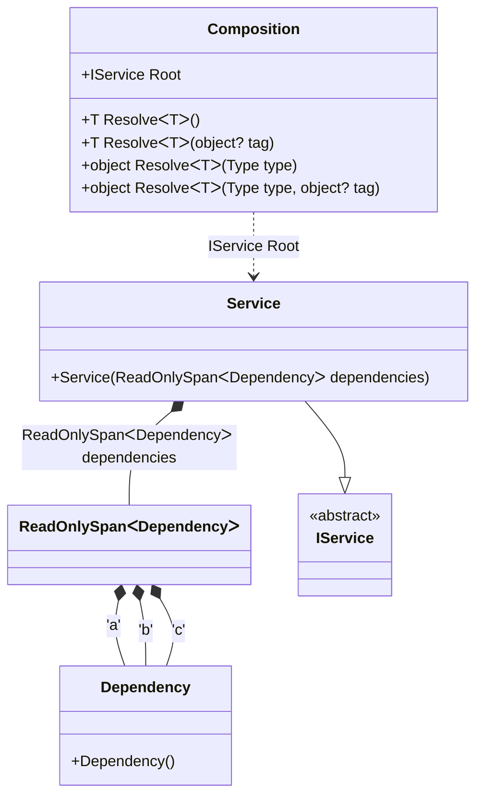

#### Span and ReadOnlySpan

[](../tests/Pure.DI.UsageTests/BaseClassLibrary/SpanScenario.cs)

Specifying `Span<T>` and `ReadOnlySpan<T>` work the same as with the array `T[]`.

```c#
internal struct Dependency
{
}

internal interface IService
{
    int Count { get; }
}

internal class Service : IService
{
    public Service(ReadOnlySpan<Dependency> dependencies)
    {
        Count = dependencies.Length;
    }

    public int Count { get; }
}

DI.Setup("Composition")
    .Bind<Dependency>('a').To<Dependency>()
    .Bind<Dependency>('b').To<Dependency>()
    .Bind<Dependency>('c').To<Dependency>()
    .Bind<IService>().To<Service>()
    .Root<IService>("Root");

var composition = new Composition();
var service = composition.Root;
service.Count.ShouldBe(3);
```

<details open>
<summary>Class Diagram</summary>



</details>

<details>
<summary>Generated Code</summary>

```c#
partial class Composition
{
  public Composition()
  {
  }
  
  internal Composition(Composition parent)
  {
  }
  
  #region Composition Roots
  public Pure.DI.UsageTests.BCL.SpanScenario.IService Root
  {
    [global::System.Runtime.CompilerServices.MethodImpl((global::System.Runtime.CompilerServices.MethodImplOptions)0x300)]
    get
    {
      Pure.DI.UsageTests.BCL.SpanScenario.Dependency v25Local882EFC = new Pure.DI.UsageTests.BCL.SpanScenario.Dependency();
      Pure.DI.UsageTests.BCL.SpanScenario.Dependency v26Local882EFC = new Pure.DI.UsageTests.BCL.SpanScenario.Dependency();
      Pure.DI.UsageTests.BCL.SpanScenario.Dependency v27Local882EFC = new Pure.DI.UsageTests.BCL.SpanScenario.Dependency();
      System.ReadOnlySpan<Pure.DI.UsageTests.BCL.SpanScenario.Dependency> v24Local882EFC = stackalloc Pure.DI.UsageTests.BCL.SpanScenario.Dependency[3] { v25Local882EFC, v26Local882EFC, v27Local882EFC };
      Pure.DI.UsageTests.BCL.SpanScenario.Service v23Local882EFC = new Pure.DI.UsageTests.BCL.SpanScenario.Service(v24Local882EFC);
      return v23Local882EFC;
    }
  }
  #endregion
  
  #region API
  #if NETSTANDARD2_0_OR_GREATER || NETCOREAPP || NET40_OR_GREATER
  [global::System.Diagnostics.Contracts.Pure]
  #endif
  [global::System.Runtime.CompilerServices.MethodImpl((global::System.Runtime.CompilerServices.MethodImplOptions)0x300)]
  public T Resolve<T>()
  {
    return Resolver882EFC<T>.Value.Resolve(this);
  }
  
  #if NETSTANDARD2_0_OR_GREATER || NETCOREAPP || NET40_OR_GREATER
  [global::System.Diagnostics.Contracts.Pure]
  #endif
  [global::System.Runtime.CompilerServices.MethodImpl((global::System.Runtime.CompilerServices.MethodImplOptions)0x300)]
  public T Resolve<T>(object? tag)
  {
    return Resolver882EFC<T>.Value.ResolveByTag(this, tag);
  }
  
  #if NETSTANDARD2_0_OR_GREATER || NETCOREAPP || NET40_OR_GREATER
  [global::System.Diagnostics.Contracts.Pure]
  #endif
  [global::System.Runtime.CompilerServices.MethodImpl((global::System.Runtime.CompilerServices.MethodImplOptions)0x300)]
  public object Resolve(global::System.Type type)
  {
    int index = (int)(_bucketSize882EFC * ((uint)global::System.Runtime.CompilerServices.RuntimeHelpers.GetHashCode(type) % 1));
    ref var pair = ref _buckets882EFC[index];
    if (ReferenceEquals(pair.Key, type))
    {
      return pair.Value.Resolve(this);
    }
    
    int maxIndex = index + _bucketSize882EFC;
    for (int i = index + 1; i < maxIndex; i++)
    {
      pair = ref _buckets882EFC[i];
      if (ReferenceEquals(pair.Key, type))
      {
        return pair.Value.Resolve(this);
      }
    }
    
    throw new global::System.InvalidOperationException($"Cannot resolve composition root of type {type}.");
  }
  
  #if NETSTANDARD2_0_OR_GREATER || NETCOREAPP || NET40_OR_GREATER
  [global::System.Diagnostics.Contracts.Pure]
  #endif
  [global::System.Runtime.CompilerServices.MethodImpl((global::System.Runtime.CompilerServices.MethodImplOptions)0x300)]
  public object Resolve(global::System.Type type, object? tag)
  {
    int index = (int)(_bucketSize882EFC * ((uint)global::System.Runtime.CompilerServices.RuntimeHelpers.GetHashCode(type) % 1));
    ref var pair = ref _buckets882EFC[index];
    if (ReferenceEquals(pair.Key, type))
    {
      return pair.Value.ResolveByTag(this, tag);
    }
    
    int maxIndex = index + _bucketSize882EFC;
    for (int i = index + 1; i < maxIndex; i++)
    {
      pair = ref _buckets882EFC[i];
      if (ReferenceEquals(pair.Key, type))
      {
        return pair.Value.ResolveByTag(this, tag);
      }
    }
    
    throw new global::System.InvalidOperationException($"Cannot resolve composition root of type {type}.");
  }
  
  #endregion
  
  public override string ToString()
  {
    return
      "classDiagram\n" +
        "  class Composition {\n" +
          "    +IService Root\n" +
          "    +T ResolveᐸTᐳ()\n" +
          "    +T ResolveᐸTᐳ(object? tag)\n" +
          "    +object ResolveᐸTᐳ(Type type)\n" +
          "    +object ResolveᐸTᐳ(Type type, object? tag)\n" +
        "  }\n" +
        "  class ReadOnlySpanᐸDependencyᐳ\n" +
        "  Service --|> IService : \n" +
        "  class Service {\n" +
          "    +Service(ReadOnlySpanᐸDependencyᐳ dependencies)\n" +
        "  }\n" +
        "  class Dependency {\n" +
          "    +Dependency()\n" +
        "  }\n" +
        "  class IService {\n" +
          "    <<abstract>>\n" +
        "  }\n" +
        "  ReadOnlySpanᐸDependencyᐳ *--  Dependency : 'a'  \n" +
        "  ReadOnlySpanᐸDependencyᐳ *--  Dependency : 'b'  \n" +
        "  ReadOnlySpanᐸDependencyᐳ *--  Dependency : 'c'  \n" +
        "  Service *--  ReadOnlySpanᐸDependencyᐳ : ReadOnlySpanᐸDependencyᐳ dependencies\n" +
        "  Composition ..> Service : IService Root";
  }
  
  private readonly static int _bucketSize882EFC;
  private readonly static global::Pure.DI.Pair<global::System.Type, global::Pure.DI.IResolver<Composition, object>>[] _buckets882EFC;
  
  static Composition()
  {
    Resolver882EFC0 valResolver882EFC0 = new Resolver882EFC0();
    Resolver882EFC<Pure.DI.UsageTests.BCL.SpanScenario.IService>.Value = valResolver882EFC0;
    _buckets882EFC = global::Pure.DI.Buckets<global::System.Type, global::Pure.DI.IResolver<Composition, object>>.Create(
      1,
      out _bucketSize882EFC,
      new global::Pure.DI.Pair<global::System.Type, global::Pure.DI.IResolver<Composition, object>>[1]
      {
         new global::Pure.DI.Pair<global::System.Type, global::Pure.DI.IResolver<Composition, object>>(typeof(Pure.DI.UsageTests.BCL.SpanScenario.IService), valResolver882EFC0)
      });
  }
  
  #region Resolvers
  #pragma warning disable CS0649
  private class Resolver882EFC<T>
  {
    public static global::Pure.DI.IResolver<Composition, T> Value;
  }
  
  private sealed class Resolver882EFC0: global::Pure.DI.IResolver<Composition, Pure.DI.UsageTests.BCL.SpanScenario.IService>
  {
    [global::System.Runtime.CompilerServices.MethodImpl((global::System.Runtime.CompilerServices.MethodImplOptions)0x300)]
    public Pure.DI.UsageTests.BCL.SpanScenario.IService Resolve(Composition composition)
    {
      return composition.Root;
    }
    
    [global::System.Runtime.CompilerServices.MethodImpl((global::System.Runtime.CompilerServices.MethodImplOptions)0x300)]
    public Pure.DI.UsageTests.BCL.SpanScenario.IService ResolveByTag(Composition composition, object tag)
    {
      if (Equals(tag, null)) return composition.Root;
      throw new global::System.InvalidOperationException($"Cannot resolve composition root \"{tag}\" of type Pure.DI.UsageTests.BCL.SpanScenario.IService.");
    }
  }
  #pragma warning restore CS0649
  #endregion
}
```

</details>


This scenario is even more efficient in the case of `Span<T>` or `ReadOnlySpan<T>` when `T` is a value type. In this case, there is no heap allocation, and the composition root `IService` looks like this:
```c#
public IService Root
{
  get
  {
    ReadOnlySpan<Dependency> dependencies = stackalloc Dependency[3] { new Dependency(), new Dependency(), new Dependency() };
    return new Service(dependencies);
  }
}
```
