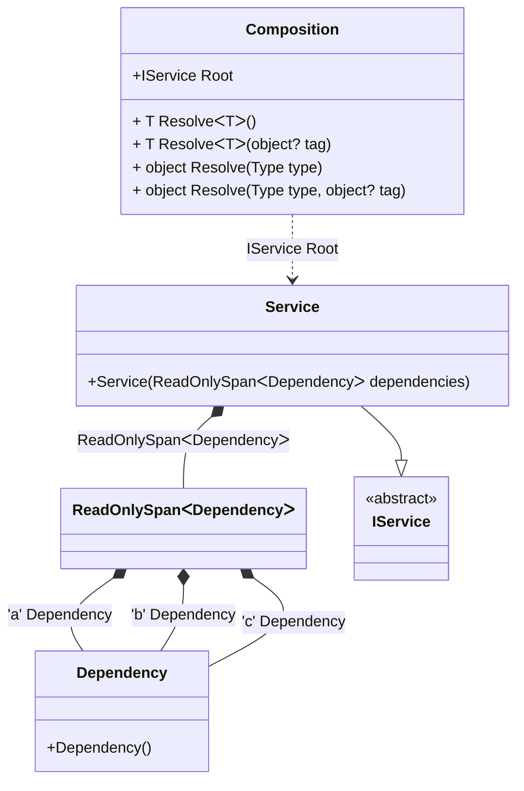

#### Span and ReadOnlySpan

[](../tests/Pure.DI.UsageTests/BaseClassLibrary/SpanScenario.cs)

Specifying `Span<T>` and `ReadOnlySpan<T>` work the same as with the array `T[]`.

```c#
struct Dependency
{
}

interface IService
{
    int Count { get; }
}

class Service : IService
{
    public Service(ReadOnlySpan<Dependency> dependencies) =>
        Count = dependencies.Length;

    public int Count { get; }
}

DI.Setup("Composition")
    .Bind<Dependency>('a').To<Dependency>()
    .Bind<Dependency>('b').To<Dependency>()
    .Bind<Dependency>('c').To<Dependency>()
    .Bind<IService>().To<Service>().Root<IService>("Root");

var composition = new Composition();
var service = composition.Root;
service.Count.ShouldBe(3);
```

<details open>
<summary>Class Diagram</summary>



</details>

<details>
<summary>Pure.DI-generated partial class Composition</summary><blockquote>

```c#
partial class Composition
{
  private readonly global::System.IDisposable[] _disposableSingletonsM10D06di;
  
  public Composition()
  {
    _disposableSingletonsM10D06di = new global::System.IDisposable[0];
  }
  
  internal Composition(Composition parent)
  {
    _disposableSingletonsM10D06di = new global::System.IDisposable[0];
  }
  
  #region Composition Roots
  public Pure.DI.UsageTests.BCL.SpanScenario.IService Root
  {
    [global::System.Runtime.CompilerServices.MethodImpl((global::System.Runtime.CompilerServices.MethodImplOptions)0x300)]
    get
    {
      var transientM10D06di4 = new Pure.DI.UsageTests.BCL.SpanScenario.Dependency();
      var transientM10D06di3 = new Pure.DI.UsageTests.BCL.SpanScenario.Dependency();
      var transientM10D06di2 = new Pure.DI.UsageTests.BCL.SpanScenario.Dependency();
      System.ReadOnlySpan<Pure.DI.UsageTests.BCL.SpanScenario.Dependency> transientM10D06di1 = stackalloc Pure.DI.UsageTests.BCL.SpanScenario.Dependency[3]
      {
          transientM10D06di2,
          transientM10D06di3,
          transientM10D06di4
      };
      var transientM10D06di0 = new Pure.DI.UsageTests.BCL.SpanScenario.Service(transientM10D06di1);
      return transientM10D06di0;
    }
  }
  #endregion
  
  #region API
  #if NETSTANDARD2_0_OR_GREATER || NETCOREAPP || NET40_OR_GREATER
  [global::System.Diagnostics.Contracts.Pure]
  #endif
  [global::System.Runtime.CompilerServices.MethodImpl((global::System.Runtime.CompilerServices.MethodImplOptions)0x300)]
  public T Resolve<T>()
  {
    return ResolverM10D06di<T>.Value.Resolve(this);
  }
  
  #if NETSTANDARD2_0_OR_GREATER || NETCOREAPP || NET40_OR_GREATER
  [global::System.Diagnostics.Contracts.Pure]
  #endif
  [global::System.Runtime.CompilerServices.MethodImpl((global::System.Runtime.CompilerServices.MethodImplOptions)0x300)]
  public T Resolve<T>(object? tag)
  {
    return ResolverM10D06di<T>.Value.ResolveByTag(this, tag);
  }
  
  #if NETSTANDARD2_0_OR_GREATER || NETCOREAPP || NET40_OR_GREATER
  [global::System.Diagnostics.Contracts.Pure]
  #endif
  [global::System.Runtime.CompilerServices.MethodImpl((global::System.Runtime.CompilerServices.MethodImplOptions)0x300)]
  public object Resolve(global::System.Type type)
  {
    var index = (int)(_bucketSizeM10D06di * ((uint)global::System.Runtime.CompilerServices.RuntimeHelpers.GetHashCode(type) % 1));
    var finish = index + _bucketSizeM10D06di;
    do {
      ref var pair = ref _bucketsM10D06di[index];
      if (ReferenceEquals(pair.Key, type))
      {
        return pair.Value.Resolve(this);
      }
    } while (++index < finish);
    
    throw new global::System.InvalidOperationException($"Cannot resolve composition root of type {type}.");
  }
  
  #if NETSTANDARD2_0_OR_GREATER || NETCOREAPP || NET40_OR_GREATER
  [global::System.Diagnostics.Contracts.Pure]
  #endif
  [global::System.Runtime.CompilerServices.MethodImpl((global::System.Runtime.CompilerServices.MethodImplOptions)0x300)]
  public object Resolve(global::System.Type type, object? tag)
  {
    var index = (int)(_bucketSizeM10D06di * ((uint)global::System.Runtime.CompilerServices.RuntimeHelpers.GetHashCode(type) % 1));
    var finish = index + _bucketSizeM10D06di;
    do {
      ref var pair = ref _bucketsM10D06di[index];
      if (ReferenceEquals(pair.Key, type))
      {
        return pair.Value.ResolveByTag(this, tag);
      }
    } while (++index < finish);
    
    throw new global::System.InvalidOperationException($"Cannot resolve composition root \"{tag}\" of type {type}.");
  }
  #endregion
  
  public override string ToString()
  {
    return
      "classDiagram\n" +
        "  class Composition {\n" +
          "    +IService Root\n" +
          "    + T ResolveᐸTᐳ()\n" +
          "    + T ResolveᐸTᐳ(object? tag)\n" +
          "    + object Resolve(Type type)\n" +
          "    + object Resolve(Type type, object? tag)\n" +
        "  }\n" +
        "  class ReadOnlySpanᐸDependencyᐳ\n" +
        "  Service --|> IService : \n" +
        "  class Service {\n" +
          "    +Service(ReadOnlySpanᐸDependencyᐳ dependencies)\n" +
        "  }\n" +
        "  class Dependency {\n" +
          "    +Dependency()\n" +
        "  }\n" +
        "  class IService {\n" +
          "    <<abstract>>\n" +
        "  }\n" +
        "  ReadOnlySpanᐸDependencyᐳ *--  Dependency : 'a'  Dependency\n" +
        "  ReadOnlySpanᐸDependencyᐳ *--  Dependency : 'b'  Dependency\n" +
        "  ReadOnlySpanᐸDependencyᐳ *--  Dependency : 'c'  Dependency\n" +
        "  Service *--  ReadOnlySpanᐸDependencyᐳ : ReadOnlySpanᐸDependencyᐳ\n" +
        "  Composition ..> Service : IService Root";
  }
  
  private readonly static int _bucketSizeM10D06di;
  private readonly static global::Pure.DI.Pair<global::System.Type, global::Pure.DI.IResolver<Composition, object>>[] _bucketsM10D06di;
  
  static Composition()
  {
    var valResolverM10D06di_0000 = new ResolverM10D06di_0000();
    ResolverM10D06di<Pure.DI.UsageTests.BCL.SpanScenario.IService>.Value = valResolverM10D06di_0000;
    _bucketsM10D06di = global::Pure.DI.Buckets<global::System.Type, global::Pure.DI.IResolver<Composition, object>>.Create(
      1,
      out _bucketSizeM10D06di,
      new global::Pure.DI.Pair<global::System.Type, global::Pure.DI.IResolver<Composition, object>>[1]
      {
         new global::Pure.DI.Pair<global::System.Type, global::Pure.DI.IResolver<Composition, object>>(typeof(Pure.DI.UsageTests.BCL.SpanScenario.IService), valResolverM10D06di_0000)
      });
  }
  
  #region Resolvers
  private sealed class ResolverM10D06di<T>: global::Pure.DI.IResolver<Composition, T>
  {
    public static global::Pure.DI.IResolver<Composition, T> Value = new ResolverM10D06di<T>();
    
    public T Resolve(Composition composite)
    {
      throw new global::System.InvalidOperationException($"Cannot resolve composition root of type {typeof(T)}.");
    }
    
    public T ResolveByTag(Composition composite, object tag)
    {
      throw new global::System.InvalidOperationException($"Cannot resolve composition root \"{tag}\" of type {typeof(T)}.");
    }
  }
  
  private sealed class ResolverM10D06di_0000: global::Pure.DI.IResolver<Composition, Pure.DI.UsageTests.BCL.SpanScenario.IService>
  {
    [global::System.Runtime.CompilerServices.MethodImpl((global::System.Runtime.CompilerServices.MethodImplOptions)0x300)]
    public Pure.DI.UsageTests.BCL.SpanScenario.IService Resolve(Composition composition)
    {
      return composition.Root;
    }
    
    [global::System.Runtime.CompilerServices.MethodImpl((global::System.Runtime.CompilerServices.MethodImplOptions)0x300)]
    public Pure.DI.UsageTests.BCL.SpanScenario.IService ResolveByTag(Composition composition, object tag)
    {
      if (Equals(tag, null)) return composition.Root;
      throw new global::System.InvalidOperationException($"Cannot resolve composition root \"{tag}\" of type Pure.DI.UsageTests.BCL.SpanScenario.IService.");
    }
  }
  #endregion
}
```

</blockquote></details>


This scenario is even more efficient in the case of `Span<T>` or `ReadOnlySpan<T>` when `T` is a value type. In this case, there is no heap allocation, and the composition root `IService` looks like this:
```c#
public IService Root
{
  get
  {
    ReadOnlySpan<Dependency> dependencies = stackalloc Dependency[3] { new Dependency(), new Dependency(), new Dependency() };
    return new Service(dependencies);
  }
}
```
