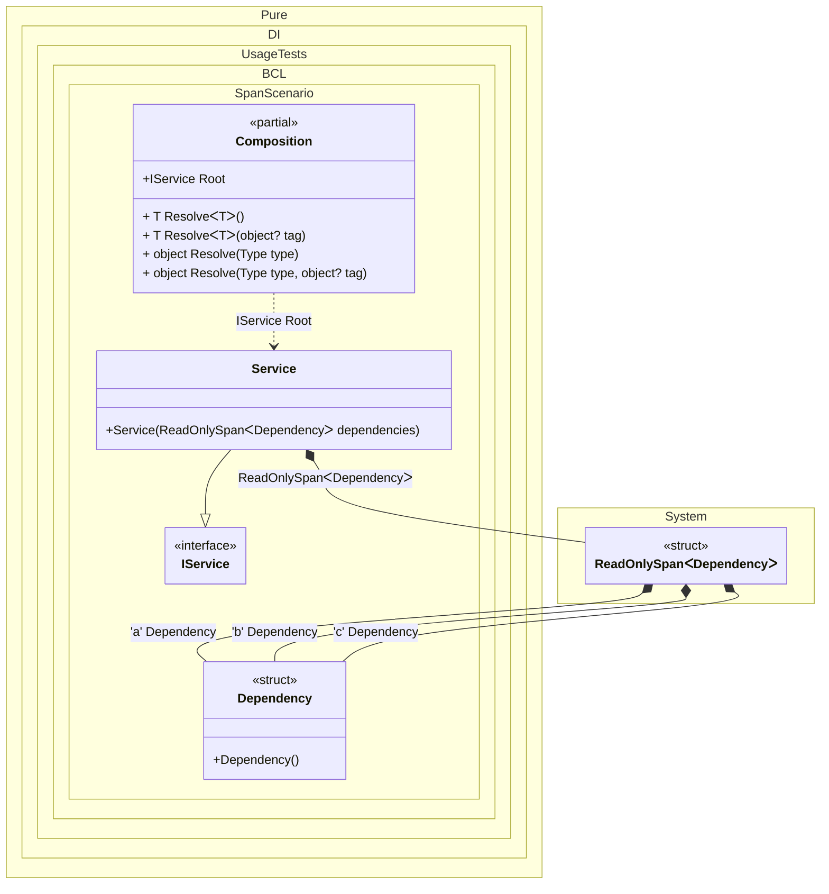

#### Span and ReadOnlySpan

[](../tests/Pure.DI.UsageTests/BaseClassLibrary/SpanScenario.cs)

Specifying `Span<T>` and `ReadOnlySpan<T>` work the same as with the array `T[]`.


```c#
using Shouldly;
using Pure.DI;

DI.Setup(nameof(Composition))
    .Bind<Dependency>('a').To<Dependency>()
    .Bind<Dependency>('b').To<Dependency>()
    .Bind<Dependency>('c').To<Dependency>()
    .Bind<IService>().To<Service>()

    // Composition root
    .Root<IService>("Root");

var composition = new Composition();
var service = composition.Root;
service.Count.ShouldBe(3);

struct Dependency;

interface IService
{
    int Count { get; }
}

class Service(ReadOnlySpan<Dependency> dependencies) : IService
{
    public int Count { get; } = dependencies.Length;
}
```

<details>
<summary>Running this code sample locally</summary>

- Make sure you have the [.NET SDK 9.0](https://dotnet.microsoft.com/en-us/download/dotnet/9.0) or later is installed
- Create a net9.0 (or later) console application
- Add references to NuGet packages
  - [Pure.DI](https://www.nuget.org/packages/Pure.DI)
  - [Shouldly](https://www.nuget.org/packages/Shouldly)
- Copy the example code into the _Program.cs_ file

You are ready to run the example!

</details>

This scenario is even more efficient in the case of `Span<T>` or `ReadOnlySpan<T>` when `T` is a value type. In this case, there is no heap allocation, and the composition root `IService` looks like this:
```c#
public IService Root
{
  get
  {
    ReadOnlySpan<Dependency> dependencies = stackalloc Dependency[3] { new Dependency(), new Dependency(), new Dependency() };
    return new Service(dependencies);
  }
}
```


Class diagram:



