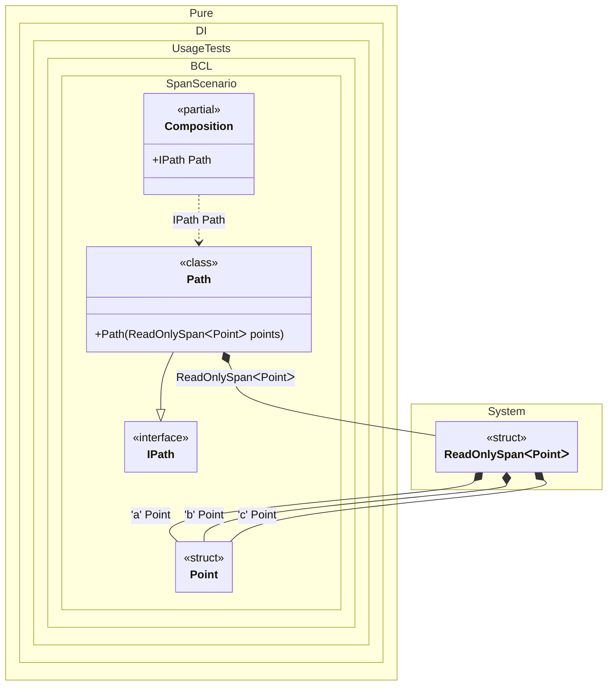

#### Span and ReadOnlySpan

Specifying `Span<T>` and `ReadOnlySpan<T>` work the same as with the array `T[]`.


```c#
using Shouldly;
using Pure.DI;

DI.Setup(nameof(Composition))
    .Bind<Point>('a').To(_ => new Point(1, 1))
    .Bind<Point>('b').To(_ => new Point(2, 2))
    .Bind<Point>('c').To(_ => new Point(3, 3))
    .Bind<IPath>().To<Path>()

    // Composition root
    .Root<IPath>("Path");

var composition = new Composition();
var path = composition.Path;
path.PointCount.ShouldBe(3);

readonly struct Point(int x, int y)
{
    public int X { get; } = x;

    public int Y { get; } = y;
}

interface IPath
{
    int PointCount { get; }
}

class Path(ReadOnlySpan<Point> points) : IPath
{
    // The 'points' span is allocated on the stack, so it's very efficient.
    // However, we cannot store it in a field because it's a ref struct.
    // We can process it here in the constructor.
    public int PointCount { get; } = points.Length;
}
```

<details>
<summary>Running this code sample locally</summary>

- Make sure you have the [.NET SDK 10.0](https://dotnet.microsoft.com/en-us/download/dotnet/10.0) or later is installed
```bash
dotnet --list-sdk
```
- Create a net10.0 (or later) console application
```bash
dotnet new console -n Sample
```
- Add references to NuGet packages
  - [Pure.DI](https://www.nuget.org/packages/Pure.DI)
  - [Shouldly](https://www.nuget.org/packages/Shouldly)
```bash
dotnet add package Pure.DI
dotnet add package Shouldly
```
- Copy the example code into the _Program.cs_ file

You are ready to run the example 🚀
```bash
dotnet run
```

</details>

This scenario is even more efficient in the case of `Span<T>` or `ReadOnlySpan<T>` when `T` is a value type. In this case, there is no heap allocation, and the composition root `IPath` looks like this:
```c#
public IPath Path
{
  get
  {
    ReadOnlySpan<Point> points = stackalloc Point[3] { new Point(1, 1), new Point(2, 2), new Point(3, 3) };
    return new Path(points);
  }
}
```

The following partial class will be generated:

```c#
partial class Composition
{
  [OrdinalAttribute(256)]
  public Composition()
  {
  }

  internal Composition(Composition parentScope)
  {
  }

  public IPath Path
  {
    [MethodImpl(MethodImplOptions.AggressiveInlining)]
    get
    {
      Point transientPoint2 = new Point(1, 1);
      Point transientPoint3 = new Point(2, 2);
      Point transientPoint4 = new Point(3, 3);
      return new Path(stackalloc Point[3] { transientPoint2, transientPoint3, transientPoint4 });
    }
  }
}
```

Class diagram:



