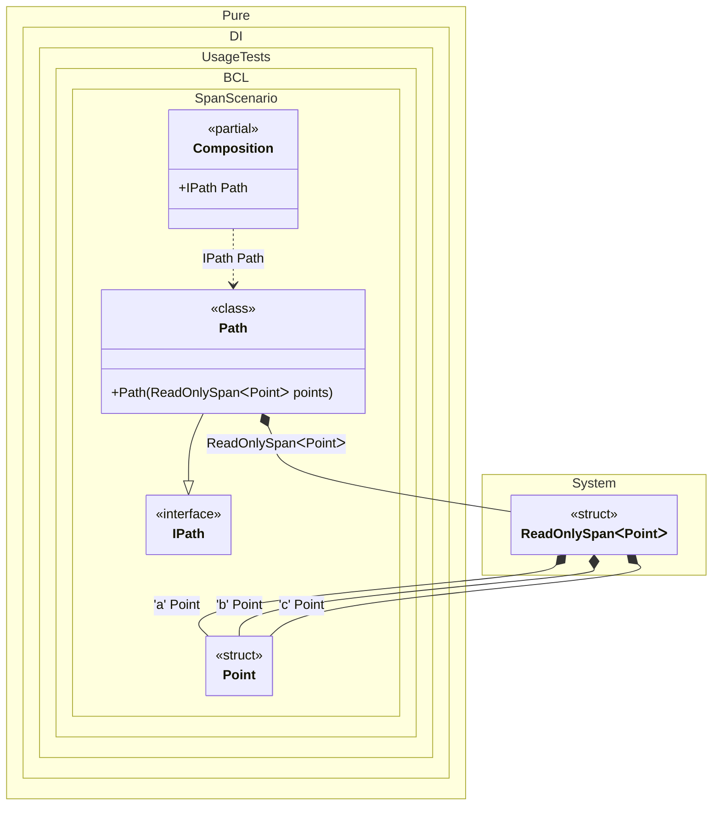

#### Span and ReadOnlySpan

Specifying `Span<T>` and `ReadOnlySpan<T>` work the same as with the array `T[]` for immediate constructor or method use.


```c#
using Shouldly;
using Pure.DI;

DI.Setup(nameof(Composition))
    .Bind<Point>('a').To(() => new Point(1, 1))
    .Bind<Point>('b').To(() => new Point(2, 2))
    .Bind<Point>('c').To(() => new Point(3, 3))
    .Bind<IPath>().To<Path>()

    // Composition root
    .Root<IPath>("Path");

var composition = new Composition();
var path = composition.Path;
path.PointCount.ShouldBe(3);

readonly struct Point(int x, int y)
{
    public int X { get; } = x;

    public int Y { get; } = y;
}

interface IPath
{
    int PointCount { get; }
}

class Path(ReadOnlySpan<Point> points) : IPath
{
    // The 'points' span is allocated on the stack, so it's very efficient.
    // However, we cannot store it in a field because it's a ref struct.
    // We can process it here in the constructor.
    public int PointCount { get; } = points.Length;
}
```

<details>
<summary>Running this code sample locally</summary>

- Make sure you have the [.NET SDK 10.0](https://dotnet.microsoft.com/en-us/download/dotnet/10.0) or later installed
```bash
dotnet --list-sdk
```
- Create a net10.0 (or later) console application
```bash
dotnet new console -n Sample
```
- Add references to the NuGet packages
  - [Pure.DI](https://www.nuget.org/packages/Pure.DI)
  - [Shouldly](https://www.nuget.org/packages/Shouldly)
```bash
dotnet add package Pure.DI
dotnet add package Shouldly
```
- Copy the example code into the _Program.cs_ file

You are ready to run the example 🚀
```bash
dotnet run
```

</details>

This scenario is even more efficient in the case of `Span<T>` or `ReadOnlySpan<T>` when `T` is a value type. In this case, there is no heap allocation, and the composition root `IPath` looks like this:
```c#
public IPath Path
{
  get
  {
    ReadOnlySpan<Point> points = stackalloc Point[3] { new Point(1, 1), new Point(2, 2), new Point(3, 3) };
    return new Path(points);
  }
}
```
Constructor injection into a heap type is available for compatibility and reports warning `DIW012`. Prefer method injection for new code when the stack-only value is only needed during initialization.
Generic root arguments with `where T : allows ref struct` follow the same rules. Pure.DI treats such `T` as maybe stack-only and emits `scoped T` in generated root signatures.
When a root has several arguments, `scoped` is applied only to arguments that are stack-only or maybe stack-only themselves. Heap-safe wrappers such as `Wrapper<T>` remain regular parameters even when `T` allows ref structs.
Factory bodies may resolve and consume stack-only values immediately via `ctx.Inject<T>(...)` when the API target supports `allows ref struct`. Pure.DI reports `DIE049` when such values are captured behind a generated delegate or deferred factory.
Generic interfaces are allowed when the implementation is heap-safe, for example `class Parser<T> : IParser<T>`. Pure.DI reports `DIE048` only when the implementation itself is stack-only, such as `ref struct Parser<T> : IParser<T>`.
Pure.DI reports errors when `Span<T>`, `ReadOnlySpan<T>`, or custom `ref struct` values are injected into fields, properties, stored lifetimes, delegate captures, or stack-only interface conversions.

<details>
<summary>The following partial class will be generated</summary>

```c#
partial class Composition
{
  public IPath Path
  {
    [MethodImpl(MethodImplOptions.AggressiveInlining)]
    get
    {
      Point transientPoint = new Point(1, 1);
      Point transientPoint1 = new Point(2, 2);
      Point transientPoint2 = new Point(3, 3);
      return new Path(stackalloc Point[3] { transientPoint, transientPoint1, transientPoint2 });
    }
  }
}
```

</details>

Class diagram:


```mermaid
---
 config:
  class:
   hideEmptyMembersBox: true
---
classDiagram
	Path --|> IPath
	Composition ..> Path : IPath Path
	Path *-- ReadOnlySpanᐸPointᐳ : ReadOnlySpanᐸPointᐳ
	ReadOnlySpanᐸPointᐳ *-- Point : 'a' Point
	ReadOnlySpanᐸPointᐳ *-- Point : 'b' Point
	ReadOnlySpanᐸPointᐳ *-- Point : 'c' Point
	namespace Pure.DI.UsageTests.BCL.SpanScenario {
		class Composition {
		<<partial>>
		+IPath Path
		}
		class IPath {
			<<interface>>
		}
		class Path {
				<<class>>
			+Path(ReadOnlySpanᐸPointᐳ points)
		}
		class Point {
				<<struct>>
		}
	}
	namespace System {
		class ReadOnlySpanᐸPointᐳ {
				<<struct>>
		}
	}
```

See also:

- [Array](array.md)

