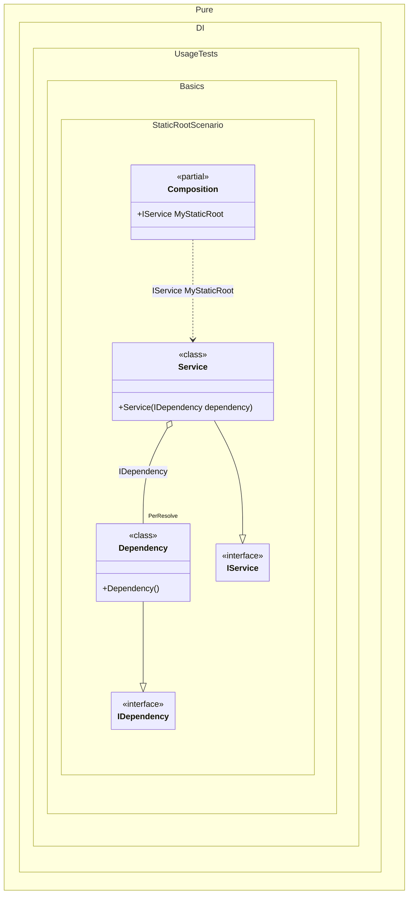

#### Static root


```c#
using Shouldly;
using Pure.DI;

DI.Setup(nameof(Composition))
    .Bind().As(Lifetime.PerResolve).To<Dependency>()
    .Bind().To<Service>()
    .Root<IService>("MyStaticRoot", kind: RootKinds.Static);

var root = Composition.MyStaticRoot;
root.ShouldBeOfType<Service>();

interface IDependency;

class Dependency : IDependency;

interface IService;

class Service(IDependency dependency) : IService;
```

<details>
<summary>Running this code sample locally</summary>

- Make sure you have the [.NET SDK 9.0](https://dotnet.microsoft.com/en-us/download/dotnet/9.0) or later is installed
```bash
dotnet --list-sdk
```
- Create a net9.0 (or later) console application
```bash
dotnet new console -n Sample
```
- Add references to NuGet packages
  - [Pure.DI](https://www.nuget.org/packages/Pure.DI)
  - [Shouldly](https://www.nuget.org/packages/Shouldly)
```bash
dotnet add package Pure.DI
dotnet add package Shouldly
```
- Copy the example code into the _Program.cs_ file

You are ready to run the example 🚀
```bash
dotnet run
```

</details>

The following partial class will be generated:

```c#
partial class Composition
{
  [OrdinalAttribute(256)]
  public Composition()
  {
  }

  internal Composition(Composition parentScope)
  {
  }

  public static IService MyStaticRoot
  {
    [MethodImpl(MethodImplOptions.AggressiveInlining)]
    get
    {
      #if NET9_0_OR_GREATER
      var perResolveLock = new Lock();
      #else
      var perResolveLock = new Object();
      #endif
      var perResolveDependency1 = default(Dependency);
      if (perResolveDependency1 is null)
        lock (perResolveLock)
          if (perResolveDependency1 is null)
          {
            perResolveDependency1 = new Dependency();
          }

      return new Service(perResolveDependency1);
    }
  }
}
```

Class diagram:



