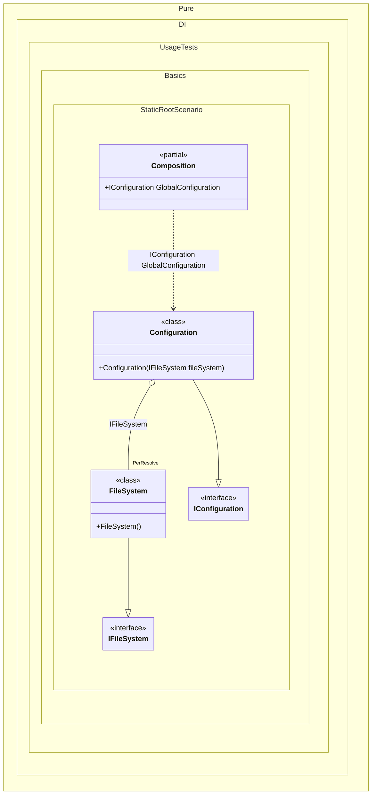

#### Static root

Passing `kind: RootKinds.Static` to `Root<T>(...)` makes the generated root a static member, so an instance can be obtained directly from the composition type — `Composition.GlobalConfiguration` — without creating a composition object.
This comes in handy at application entry points or in code that has no composition instance to hand.


```c#
using Shouldly;
using Pure.DI;

DI.Setup(nameof(Composition))
    .Bind().As(Lifetime.PerResolve).To<FileSystem>()
    .Bind().To<Configuration>()
    .Root<IConfiguration>("GlobalConfiguration", kind: RootKinds.Static);

var configuration = Composition.GlobalConfiguration;
configuration.ShouldBeOfType<Configuration>();

interface IFileSystem;

class FileSystem : IFileSystem;

interface IConfiguration;

class Configuration(IFileSystem fileSystem) : IConfiguration;
```

<details>
<summary>Running this code sample locally</summary>

- Make sure you have the [.NET SDK 10.0](https://dotnet.microsoft.com/en-us/download/dotnet/10.0) or later installed
```bash
dotnet --list-sdk
```
- Create a net10.0 (or later) console application
```bash
dotnet new console -n Sample
```
- Add references to the NuGet packages
  - [Pure.DI](https://www.nuget.org/packages/Pure.DI)
  - [Shouldly](https://www.nuget.org/packages/Shouldly)
```bash
dotnet add package Pure.DI
dotnet add package Shouldly
```
- Copy the example code into the _Program.cs_ file

You are ready to run the example 🚀
```bash
dotnet run
```

</details>

>[!NOTE]
>Static roots are useful when you want to access services without creating a composition instance.

<details>
<summary>The following partial class will be generated</summary>

```c#
partial class Composition
{
  public static IConfiguration GlobalConfiguration
  {
    [MethodImpl(MethodImplOptions.AggressiveInlining)]
    get
    {
      #if NET9_0_OR_GREATER
      var perResolveLock = new Lock();
      #else
      var perResolveLock = new Object();
      #endif
      var perResolveFileSystem = default(FileSystem);
      if (perResolveFileSystem is null)
        lock (perResolveLock)
          if (perResolveFileSystem is null)
          {
            perResolveFileSystem = new FileSystem();
          }

      return new Configuration(perResolveFileSystem);
    }
  }
}
```

</details>

Class diagram:


```mermaid
---
 config:
  class:
   hideEmptyMembersBox: true
---
classDiagram
	FileSystem --|> IFileSystem
	Configuration --|> IConfiguration
	Composition ..> Configuration : IConfiguration GlobalConfiguration
	Configuration o-- "PerResolve" FileSystem : IFileSystem
	namespace Pure.DI.UsageTests.Basics.StaticRootScenario {
		class Composition {
		<<partial>>
		+IConfiguration GlobalConfiguration
		}
		class Configuration {
				<<class>>
			+Configuration(IFileSystem fileSystem)
		}
		class FileSystem {
				<<class>>
			+FileSystem()
		}
		class IConfiguration {
			<<interface>>
		}
		class IFileSystem {
			<<interface>>
		}
	}
```

See also:

- [Composition root kinds](composition-root-kinds.md)

