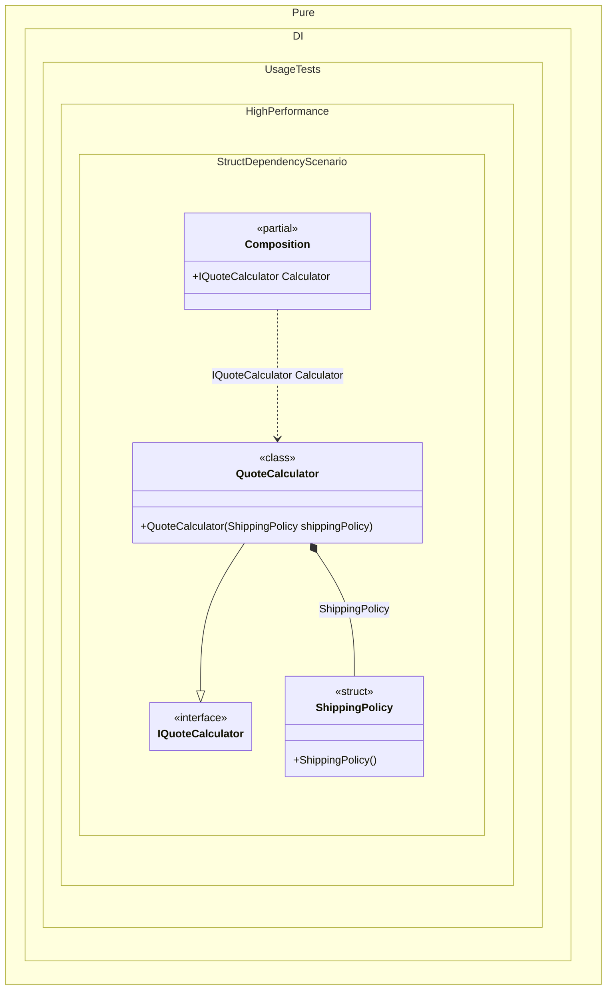

#### Struct dependency

Small immutable value-type services are useful on hot paths where the dependency represents a policy, a formatter, or a calculator with no identity and no shared mutable state. Pure.DI can compose those values directly, so consumers receive a strongly typed value without runtime lookup.
This example uses a `readonly struct` shipping-price policy in a checkout quote calculator. The policy is cheap to copy, deterministic, and has no lifetime state, which makes it a good fit for value semantics.


```c#
using Shouldly;
using Pure.DI;

DI.Setup(nameof(Composition))
    .Bind().To<ShippingPolicy>()
    .Bind<IQuoteCalculator>().To<QuoteCalculator>()
    .Root<IQuoteCalculator>("Calculator");

var composition = new Composition();
var calculator = composition.Calculator;

calculator.GetTotal(new Cart(120m, 2.5m)).ShouldBe(125.99m);

readonly record struct Cart(decimal Subtotal, decimal WeightKg);

readonly struct ShippingPolicy
{
    public decimal Calculate(decimal weightKg) =>
        weightKg <= 1m ? 2.99m : 5.99m;
}

interface IQuoteCalculator
{
    decimal GetTotal(Cart cart);
}

sealed class QuoteCalculator(ShippingPolicy shippingPolicy) : IQuoteCalculator
{
    public decimal GetTotal(Cart cart) =>
        cart.Subtotal + shippingPolicy.Calculate(cart.WeightKg);
}
```

<details>
<summary>Running this code sample locally</summary>

- Make sure you have the [.NET SDK 10.0](https://dotnet.microsoft.com/en-us/download/dotnet/10.0) or later installed
```bash
dotnet --list-sdk
```
- Create a net10.0 (or later) console application
```bash
dotnet new console -n Sample
```
- Add references to the NuGet packages
  - [Pure.DI](https://www.nuget.org/packages/Pure.DI)
  - [Shouldly](https://www.nuget.org/packages/Shouldly)
```bash
dotnet add package Pure.DI
dotnet add package Shouldly
```
- Copy the example code into the _Program.cs_ file

You are ready to run the example 🚀
```bash
dotnet run
```

</details>

Prefer this pattern for tiny stateless rules and calculations. Do not turn large mutable objects into structs just to avoid allocation; copying a large struct can be more expensive than allocating one object. Keep value-type services small, immutable, and obvious.

<details>
<summary>The following partial class will be generated</summary>

```c#
partial class Composition
{
  public IQuoteCalculator Calculator
  {
    [MethodImpl(MethodImplOptions.AggressiveInlining)]
    get
    {
      return new QuoteCalculator(new ShippingPolicy());
    }
  }
}
```

</details>

Class diagram:



See also:

- [Span and ReadOnlySpan](span-and-readonlyspan.md)
- [Default Func with ReadOnlySpan](default-func-with-readonlyspan.md)

