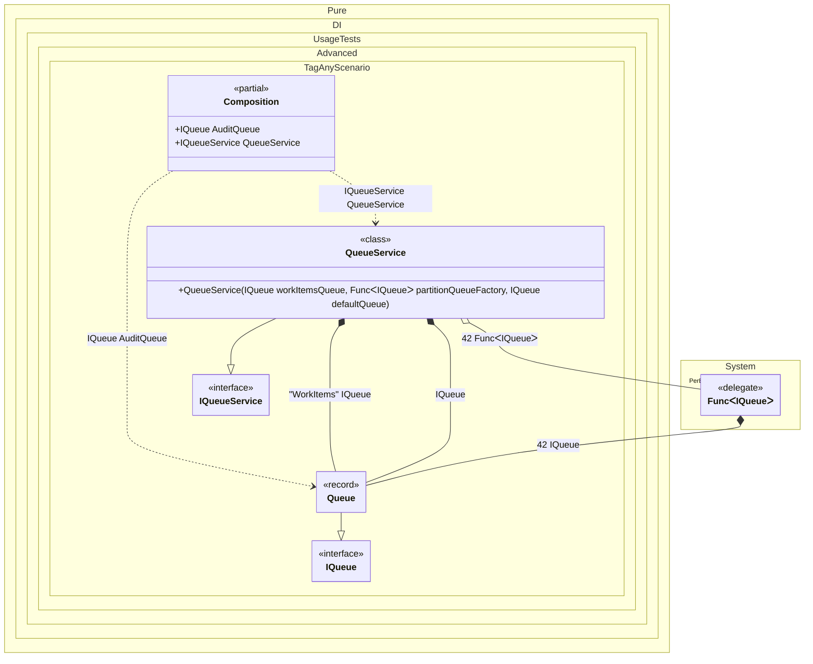

#### Tag Any


```c#
using Shouldly;
using Pure.DI;

DI.Setup(nameof(Composition))
    // Binds IQueue to the Queue implementation.
    // Tag.Any creates a binding that matches any tag (including null),
    // allowing the specific tag value to be used within the factory (ctx.Tag).
    .Bind<IQueue>(Tag.Any).To(ctx => new Queue(ctx.Tag))
    .Bind<IQueueService>().To<QueueService>()

    // Composition root
    .Root<IQueueService>("QueueService")

    // Root by Tag.Any: Resolves IQueue with the tag "Audit"
    .Root<IQueue>("AuditQueue", "Audit");

var composition = new Composition();
var queueService = composition.QueueService;

queueService.WorkItemsQueue.Id.ShouldBe("WorkItems");
queueService.PartitionQueue.Id.ShouldBe(42);
queueService.DefaultQueue.Id.ShouldBeNull();
composition.AuditQueue.Id.ShouldBe("Audit");

interface IQueue
{
    object? Id { get; }
}

record Queue(object? Id) : IQueue;

interface IQueueService
{
    IQueue WorkItemsQueue { get; }

    IQueue PartitionQueue { get; }

    IQueue DefaultQueue { get; }
}

class QueueService(
    // Injects IQueue tagged with "WorkItems"
    [Tag("WorkItems")] IQueue workItemsQueue,
    // Injects IQueue tagged with integer 42
    [Tag(42)] Func<IQueue> partitionQueueFactory,
    // Injects IQueue with the default (null) tag
    IQueue defaultQueue)
    : IQueueService
{
    public IQueue WorkItemsQueue { get; } = workItemsQueue;

    public IQueue PartitionQueue { get; } = partitionQueueFactory();

    public IQueue DefaultQueue { get; } = defaultQueue;
}
```

<details>
<summary>Running this code sample locally</summary>

- Make sure you have the [.NET SDK 10.0](https://dotnet.microsoft.com/en-us/download/dotnet/10.0) or later is installed
```bash
dotnet --list-sdk
```
- Create a net10.0 (or later) console application
```bash
dotnet new console -n Sample
```
- Add references to NuGet packages
  - [Pure.DI](https://www.nuget.org/packages/Pure.DI)
  - [Shouldly](https://www.nuget.org/packages/Shouldly)
```bash
dotnet add package Pure.DI
dotnet add package Shouldly
```
- Copy the example code into the _Program.cs_ file

You are ready to run the example 🚀
```bash
dotnet run
```

</details>

The following partial class will be generated:

```c#
partial class Composition
{
  [OrdinalAttribute(256)]
  public Composition()
  {
  }

  internal Composition(Composition parentScope)
  {
  }

  public IQueue AuditQueue
  {
    [MethodImpl(MethodImplOptions.AggressiveInlining)]
    get
    {
      Queue transientQueue = new Queue("Audit");
      return transientQueue;
    }
  }

  public IQueueService QueueService
  {
    [MethodImpl(MethodImplOptions.AggressiveInlining)]
    get
    {
      Queue transientQueue2 = new Queue("WorkItems");
      Queue transientQueue4 = new Queue(null);
      Func<IQueue> transientFunc3 = new Func<IQueue>(
      [MethodImpl(MethodImplOptions.AggressiveInlining)]
      () =>
      {
        Queue transientQueue5 = new Queue(42);
        IQueue localValue = transientQueue5;
        return localValue;
      });
      return new QueueService(transientQueue2, transientFunc3, transientQueue4);
    }
  }
}
```

Class diagram:



