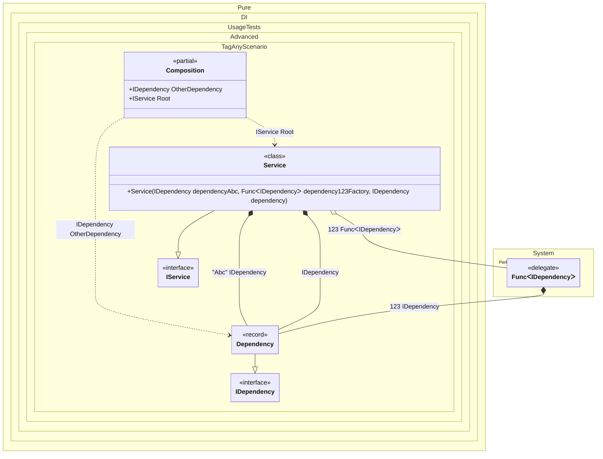

#### Tag Any


```c#
using Shouldly;
using Pure.DI;

DI.Setup(nameof(Composition))
    .Bind<IDependency>(Tag.Any).To(ctx => new Dependency(ctx.Tag))
    .Bind<IService>().To<Service>()

    // Composition root
    .Root<IService>("Root")

    // Root by Tag.Any
    .Root<IDependency>("OtherDependency", "Other");

var composition = new Composition();
var service = composition.Root;
service.Dependency1.Key.ShouldBe("Abc");
service.Dependency2.Key.ShouldBe(123);
service.Dependency3.Key.ShouldBeNull();
composition.OtherDependency.Key.ShouldBe("Other");

interface IDependency
{
    object? Key { get; }
}

record Dependency(object? Key) : IDependency;

interface IService
{
    IDependency Dependency1 { get; }

    IDependency Dependency2 { get; }

    IDependency Dependency3 { get; }
}

class Service(
    [Tag("Abc")] IDependency dependencyAbc,
    [Tag(123)] Func<IDependency> dependency123Factory,
    IDependency dependency)
    : IService
{
    public IDependency Dependency1 { get; } = dependencyAbc;

    public IDependency Dependency2 { get; } = dependency123Factory();

    public IDependency Dependency3 { get; } = dependency;
}
```

<details>
<summary>Running this code sample locally</summary>

- Make sure you have the [.NET SDK 9.0](https://dotnet.microsoft.com/en-us/download/dotnet/9.0) or later is installed
```bash
dotnet --list-sdk
```
- Create a net9.0 (or later) console application
```bash
dotnet new console -n Sample
```
- Add references to NuGet packages
  - [Pure.DI](https://www.nuget.org/packages/Pure.DI)
  - [Shouldly](https://www.nuget.org/packages/Shouldly)
```bash
dotnet add package Pure.DI
dotnet add package Shouldly
```
- Copy the example code into the _Program.cs_ file

You are ready to run the example 🚀
```bash
dotnet run
```

</details>

The following partial class will be generated:

```c#
partial class Composition
{
  private readonly Composition _root;

  [OrdinalAttribute(256)]
  public Composition()
  {
    _root = this;
  }

  internal Composition(Composition parentScope)
  {
    _root = (parentScope ?? throw new ArgumentNullException(nameof(parentScope)))._root;
  }

  public IDependency OtherDependency
  {
    [MethodImpl(MethodImplOptions.AggressiveInlining)]
    get
    {
      Dependency transientDependency0 = new Dependency("Other");
      return transientDependency0;
    }
  }

  public IService Root
  {
    [MethodImpl(MethodImplOptions.AggressiveInlining)]
    get
    {
      Dependency transientDependency2 = new Dependency("Abc");
      Dependency transientDependency4 = new Dependency(null);
      Func<IDependency> perBlockFunc3 = new Func<IDependency>(
      [MethodImpl(MethodImplOptions.AggressiveInlining)]
      () =>
      {
        Dependency transientDependency5 = new Dependency(123);
        IDependency localValue51 = transientDependency5;
        return localValue51;
      });
      return new Service(transientDependency2, perBlockFunc3, transientDependency4);
    }
  }
}
```

Class diagram:



