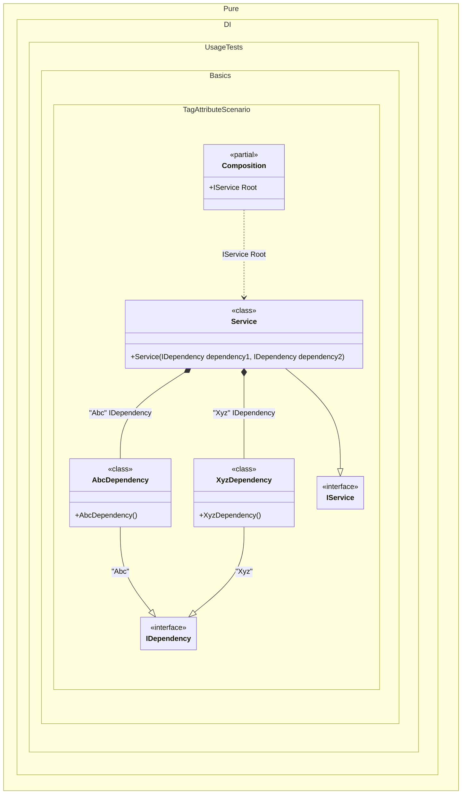

#### Tag attribute

Sometimes it's important to take control of building a dependency graph. For example, when there are multiple implementations of the same contract. In this case, _tags_ will help:


```c#
using Shouldly;
using Pure.DI;

DI.Setup(nameof(Composition))
    .Bind("Abc").To<AbcDependency>()
    .Bind("Xyz").To<XyzDependency>()
    .Bind().To<Service>()

    // Composition root
    .Root<IService>("Root");

var composition = new Composition();
var service = composition.Root;
service.Dependency1.ShouldBeOfType<AbcDependency>();
service.Dependency2.ShouldBeOfType<XyzDependency>();

interface IDependency;

class AbcDependency : IDependency;

class XyzDependency : IDependency;

class Dependency : IDependency;

interface IService
{
    IDependency Dependency1 { get; }

    IDependency Dependency2 { get; }
}

class Service(
    [Tag("Abc")] IDependency dependency1,
    [Tag("Xyz")] IDependency dependency2)
    : IService
{
    public IDependency Dependency1 { get; } = dependency1;

    public IDependency Dependency2 { get; } = dependency2;
}
```

<details>
<summary>Running this code sample locally</summary>

- Make sure you have the [.NET SDK 9.0](https://dotnet.microsoft.com/en-us/download/dotnet/9.0) or later is installed
```bash
dotnet --list-sdk
```
- Create a net9.0 (or later) console application
```bash
dotnet new console -n Sample
```
- Add references to NuGet packages
  - [Pure.DI](https://www.nuget.org/packages/Pure.DI)
  - [Shouldly](https://www.nuget.org/packages/Shouldly)
```bash
dotnet add package Pure.DI
dotnet add package Shouldly
```
- Copy the example code into the _Program.cs_ file

You are ready to run the example 🚀
```bash
dotnet run
```

</details>

The tag can be a constant, a type, a [smart tag](smart-tags.md), or a value of an `Enum` type. This attribute is part of the API, but you can use your own attribute at any time, and this allows you to define them in the assembly and namespace you want.

The following partial class will be generated:

```c#
partial class Composition
{
  [OrdinalAttribute(256)]
  public Composition()
  {
  }

  internal Composition(Composition parentScope)
  {
  }

  public IService Root
  {
    [MethodImpl(MethodImplOptions.AggressiveInlining)]
    get
    {
      return new Service(new AbcDependency(), new XyzDependency());
    }
  }
}
```

Class diagram:



