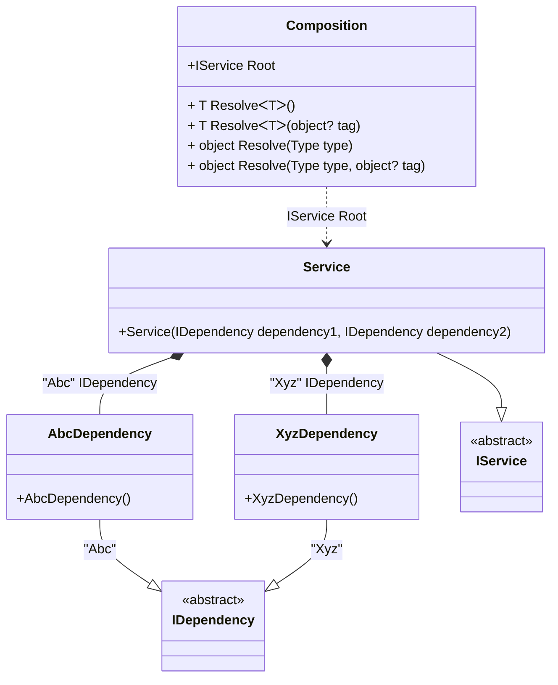

#### Tag attribute

[](../tests/Pure.DI.UsageTests/Attributes/TagAttributeScenario.cs)

Sometimes it's important to take control of building a dependency graph. For example, when there are multiple implementations of the same contract. In this case, _tags_ will help:

```c#
interface IDependency;

class AbcDependency : IDependency;

class XyzDependency : IDependency;

class Dependency : IDependency;

interface IService
{
    IDependency Dependency1 { get; }

    IDependency Dependency2 { get; }
}

class Service(
    [Tag("Abc")] IDependency dependency1,
    [Tag("Xyz")] IDependency dependency2)
    : IService
{
    public IDependency Dependency1 { get; } = dependency1;

    public IDependency Dependency2 { get; } = dependency2;
}

DI.Setup(nameof(Composition))
    .Bind<IDependency>("Abc").To<AbcDependency>()
    .Bind<IDependency>("Xyz").To<XyzDependency>()
    .Bind<IService>().To<Service>()

    // Composition root
    .Root<IService>("Root");

var composition = new Composition();
var service = composition.Root;
service.Dependency1.ShouldBeOfType<AbcDependency>();
service.Dependency2.ShouldBeOfType<XyzDependency>();
```

The tag can be a constant, a type, or a value of an enumerated type. This attribute is part of the API, but you can use your own attribute at any time, and this allows you to define them in the assembly and namespace you want.

<details open>
<summary>Class Diagram</summary>



</details>

<details>
<summary>Pure.DI-generated partial class Composition</summary><blockquote>

```c#
partial class Composition
{
  private readonly Composition _rootM03D28di;
  
  public Composition()
  {
    _rootM03D28di = this;
  }
  
  internal Composition(Composition baseComposition)
  {
    _rootM03D28di = baseComposition._rootM03D28di;
  }
  
  public Pure.DI.UsageTests.Basics.TagAttributeScenario.IService Root
  {
    get
    {
      return new Pure.DI.UsageTests.Basics.TagAttributeScenario.Service(new Pure.DI.UsageTests.Basics.TagAttributeScenario.AbcDependency(), new Pure.DI.UsageTests.Basics.TagAttributeScenario.XyzDependency());
    }
  }
  
  public T Resolve<T>()
  {
    return ResolverM03D28di<T>.Value.Resolve(this);
  }
  
  public T Resolve<T>(object? tag)
  {
    return ResolverM03D28di<T>.Value.ResolveByTag(this, tag);
  }
  
  public object Resolve(global::System.Type type)
  {
    var index = (int)(_bucketSizeM03D28di * ((uint)global::System.Runtime.CompilerServices.RuntimeHelpers.GetHashCode(type) % 1));
    var finish = index + _bucketSizeM03D28di;
    do {
      ref var pair = ref _bucketsM03D28di[index];
      if (ReferenceEquals(pair.Key, type))
      {
        return pair.Value.Resolve(this);
      }
    } while (++index < finish);
    
    throw new global::System.InvalidOperationException($"Cannot resolve composition root of type {type}.");
  }
  
  public object Resolve(global::System.Type type, object? tag)
  {
    var index = (int)(_bucketSizeM03D28di * ((uint)global::System.Runtime.CompilerServices.RuntimeHelpers.GetHashCode(type) % 1));
    var finish = index + _bucketSizeM03D28di;
    do {
      ref var pair = ref _bucketsM03D28di[index];
      if (ReferenceEquals(pair.Key, type))
      {
        return pair.Value.ResolveByTag(this, tag);
      }
    } while (++index < finish);
    
    throw new global::System.InvalidOperationException($"Cannot resolve composition root \"{tag}\" of type {type}.");
  }
  
  public override string ToString()
  {
    return
      "classDiagram\n" +
        "  class Composition {\n" +
          "    +IService Root\n" +
          "    + T ResolveᐸTᐳ()\n" +
          "    + T ResolveᐸTᐳ(object? tag)\n" +
          "    + object Resolve(Type type)\n" +
          "    + object Resolve(Type type, object? tag)\n" +
        "  }\n" +
        "  AbcDependency --|> IDependency : \"Abc\" \n" +
        "  class AbcDependency {\n" +
          "    +AbcDependency()\n" +
        "  }\n" +
        "  XyzDependency --|> IDependency : \"Xyz\" \n" +
        "  class XyzDependency {\n" +
          "    +XyzDependency()\n" +
        "  }\n" +
        "  Service --|> IService : \n" +
        "  class Service {\n" +
          "    +Service(IDependency dependency1, IDependency dependency2)\n" +
        "  }\n" +
        "  class IDependency {\n" +
          "    <<abstract>>\n" +
        "  }\n" +
        "  class IService {\n" +
          "    <<abstract>>\n" +
        "  }\n" +
        "  Service *--  AbcDependency : \"Abc\"  IDependency\n" +
        "  Service *--  XyzDependency : \"Xyz\"  IDependency\n" +
        "  Composition ..> Service : IService Root";
  }
  
  private readonly static int _bucketSizeM03D28di;
  private readonly static global::Pure.DI.Pair<global::System.Type, global::Pure.DI.IResolver<Composition, object>>[] _bucketsM03D28di;
  
  static Composition()
  {
    var valResolverM03D28di_0000 = new ResolverM03D28di_0000();
    ResolverM03D28di<Pure.DI.UsageTests.Basics.TagAttributeScenario.IService>.Value = valResolverM03D28di_0000;
    _bucketsM03D28di = global::Pure.DI.Buckets<global::System.Type, global::Pure.DI.IResolver<Composition, object>>.Create(
      1,
      out _bucketSizeM03D28di,
      new global::Pure.DI.Pair<global::System.Type, global::Pure.DI.IResolver<Composition, object>>[1]
      {
         new global::Pure.DI.Pair<global::System.Type, global::Pure.DI.IResolver<Composition, object>>(typeof(Pure.DI.UsageTests.Basics.TagAttributeScenario.IService), valResolverM03D28di_0000)
      });
  }
  
  private sealed class ResolverM03D28di<T>: global::Pure.DI.IResolver<Composition, T>
  {
    public static global::Pure.DI.IResolver<Composition, T> Value = new ResolverM03D28di<T>();
    
    public T Resolve(Composition composite)
    {
      throw new global::System.InvalidOperationException($"Cannot resolve composition root of type {typeof(T)}.");
    }
    
    public T ResolveByTag(Composition composite, object tag)
    {
      throw new global::System.InvalidOperationException($"Cannot resolve composition root \"{tag}\" of type {typeof(T)}.");
    }
  }
  
  private sealed class ResolverM03D28di_0000: global::Pure.DI.IResolver<Composition, Pure.DI.UsageTests.Basics.TagAttributeScenario.IService>
  {
    public Pure.DI.UsageTests.Basics.TagAttributeScenario.IService Resolve(Composition composition)
    {
      return composition.Root;
    }
    
    public Pure.DI.UsageTests.Basics.TagAttributeScenario.IService ResolveByTag(Composition composition, object tag)
    {
      switch (tag)
      {
        case null:
          return composition.Root;
      }
      throw new global::System.InvalidOperationException($"Cannot resolve composition root \"{tag}\" of type Pure.DI.UsageTests.Basics.TagAttributeScenario.IService.");
    }
  }
}
```

</blockquote></details>

