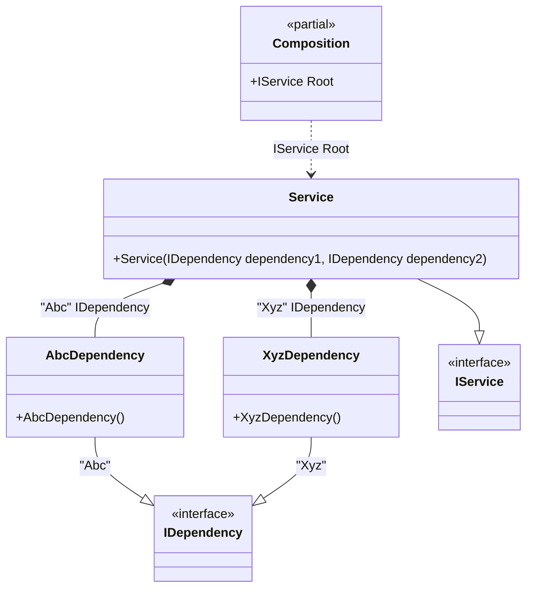

#### Tag attribute

[](../tests/Pure.DI.UsageTests/Attributes/TagAttributeScenario.cs)

Sometimes it's important to take control of building a dependency graph. For example, when there are multiple implementations of the same contract. In this case, _tags_ will help:


```c#
interface IDependency;

class AbcDependency : IDependency;

class XyzDependency : IDependency;

class Dependency : IDependency;

interface IService
{
    IDependency Dependency1 { get; }

    IDependency Dependency2 { get; }
}

class Service(
    [Tag("Abc")] IDependency dependency1,
    [Tag("Xyz")] IDependency dependency2)
    : IService
{
    public IDependency Dependency1 { get; } = dependency1;

    public IDependency Dependency2 { get; } = dependency2;
}

DI.Setup(nameof(Composition))
    .Bind<IDependency>("Abc").To<AbcDependency>()
    .Bind<IDependency>("Xyz").To<XyzDependency>()
    .Bind<IService>().To<Service>()

    // Composition root
    .Root<IService>("Root");

var composition = new Composition();
var service = composition.Root;
service.Dependency1.ShouldBeOfType<AbcDependency>();
service.Dependency2.ShouldBeOfType<XyzDependency>();
```

The tag can be a constant, a type, or a value of an enumerated type. This attribute is part of the API, but you can use your own attribute at any time, and this allows you to define them in the assembly and namespace you want.

The following partial class will be generated:

```c#
partial class Composition
{
  private readonly Composition _root;

  public Composition()
  {
    _root = this;
  }

  internal Composition(Composition parentScope)
  {
    _root = (parentScope ?? throw new ArgumentNullException(nameof(parentScope)))._root;
  }

  public IService Root
  {
    [MethodImpl(MethodImplOptions.AggressiveInlining)]
    get
    {
      return new Service(new AbcDependency(), new XyzDependency());
    }
  }
}
```

Class diagram:



