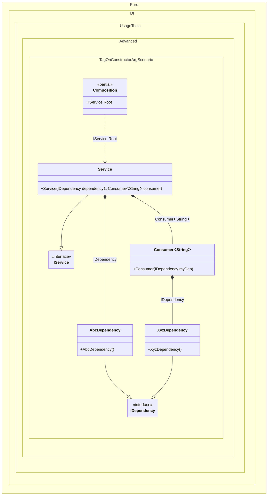

#### Tag on a constructor argument

[](../tests/Pure.DI.UsageTests/Advanced/TagOnConstructorArgScenario.cs)

The wildcards ‘*’ and ‘?’ are supported.


```c#
using Shouldly;
using Pure.DI;

DI.Setup(nameof(Composition))
    .Bind(Tag.OnConstructorArg<Service>("dependency1"))
        .To<AbcDependency>()
    .Bind(Tag.OnConstructorArg<Consumer<TT>>("myDep"))
        .To<XyzDependency>()
    .Bind<IService>().To<Service>()

    // Specifies to create the composition root named "Root"
    .Root<IService>("Root");

var composition = new Composition();
var service = composition.Root;
service.Dependency1.ShouldBeOfType<AbcDependency>();
service.Dependency2.ShouldBeOfType<XyzDependency>();

interface IDependency;

class AbcDependency : IDependency;

class XyzDependency : IDependency;

class Consumer<T>(IDependency myDep)
{
    public IDependency Dependency { get; } = myDep;
}

interface IService
{
    IDependency Dependency1 { get; }

    IDependency Dependency2 { get; }
}

class Service(
    IDependency dependency1,
    Consumer<string> consumer)
    : IService
{
    public IDependency Dependency1 { get; } = dependency1;

    public IDependency Dependency2 => consumer.Dependency;
}
```

<details>
<summary>Running this code sample locally</summary>

- Make sure you have the [.NET SDK 9.0](https://dotnet.microsoft.com/en-us/download/dotnet/9.0) or later is installed
- Create a net9.0 (or later) console application
- Add references to NuGet packages
  - [Pure.DI](https://www.nuget.org/packages/Pure.DI)
  - [Shouldly](https://www.nuget.org/packages/Shouldly)
- Copy the example code into the _Program.cs_ file

You are ready to run the example!

</details>

> [!WARNING]
> Each potentially injectable argument, property, or field contains an additional tag. This tag can be used to specify what can be injected there. This will only work if the binding type and the tag match. So while this approach can be useful for specifying what to enter, it can be more expensive to maintain and less reliable, so it is recommended to use attributes like `[Tag(...)]` instead.


Class diagram:



