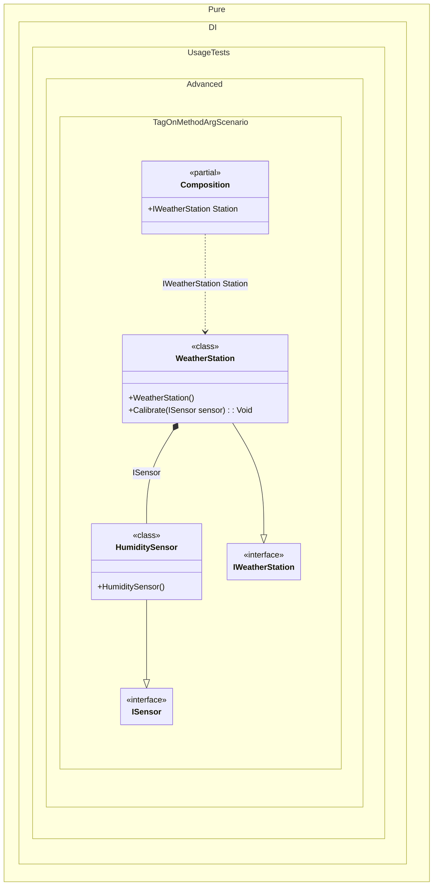

#### Tag on a method argument

The wildcards ‘*’ and ‘?’ are supported.


```c#
using Shouldly;
using Pure.DI;

DI.Setup(nameof(Composition))
    .Bind().To<TemperatureSensor>()
    // Binds specifically to the argument "sensor" of the "Calibrate" method
    // in the "WeatherStation" class
    .Bind(Tag.OnMethodArg<WeatherStation>(nameof(WeatherStation.Calibrate), "sensor"))
    .To<HumiditySensor>()
    .Bind<IWeatherStation>().To<WeatherStation>()

    // Specifies to create the composition root named "Station"
    .Root<IWeatherStation>("Station");

var composition = new Composition();
var station = composition.Station;
station.Sensor.ShouldBeOfType<HumiditySensor>();

interface ISensor;

class TemperatureSensor : ISensor;

class HumiditySensor : ISensor;

interface IWeatherStation
{
    ISensor? Sensor { get; }
}

class WeatherStation : IWeatherStation
{
    // The [Dependency] attribute is used to mark the method for injection
    [Dependency]
    public void Calibrate(ISensor sensor) =>
        Sensor = sensor;

    public ISensor? Sensor { get; private set; }
}
```

<details>
<summary>Running this code sample locally</summary>

- Make sure you have the [.NET SDK 10.0](https://dotnet.microsoft.com/en-us/download/dotnet/10.0) or later is installed
```bash
dotnet --list-sdk
```
- Create a net10.0 (or later) console application
```bash
dotnet new console -n Sample
```
- Add references to NuGet packages
  - [Pure.DI](https://www.nuget.org/packages/Pure.DI)
  - [Shouldly](https://www.nuget.org/packages/Shouldly)
```bash
dotnet add package Pure.DI
dotnet add package Shouldly
```
- Copy the example code into the _Program.cs_ file

You are ready to run the example 🚀
```bash
dotnet run
```

</details>

> [!WARNING]
> Each potentially injectable argument, property, or field contains an additional tag. This tag can be used to specify what can be injected there. This will only work if the binding type and the tag match. So while this approach can be useful for specifying what to enter, it can be more expensive to maintain and less reliable, so it is recommended to use attributes like `[Tag(...)]` instead.

The following partial class will be generated:

```c#
partial class Composition
{
  [OrdinalAttribute(256)]
  public Composition()
  {
  }

  internal Composition(Composition parentScope)
  {
  }

  public IWeatherStation Station
  {
    [MethodImpl(MethodImplOptions.AggressiveInlining)]
    get
    {
      var transientWeatherStation = new WeatherStation();
      transientWeatherStation.Calibrate(new HumiditySensor());
      return transientWeatherStation;
    }
  }
}
```

Class diagram:



