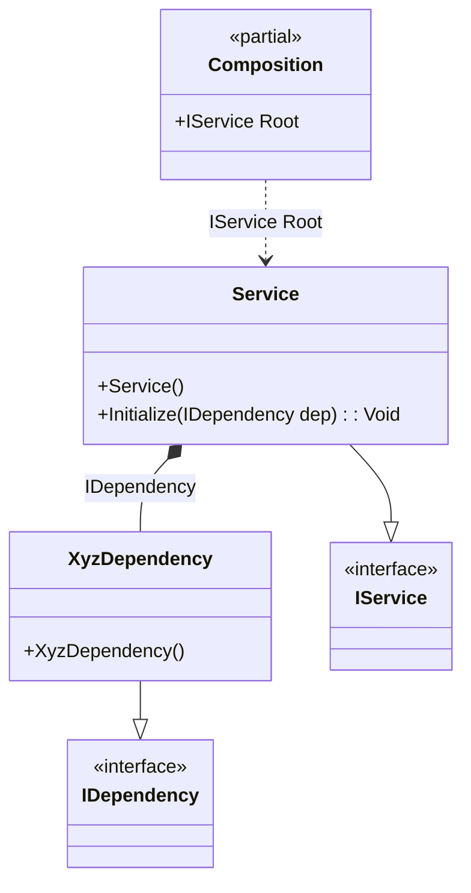

#### Tag on a method argument

[](../tests/Pure.DI.UsageTests/Advanced/TagOnMethodArgScenario.cs)

The wildcards ‘*’ and ‘?’ are supported.


```c#
namespace Pure.DI.UsageTests.Advanced.TagOnMethodArgScenario;


interface IDependency;

class AbcDependency : IDependency;

class XyzDependency : IDependency;

interface IService
{
    IDependency? Dependency { get; }
}

class Service : IService
{
    [Ordinal(1)]
    public void Initialize(IDependency dep) =>
        Dependency = dep;

    public IDependency? Dependency { get; private set; }
}

DI.Setup(nameof(Composition))
    .Bind().To<AbcDependency>()
    .Bind(Tag.OnMethodArg<Service>(nameof(Service.Initialize), "dep"))
        .To<XyzDependency>()
    .Bind<IService>().To<Service>()

    // Specifies to create the composition root named "Root"
    .Root<IService>("Root");

var composition = new Composition();
var service = composition.Root;
service.Dependency.ShouldBeOfType<XyzDependency>();
```

> [!WARNING]
> Each potentially injectable argument, property, or field contains an additional tag. This tag can be used to specify what can be injected there. This will only work if the binding type and the tag match. So while this approach can be useful for specifying what to enter, it can be more expensive to maintain and less reliable, so it is recommended to use attributes like `[Tag(...)]` instead.

The following partial class will be generated:

```c#
partial class Composition
{
  private readonly Composition _root;

  [OrdinalAttribute(20)]
  public Composition()
  {
    _root = this;
  }

  internal Composition(Composition parentScope)
  {
    _root = (parentScope ?? throw new ArgumentNullException(nameof(parentScope)))._root;
  }

  public IService Root
  {
    [MethodImpl(MethodImplOptions.AggressiveInlining)]
    get
    {
      Service transientService0 = new Service();
      transientService0.Initialize(new XyzDependency());
      return transientService0;
    }
  }
}
```

Class diagram:



