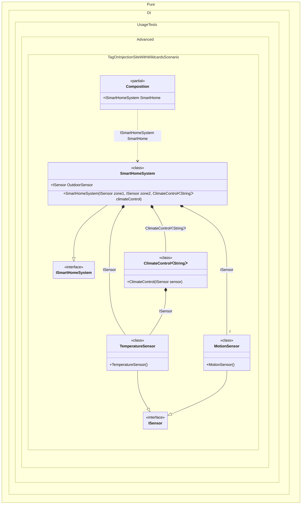

#### Tag on injection site with wildcards

The wildcards ‘*’ and ‘?’ are supported.


```c#
using Shouldly;
using Pure.DI;

DI.Setup(nameof(Composition))
    // We use wildcards to specify logic:
    // 1. Inject TemperatureSensor into 'OutdoorSensor' property of SmartHomeSystem
    // 2. Inject TemperatureSensor into 'sensor' argument of any ClimateControl
    .Bind(Tag.On("*SmartHomeSystem:OutdoorSensor", "*ClimateControl:sensor"))
    .To<TemperatureSensor>()

    // Inject MotionSensor into any argument starting with 'zone' inside SmartHomeSystem
    // This corresponds to 'zone1' and 'zone2'
    .Bind(Tag.On("*SmartHomeSystem:zone?"))
    .To<MotionSensor>()
    .Bind<ISmartHomeSystem>().To<SmartHomeSystem>()

    // Specifies to create the composition root named "Root"
    .Root<ISmartHomeSystem>("SmartHome");

var composition = new Composition();
var smartHome = composition.SmartHome;

// Verification:
// Zone sensors should be MotionSensors (matched by "*SmartHomeSystem:zone?")
smartHome.Zone1.ShouldBeOfType<MotionSensor>();
smartHome.Zone2.ShouldBeOfType<MotionSensor>();

// Outdoor sensor should be TemperatureSensor (matched by "*SmartHomeSystem:OutdoorSensor")
smartHome.OutdoorSensor.ShouldBeOfType<TemperatureSensor>();

// Climate control sensor should be TemperatureSensor (matched by "*ClimateControl:sensor")
smartHome.ClimateSensor.ShouldBeOfType<TemperatureSensor>();

interface ISensor;

class TemperatureSensor : ISensor;

class MotionSensor : ISensor;

class ClimateControl<T>(ISensor sensor)
{
    public ISensor Sensor { get; } = sensor;
}

interface ISmartHomeSystem
{
    ISensor Zone1 { get; }

    ISensor Zone2 { get; }

    ISensor OutdoorSensor { get; }

    ISensor ClimateSensor { get; }
}

class SmartHomeSystem(
    ISensor zone1,
    ISensor zone2,
    ClimateControl<string> climateControl)
    : ISmartHomeSystem
{
    public ISensor Zone1 { get; } = zone1;

    public ISensor Zone2 { get; } = zone2;

    public required ISensor OutdoorSensor { init; get; }

    public ISensor ClimateSensor => climateControl.Sensor;
}
```

<details>
<summary>Running this code sample locally</summary>

- Make sure you have the [.NET SDK 10.0](https://dotnet.microsoft.com/en-us/download/dotnet/10.0) or later is installed
```bash
dotnet --list-sdk
```
- Create a net10.0 (or later) console application
```bash
dotnet new console -n Sample
```
- Add references to NuGet packages
  - [Pure.DI](https://www.nuget.org/packages/Pure.DI)
  - [Shouldly](https://www.nuget.org/packages/Shouldly)
```bash
dotnet add package Pure.DI
dotnet add package Shouldly
```
- Copy the example code into the _Program.cs_ file

You are ready to run the example 🚀
```bash
dotnet run
```

</details>

> [!WARNING]
> Each potentially injectable argument, property, or field contains an additional tag. This tag can be used to specify what can be injected there. This will only work if the binding type and the tag match. So while this approach can be useful for specifying what to enter, it can be more expensive to maintain and less reliable, so it is recommended to use attributes like `[Tag(...)]` instead.

The following partial class will be generated:

```c#
partial class Composition
{
  [OrdinalAttribute(256)]
  public Composition()
  {
  }

  internal Composition(Composition parentScope)
  {
  }

  public ISmartHomeSystem SmartHome
  {
    [MethodImpl(MethodImplOptions.AggressiveInlining)]
    get
    {
      return new SmartHomeSystem(new MotionSensor(), new MotionSensor(), new ClimateControl<string>(new TemperatureSensor()))
      {
        OutdoorSensor = new TemperatureSensor()
      };
    }
  }
}
```

Class diagram:



