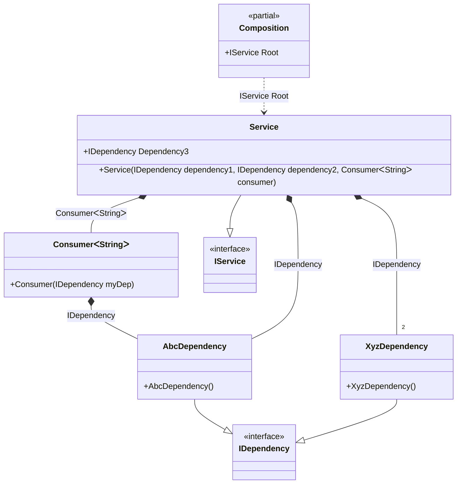

#### Tag on injection site with wildcards

[](../tests/Pure.DI.UsageTests/Advanced/TagOnInjectionSiteWithWildcardsScenario.cs)

The wildcards ‘*’ and ‘?’ are supported.


```c#
namespace Pure.DI.UsageTests.Advanced.TagOnInjectionSiteWithWildcardsScenario;


interface IDependency;

class AbcDependency : IDependency;

class XyzDependency : IDependency;

class Consumer<T>(IDependency myDep)
{
    public IDependency Dependency { get; } = myDep;
}

interface IService
{
    IDependency Dependency1 { get; }

    IDependency Dependency2 { get; }

    IDependency Dependency3 { get; }

    IDependency Dependency4 { get; }
}

class Service(
    IDependency dependency1,
    IDependency dependency2,
    Consumer<string> consumer)
    : IService
{
    public IDependency Dependency1 { get; } = dependency1;

    public IDependency Dependency2 { get; } = dependency2;

    public required IDependency Dependency3 { init; get; }

    public IDependency Dependency4 => consumer.Dependency;
}

DI.Setup(nameof(Composition))
    .Bind(Tag.On("*Service:Dependency3", "*Consumer:myDep"))
        .To<AbcDependency>()
    .Bind(Tag.On("*Service:dependency?"))
        .To<XyzDependency>()
    .Bind<IService>().To<Service>()

    // Specifies to create the composition root named "Root"
    .Root<IService>("Root");

var composition = new Composition();
var service = composition.Root;
service.Dependency1.ShouldBeOfType<XyzDependency>();
service.Dependency2.ShouldBeOfType<XyzDependency>();
service.Dependency3.ShouldBeOfType<AbcDependency>();
service.Dependency4.ShouldBeOfType<AbcDependency>();
```

> [!WARNING]
> Each potentially injectable argument, property, or field contains an additional tag. This tag can be used to specify what can be injected there. This will only work if the binding type and the tag match. So while this approach can be useful for specifying what to enter, it can be more expensive to maintain and less reliable, so it is recommended to use attributes like `[Tag(...)]` instead.

The following partial class will be generated:

```c#
partial class Composition
{
  private readonly Composition _root;

  [OrdinalAttribute(20)]
  public Composition()
  {
    _root = this;
  }

  internal Composition(Composition parentScope)
  {
    _root = (parentScope ?? throw new ArgumentNullException(nameof(parentScope)))._root;
  }

  public IService Root
  {
    [MethodImpl(MethodImplOptions.AggressiveInlining)]
    get
    {
      return new Service(new XyzDependency(), new XyzDependency(), new Consumer<string>(new AbcDependency())) { Dependency3 = new AbcDependency() };
    }
  }
}
```

Class diagram:



