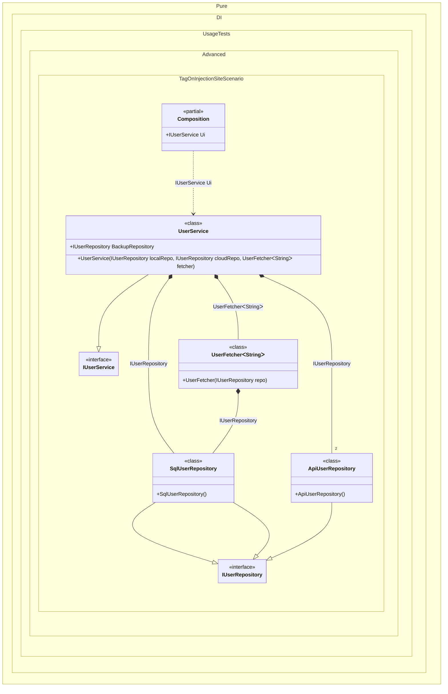

#### Tag on injection site

Sometimes it is necessary to determine which binding will be used to inject explicitly. To do this, use a special tag created by calling the `Tag.On()` method. Tag on injection site is specified in a special format: `Tag.On("<namespace>.<type>.<member>[:argument]")`. The argument is specified only for the constructor and methods. For example, for namespace _MyNamespace_ and type _Class1_:

- `Tag.On("MyNamespace.Class1.Class1:state1") - the tag corresponds to the constructor argument named _state_ of type _MyNamespace.Class1_
- `Tag.On("MyNamespace.Class1.DoSomething:myArg")` - the tag corresponds to the _myArg_ argument of the _DoSomething_ method
- `Tag.On("MyNamespace.Class1.MyData")` - the tag corresponds to property or field _MyData_

The wildcards `*` and `?` are supported. All names are case-sensitive. The global namespace prefix `global::` must be omitted. You can also combine multiple tags in a single `Tag.On("...", "...")` call.

For generic types, the type name also contains the number of type parameters, e.g., for the `myDep` constructor argument of the `Consumer<T>` class, the tag on the injection site would be ``MyNamespace.Consumer`1.Consumer:myDep``:


```c#
using Shouldly;
using Pure.DI;

DI.Setup(nameof(Composition))
    .Bind(
        Tag.On("*UserService.UserService:localRepo"),
        // Tag on injection site for generic type
        Tag.On("*UserFetcher`1.UserFetcher:repo"))
        .To<SqlUserRepository>()
    .Bind(
        // Combined tag
        Tag.On(
            "*UserService.UserService:cloudRepo",
            "*UserService:BackupRepository"))
        .To<ApiUserRepository>()
    .Bind<IUserService>().To<UserService>()

    // Specifies to create the composition root named "Root"
    .Root<IUserService>("Ui");

var composition = new Composition();
var userService = composition.Ui;
userService.LocalRepository.ShouldBeOfType<SqlUserRepository>();
userService.CloudRepository.ShouldBeOfType<ApiUserRepository>();
userService.BackupRepository.ShouldBeOfType<ApiUserRepository>();
userService.FetcherRepository.ShouldBeOfType<SqlUserRepository>();

interface IUserRepository;

class SqlUserRepository : IUserRepository;

class ApiUserRepository : IUserRepository;

class UserFetcher<T>(IUserRepository repo)
{
    public IUserRepository Repository { get; } = repo;
}

interface IUserService
{
    IUserRepository LocalRepository { get; }

    IUserRepository CloudRepository { get; }

    IUserRepository BackupRepository { get; }

    IUserRepository FetcherRepository { get; }
}

class UserService(
    IUserRepository localRepo,
    IUserRepository cloudRepo,
    UserFetcher<string> fetcher)
    : IUserService
{
    public IUserRepository LocalRepository { get; } = localRepo;

    public IUserRepository CloudRepository { get; } = cloudRepo;

    public required IUserRepository BackupRepository { init; get; }

    public IUserRepository FetcherRepository => fetcher.Repository;
}
```

<details>
<summary>Running this code sample locally</summary>

- Make sure you have the [.NET SDK 10.0](https://dotnet.microsoft.com/en-us/download/dotnet/10.0) or later is installed
```bash
dotnet --list-sdk
```
- Create a net10.0 (or later) console application
```bash
dotnet new console -n Sample
```
- Add references to NuGet packages
  - [Pure.DI](https://www.nuget.org/packages/Pure.DI)
  - [Shouldly](https://www.nuget.org/packages/Shouldly)
```bash
dotnet add package Pure.DI
dotnet add package Shouldly
```
- Copy the example code into the _Program.cs_ file

You are ready to run the example 🚀
```bash
dotnet run
```

</details>

> [!WARNING]
> Each potentially injectable argument, property, or field contains an additional tag. This tag can be used to specify what can be injected there. This will only work if the binding type and the tag match. So while this approach can be useful for specifying what to enter, it can be more expensive to maintain and less reliable, so it is recommended to use attributes like `[Tag(...)]` instead.

The following partial class will be generated:

```c#
partial class Composition
{
  public IUserService Ui
  {
    [MethodImpl(MethodImplOptions.AggressiveInlining)]
    get
    {
      return new UserService(new SqlUserRepository(), new ApiUserRepository(), new UserFetcher<string>(new SqlUserRepository()))
      {
        BackupRepository = new ApiUserRepository()
      };
    }
  }
}
```

Class diagram:



