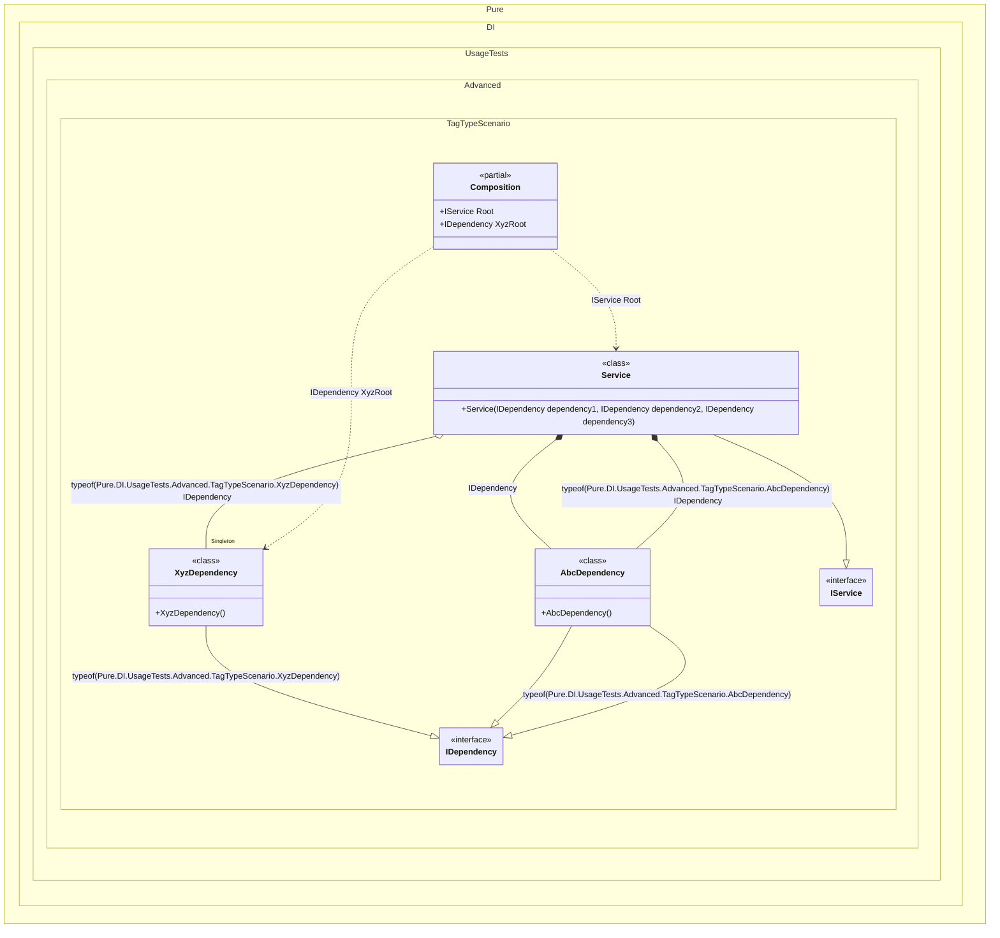

#### Tag Type

`Tag.Type` in bindings replaces the expression `typeof(T)`, where `T` is the type of the implementation in a binding.


```c#
using Shouldly;
using Pure.DI;

DI.Setup(nameof(Composition))
    // Tag.Type here is the same as typeof(AbcDependency)
    // The `default` tag is used to resolve dependencies
    // when the tag was not specified by the consumer
    .Bind<IDependency>(Tag.Type, default).To<AbcDependency>()
    // Tag.Type here is the same as typeof(XyzDependency)
    .Bind<IDependency>(Tag.Type).As(Lifetime.Singleton).To<XyzDependency>()
    .Bind<IService>().To<Service>()

    // Composition root
    .Root<IService>("Root")

    // "XyzRoot" is root name, typeof(XyzDependency) is tag
    .Root<IDependency>("XyzRoot", typeof(XyzDependency));

var composition = new Composition();
var service = composition.Root;
service.Dependency1.ShouldBeOfType<AbcDependency>();
service.Dependency2.ShouldBeOfType<XyzDependency>();
service.Dependency2.ShouldBe(composition.XyzRoot);
service.Dependency3.ShouldBeOfType<AbcDependency>();

interface IDependency;

class AbcDependency : IDependency;

class XyzDependency : IDependency;

interface IService
{
    IDependency Dependency1 { get; }

    IDependency Dependency2 { get; }

    IDependency Dependency3 { get; }
}

class Service(
    [Tag(typeof(AbcDependency))] IDependency dependency1,
    [Tag(typeof(XyzDependency))] IDependency dependency2,
    IDependency dependency3)
    : IService
{
    public IDependency Dependency1 { get; } = dependency1;

    public IDependency Dependency2 { get; } = dependency2;

    public IDependency Dependency3 { get; } = dependency3;
}
```

<details>
<summary>Running this code sample locally</summary>

- Make sure you have the [.NET SDK 9.0](https://dotnet.microsoft.com/en-us/download/dotnet/9.0) or later is installed
```bash
dotnet --list-sdk
```
- Create a net9.0 (or later) console application
```bash
dotnet new console -n Sample
```
- Add references to NuGet packages
  - [Pure.DI](https://www.nuget.org/packages/Pure.DI)
  - [Shouldly](https://www.nuget.org/packages/Shouldly)
```bash
dotnet add package Pure.DI
dotnet add package Shouldly
```
- Copy the example code into the _Program.cs_ file

You are ready to run the example 🚀
```bash
dotnet run
```

</details>

The following partial class will be generated:

```c#
partial class Composition
{
  private readonly Composition _root;
#if NET9_0_OR_GREATER
  private readonly Lock _lock;
#else
  private readonly Object _lock;
#endif

  private XyzDependency? _singleXyzDependency53;

  [OrdinalAttribute(256)]
  public Composition()
  {
    _root = this;
#if NET9_0_OR_GREATER
    _lock = new Lock();
#else
    _lock = new Object();
#endif
  }

  internal Composition(Composition parentScope)
  {
    _root = (parentScope ?? throw new ArgumentNullException(nameof(parentScope)))._root;
    _lock = _root._lock;
  }

  public IDependency XyzRoot
  {
    [MethodImpl(MethodImplOptions.AggressiveInlining)]
    get
    {
      EnsureXyzDependencyPureDIUsageTestsAdvancedTagTypeScenarioXyzDependencyExists0();
      void EnsureXyzDependencyPureDIUsageTestsAdvancedTagTypeScenarioXyzDependencyExists0()
      {
        if (_root._singleXyzDependency53 is null)
        {
          lock (_lock)
          {
            _root._singleXyzDependency53 = new XyzDependency();
          }
        }
      }

      return _root._singleXyzDependency53;
    }
  }

  public IService Root
  {
    [MethodImpl(MethodImplOptions.AggressiveInlining)]
    get
    {
      EnsureXyzDependencyPureDIUsageTestsAdvancedTagTypeScenarioXyzDependencyExists1();
      void EnsureXyzDependencyPureDIUsageTestsAdvancedTagTypeScenarioXyzDependencyExists1()
      {
        if (_root._singleXyzDependency53 is null)
        {
          lock (_lock)
          {
            _root._singleXyzDependency53 = new XyzDependency();
          }
        }
      }

      return new Service(new AbcDependency(), _root._singleXyzDependency53, new AbcDependency());
    }
  }
}
```

Class diagram:



