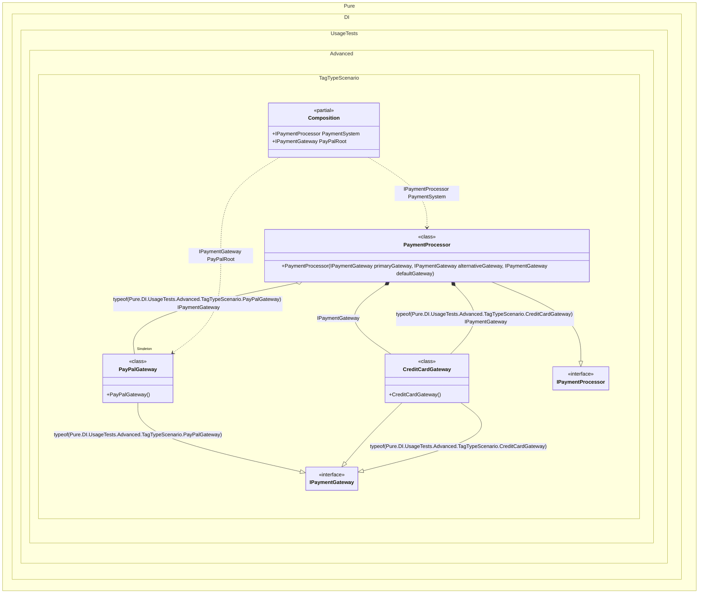

#### Tag Type

`Tag.Type` in bindings replaces the expression `typeof(T)`, where `T` is the type of the implementation in a binding.


```c#
using Shouldly;
using Pure.DI;

DI.Setup(nameof(Composition))
    // Tag.Type here is the same as typeof(CreditCardGateway)
    // The `default` tag is used to resolve dependencies
    // when the tag was not specified by the consumer
    .Bind<IPaymentGateway>(Tag.Type, default).To<CreditCardGateway>()
    // Tag.Type here is the same as typeof(PayPalGateway)
    .Bind<IPaymentGateway>(Tag.Type).As(Lifetime.Singleton).To<PayPalGateway>()
    .Bind<IPaymentProcessor>().To<PaymentProcessor>()

    // Composition root
    .Root<IPaymentProcessor>("PaymentSystem")

    // "PayPalRoot" is root name, typeof(PayPalGateway) is tag
    .Root<IPaymentGateway>("PayPalRoot", typeof(PayPalGateway));

var composition = new Composition();
var service = composition.PaymentSystem;
service.PrimaryGateway.ShouldBeOfType<CreditCardGateway>();
service.AlternativeGateway.ShouldBeOfType<PayPalGateway>();
service.AlternativeGateway.ShouldBe(composition.PayPalRoot);
service.DefaultGateway.ShouldBeOfType<CreditCardGateway>();

interface IPaymentGateway;

class CreditCardGateway : IPaymentGateway;

class PayPalGateway : IPaymentGateway;

interface IPaymentProcessor
{
    IPaymentGateway PrimaryGateway { get; }

    IPaymentGateway AlternativeGateway { get; }

    IPaymentGateway DefaultGateway { get; }
}

class PaymentProcessor(
    [Tag(typeof(CreditCardGateway))] IPaymentGateway primaryGateway,
    [Tag(typeof(PayPalGateway))] IPaymentGateway alternativeGateway,
    IPaymentGateway defaultGateway)
    : IPaymentProcessor
{
    public IPaymentGateway PrimaryGateway { get; } = primaryGateway;

    public IPaymentGateway AlternativeGateway { get; } = alternativeGateway;

    public IPaymentGateway DefaultGateway { get; } = defaultGateway;
}
```

<details>
<summary>Running this code sample locally</summary>

- Make sure you have the [.NET SDK 10.0](https://dotnet.microsoft.com/en-us/download/dotnet/10.0) or later is installed
```bash
dotnet --list-sdk
```
- Create a net10.0 (or later) console application
```bash
dotnet new console -n Sample
```
- Add references to NuGet packages
  - [Pure.DI](https://www.nuget.org/packages/Pure.DI)
  - [Shouldly](https://www.nuget.org/packages/Shouldly)
```bash
dotnet add package Pure.DI
dotnet add package Shouldly
```
- Copy the example code into the _Program.cs_ file

You are ready to run the example 🚀
```bash
dotnet run
```

</details>

The following partial class will be generated:

```c#
partial class Composition
{
  private readonly Composition _root;
#if NET9_0_OR_GREATER
  private readonly Lock _lock;
#else
  private readonly Object _lock;
#endif

  private PayPalGateway? _singletonPayPalGateway52;

  [OrdinalAttribute(256)]
  public Composition()
  {
    _root = this;
#if NET9_0_OR_GREATER
    _lock = new Lock();
#else
    _lock = new Object();
#endif
  }

  internal Composition(Composition parentScope)
  {
    _root = (parentScope ?? throw new ArgumentNullException(nameof(parentScope)))._root;
    _lock = parentScope._lock;
  }

  public IPaymentGateway PayPalRoot
  {
    [MethodImpl(MethodImplOptions.AggressiveInlining)]
    get
    {
      EnsurePayPalGatewayPureDIUsageTestsAdvancedTagTypeScenarioPayPalGatewayExists();
      return _root._singletonPayPalGateway52;
      [MethodImpl(MethodImplOptions.AggressiveInlining)]
      void EnsurePayPalGatewayPureDIUsageTestsAdvancedTagTypeScenarioPayPalGatewayExists()
      {
        if (_root._singletonPayPalGateway52 is null)
          lock (_lock)
            if (_root._singletonPayPalGateway52 is null)
            {
              _root._singletonPayPalGateway52 = new PayPalGateway();
            }
      }
    }
  }

  public IPaymentProcessor PaymentSystem
  {
    [MethodImpl(MethodImplOptions.AggressiveInlining)]
    get
    {
      EnsurePayPalGatewayPureDIUsageTestsAdvancedTagTypeScenarioPayPalGatewayExists();
      return new PaymentProcessor(new CreditCardGateway(), _root._singletonPayPalGateway52, new CreditCardGateway());
      [MethodImpl(MethodImplOptions.AggressiveInlining)]
      void EnsurePayPalGatewayPureDIUsageTestsAdvancedTagTypeScenarioPayPalGatewayExists()
      {
        if (_root._singletonPayPalGateway52 is null)
          lock (_lock)
            if (_root._singletonPayPalGateway52 is null)
            {
              _root._singletonPayPalGateway52 = new PayPalGateway();
            }
      }
    }
  }
}
```

Class diagram:



