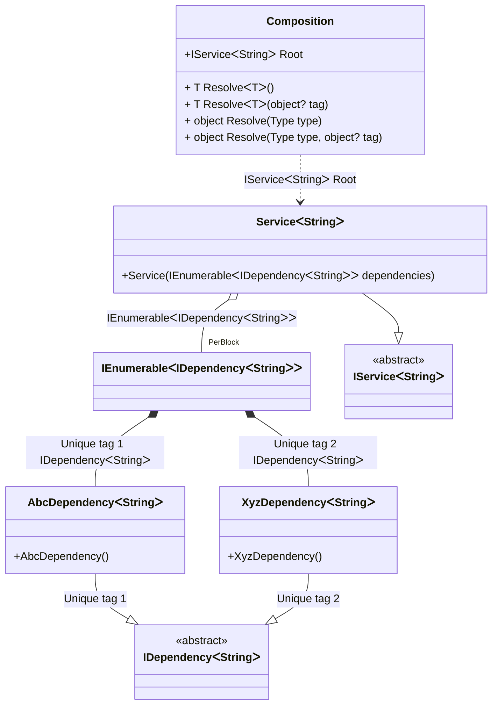

#### Tag Unique

[](../tests/Pure.DI.UsageTests/Advanced/TagUniqueScenario.cs)

`Tag.Unique` is useful to register a binding with a unique tag. It will not be available through the composition root or `Resolve` methods directly, but can be embedded in compositions as some kind of enumeration.

```c#
interface IDependency<T>;

class AbcDependency<T> : IDependency<T>;

class XyzDependency<T> : IDependency<T>;

interface IService<T>
{
    ImmutableArray<IDependency<T>> Dependencies { get; }
}

class Service<T>(IEnumerable<IDependency<T>> dependencies) : IService<T>
{
    public ImmutableArray<IDependency<T>> Dependencies { get; }
        = dependencies.ToImmutableArray();
}

DI.Setup(nameof(Composition))
    .Bind<IDependency<TT>>(Tag.Unique).To<AbcDependency<TT>>()
    .Bind<IDependency<TT>>(Tag.Unique).To<XyzDependency<TT>>()
    .Bind<IService<TT>>().To<Service<TT>>()

    // Composition root
    .Root<IService<string>>("Root");

var composition = new Composition();
var stringService = composition.Root;
stringService.Dependencies.Length.ShouldBe(2);
```

<details open>
<summary>Class Diagram</summary>



</details>

<details>
<summary>Pure.DI-generated partial class Composition</summary><blockquote>

```c#
partial class Composition
{
  private readonly Composition _rootM04D13di;
  
  public Composition()
  {
    _rootM04D13di = this;
  }
  
  internal Composition(Composition baseComposition)
  {
    _rootM04D13di = baseComposition._rootM04D13di;
  }
  
  public Pure.DI.UsageTests.Advanced.TagUniqueScenario.IService<string> Root
  {
    [global::System.Runtime.CompilerServices.MethodImpl((global::System.Runtime.CompilerServices.MethodImplOptions)0x100)]
    get
    {
      [global::System.Runtime.CompilerServices.MethodImpl((global::System.Runtime.CompilerServices.MethodImplOptions)0x200)]
      System.Collections.Generic.IEnumerable<Pure.DI.UsageTests.Advanced.TagUniqueScenario.IDependency<string>> LocalperBlockM04D13di1_IEnumerable()
      {
          yield return new Pure.DI.UsageTests.Advanced.TagUniqueScenario.AbcDependency<string>();
          yield return new Pure.DI.UsageTests.Advanced.TagUniqueScenario.XyzDependency<string>();
      }
      System.Collections.Generic.IEnumerable<Pure.DI.UsageTests.Advanced.TagUniqueScenario.IDependency<string>> perBlockM04D13di1_IEnumerable = LocalperBlockM04D13di1_IEnumerable();
      return new Pure.DI.UsageTests.Advanced.TagUniqueScenario.Service<string>(perBlockM04D13di1_IEnumerable);
    }
  }
  
  public T Resolve<T>()
  {
    return ResolverM04D13di<T>.Value.Resolve(this);
  }
  
  public T Resolve<T>(object? tag)
  {
    return ResolverM04D13di<T>.Value.ResolveByTag(this, tag);
  }
  
  [global::System.Runtime.CompilerServices.MethodImpl((global::System.Runtime.CompilerServices.MethodImplOptions)0x100)]
  public object Resolve(global::System.Type type)
  {
    var index = (int)(_bucketSizeM04D13di * ((uint)global::System.Runtime.CompilerServices.RuntimeHelpers.GetHashCode(type) % 1));
    ref var pair = ref _bucketsM04D13di[index];
    return pair.Key == type ? pair.Value.Resolve(this) : ResolveM04D13di(type, index);
  }
  
  [global::System.Runtime.CompilerServices.MethodImpl((global::System.Runtime.CompilerServices.MethodImplOptions)0x8)]
  private object ResolveM04D13di(global::System.Type type, int index)
  {
    var finish = index + _bucketSizeM04D13di;
    while (++index < finish)
    {
      ref var pair = ref _bucketsM04D13di[index];
      if (pair.Key == type)
      {
        return pair.Value.Resolve(this);
      }
    }
    
    throw new global::System.InvalidOperationException($"Cannot resolve composition root of type {type}.");
  }
  
  [global::System.Runtime.CompilerServices.MethodImpl((global::System.Runtime.CompilerServices.MethodImplOptions)0x100)]
  public object Resolve(global::System.Type type, object? tag)
  {
    var index = (int)(_bucketSizeM04D13di * ((uint)global::System.Runtime.CompilerServices.RuntimeHelpers.GetHashCode(type) % 1));
    ref var pair = ref _bucketsM04D13di[index];
    return pair.Key == type ? pair.Value.ResolveByTag(this, tag) : ResolveM04D13di(type, tag, index);
  }
  
  [global::System.Runtime.CompilerServices.MethodImpl((global::System.Runtime.CompilerServices.MethodImplOptions)0x8)]
  private object ResolveM04D13di(global::System.Type type, object? tag, int index)
  {
    var finish = index + _bucketSizeM04D13di;
    while (++index < finish)
    {
      ref var pair = ref _bucketsM04D13di[index];
      if (pair.Key == type)
      {
        return pair.Value.ResolveByTag(this, tag);
      }
    }
    
    throw new global::System.InvalidOperationException($"Cannot resolve composition root \"{tag}\" of type {type}.");
  }
  
  public override string ToString()
  {
    return
      "classDiagram\n" +
        "  class Composition {\n" +
          "    +IServiceᐸStringᐳ Root\n" +
          "    + T ResolveᐸTᐳ()\n" +
          "    + T ResolveᐸTᐳ(object? tag)\n" +
          "    + object Resolve(Type type)\n" +
          "    + object Resolve(Type type, object? tag)\n" +
        "  }\n" +
        "  class IEnumerableᐸIDependencyᐸStringᐳᐳ\n" +
        "  AbcDependencyᐸStringᐳ --|> IDependencyᐸStringᐳ : Unique tag 1 \n" +
        "  class AbcDependencyᐸStringᐳ {\n" +
          "    +AbcDependency()\n" +
        "  }\n" +
        "  XyzDependencyᐸStringᐳ --|> IDependencyᐸStringᐳ : Unique tag 2 \n" +
        "  class XyzDependencyᐸStringᐳ {\n" +
          "    +XyzDependency()\n" +
        "  }\n" +
        "  ServiceᐸStringᐳ --|> IServiceᐸStringᐳ : \n" +
        "  class ServiceᐸStringᐳ {\n" +
          "    +Service(IEnumerableᐸIDependencyᐸStringᐳᐳ dependencies)\n" +
        "  }\n" +
        "  class IDependencyᐸStringᐳ {\n" +
          "    <<abstract>>\n" +
        "  }\n" +
        "  class IServiceᐸStringᐳ {\n" +
          "    <<abstract>>\n" +
        "  }\n" +
        "  IEnumerableᐸIDependencyᐸStringᐳᐳ *--  AbcDependencyᐸStringᐳ : Unique tag 1  IDependencyᐸStringᐳ\n" +
        "  IEnumerableᐸIDependencyᐸStringᐳᐳ *--  XyzDependencyᐸStringᐳ : Unique tag 2  IDependencyᐸStringᐳ\n" +
        "  Composition ..> ServiceᐸStringᐳ : IServiceᐸStringᐳ Root\n" +
        "  ServiceᐸStringᐳ o--  \"PerBlock\" IEnumerableᐸIDependencyᐸStringᐳᐳ : IEnumerableᐸIDependencyᐸStringᐳᐳ";
  }
  
  private readonly static int _bucketSizeM04D13di;
  private readonly static global::Pure.DI.Pair<global::System.Type, global::Pure.DI.IResolver<Composition, object>>[] _bucketsM04D13di;
  
  static Composition()
  {
    var valResolverM04D13di_0000 = new ResolverM04D13di_0000();
    ResolverM04D13di<Pure.DI.UsageTests.Advanced.TagUniqueScenario.IService<string>>.Value = valResolverM04D13di_0000;
    _bucketsM04D13di = global::Pure.DI.Buckets<global::System.Type, global::Pure.DI.IResolver<Composition, object>>.Create(
      1,
      out _bucketSizeM04D13di,
      new global::Pure.DI.Pair<global::System.Type, global::Pure.DI.IResolver<Composition, object>>[1]
      {
         new global::Pure.DI.Pair<global::System.Type, global::Pure.DI.IResolver<Composition, object>>(typeof(Pure.DI.UsageTests.Advanced.TagUniqueScenario.IService<string>), valResolverM04D13di_0000)
      });
  }
  
  private sealed class ResolverM04D13di<T>: global::Pure.DI.IResolver<Composition, T>
  {
    public static global::Pure.DI.IResolver<Composition, T> Value = new ResolverM04D13di<T>();
    
    public T Resolve(Composition composite)
    {
      throw new global::System.InvalidOperationException($"Cannot resolve composition root of type {typeof(T)}.");
    }
    
    public T ResolveByTag(Composition composite, object tag)
    {
      throw new global::System.InvalidOperationException($"Cannot resolve composition root \"{tag}\" of type {typeof(T)}.");
    }
  }
  
  private sealed class ResolverM04D13di_0000: global::Pure.DI.IResolver<Composition, Pure.DI.UsageTests.Advanced.TagUniqueScenario.IService<string>>
  {
    public Pure.DI.UsageTests.Advanced.TagUniqueScenario.IService<string> Resolve(Composition composition)
    {
      return composition.Root;
    }
    
    public Pure.DI.UsageTests.Advanced.TagUniqueScenario.IService<string> ResolveByTag(Composition composition, object tag)
    {
      switch (tag)
      {
        case null:
          return composition.Root;
      }
      throw new global::System.InvalidOperationException($"Cannot resolve composition root \"{tag}\" of type Pure.DI.UsageTests.Advanced.TagUniqueScenario.IService<string>.");
    }
  }
}
```

</blockquote></details>

