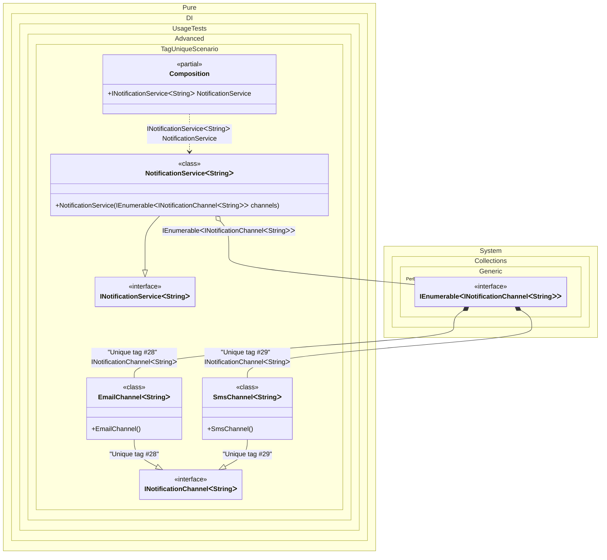

#### Tag Unique

`Tag.Unique` is useful to register a binding with a unique tag. It will not be available through the composition root or `Resolve` methods directly, but can be injected in compositions as some kind of enumeration.


```c#
using Shouldly;
using Pure.DI;
using System.Collections.Immutable;

DI.Setup(nameof(Composition))
    .Bind<INotificationChannel<TT>>(Tag.Unique).To<EmailChannel<TT>>()
    .Bind<INotificationChannel<TT>>(Tag.Unique).To<SmsChannel<TT>>()
    .Bind<INotificationService<TT>>().To<NotificationService<TT>>()

    // Composition root
    .Root<INotificationService<string>>("NotificationService");

var composition = new Composition();
var notificationService = composition.NotificationService;
notificationService.Channels.Length.ShouldBe(2);

interface INotificationChannel<T>;

class EmailChannel<T> : INotificationChannel<T>;

class SmsChannel<T> : INotificationChannel<T>;

interface INotificationService<T>
{
    ImmutableArray<INotificationChannel<T>> Channels { get; }
}

class NotificationService<T>(IEnumerable<INotificationChannel<T>> channels)
    : INotificationService<T>
{
    public ImmutableArray<INotificationChannel<T>> Channels { get; }
        = [..channels];
}
```

<details>
<summary>Running this code sample locally</summary>

- Make sure you have the [.NET SDK 10.0](https://dotnet.microsoft.com/en-us/download/dotnet/10.0) or later is installed
```bash
dotnet --list-sdk
```
- Create a net10.0 (or later) console application
```bash
dotnet new console -n Sample
```
- Add references to NuGet packages
  - [Pure.DI](https://www.nuget.org/packages/Pure.DI)
  - [Shouldly](https://www.nuget.org/packages/Shouldly)
```bash
dotnet add package Pure.DI
dotnet add package Shouldly
```
- Copy the example code into the _Program.cs_ file

You are ready to run the example 🚀
```bash
dotnet run
```

</details>

The following partial class will be generated:

```c#
partial class Composition
{
  public INotificationService<string> NotificationService
  {
    [MethodImpl(MethodImplOptions.AggressiveInlining)]
    get
    {
      [MethodImpl(MethodImplOptions.AggressiveInlining)]
      IEnumerable<INotificationChannel<string>> EnumerationOf_transientIEnumerable1()
      {
        yield return new EmailChannel<string>();
        yield return new SmsChannel<string>();
      }

      return new NotificationService<string>(EnumerationOf_transientIEnumerable1());
    }
  }
}
```

Class diagram:



