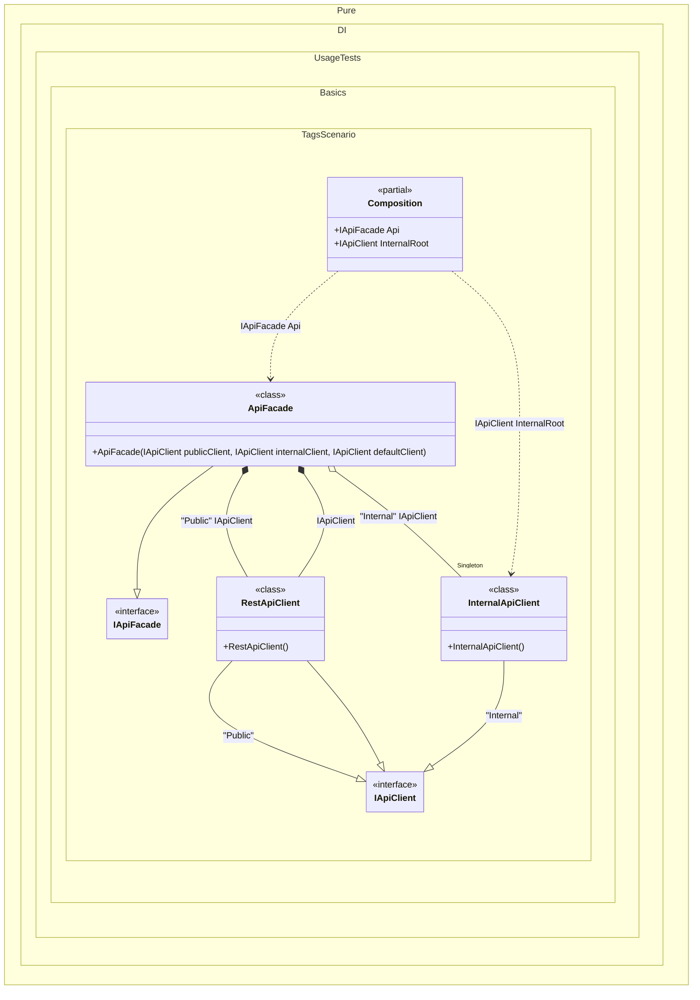

#### Tags

Sometimes it's important to take control of building a dependency graph. For example, when there are different implementations of the same interface. In this case, _tags_ will help:


```c#
using Shouldly;
using Pure.DI;

DI.Setup(nameof(Composition))
    // The `default` tag is used to resolve dependencies
    // when the tag was not specified by the consumer
    .Bind<IApiClient>("Public", default).To<RestApiClient>()
    .Bind<IApiClient>("Internal").As(Lifetime.Singleton).To<InternalApiClient>()
    .Bind<IApiFacade>().To<ApiFacade>()

    // "InternalRoot" is a root name, "Internal" is a tag
    .Root<IApiClient>("InternalRoot", "Internal")

    // Specifies to create the composition root named "Root"
    .Root<IApiFacade>("Api");

var composition = new Composition();
var api = composition.Api;
api.PublicClient.ShouldBeOfType<RestApiClient>();
api.InternalClient.ShouldBeOfType<InternalApiClient>();
api.InternalClient.ShouldBe(composition.InternalRoot);
api.DefaultClient.ShouldBeOfType<RestApiClient>();

interface IApiClient;

class RestApiClient : IApiClient;

class InternalApiClient : IApiClient;

interface IApiFacade
{
    IApiClient PublicClient { get; }

    IApiClient InternalClient { get; }

    IApiClient DefaultClient { get; }
}

class ApiFacade(
    [Tag("Public")] IApiClient publicClient,
    [Tag("Internal")] IApiClient internalClient,
    IApiClient defaultClient)
    : IApiFacade
{
    public IApiClient PublicClient { get; } = publicClient;

    public IApiClient InternalClient { get; } = internalClient;

    public IApiClient DefaultClient { get; } = defaultClient;
}
```

<details>
<summary>Running this code sample locally</summary>

- Make sure you have the [.NET SDK 10.0](https://dotnet.microsoft.com/en-us/download/dotnet/10.0) or later is installed
```bash
dotnet --list-sdk
```
- Create a net10.0 (or later) console application
```bash
dotnet new console -n Sample
```
- Add references to NuGet packages
  - [Pure.DI](https://www.nuget.org/packages/Pure.DI)
  - [Shouldly](https://www.nuget.org/packages/Shouldly)
```bash
dotnet add package Pure.DI
dotnet add package Shouldly
```
- Copy the example code into the _Program.cs_ file

You are ready to run the example 🚀
```bash
dotnet run
```

</details>

The example shows how to:
- Define multiple bindings for the same interface
- Use tags to differentiate between implementations
- Control lifetime management
- Inject tagged dependencies into constructors

The tag can be a constant, a type, a [smart tag](smart-tags.md), or a value of an `Enum` type. The _default_ and _null_ tags are also supported.

The following partial class will be generated:

```c#
partial class Composition
{
  private readonly Composition _root;
#if NET9_0_OR_GREATER
  private readonly Lock _lock;
#else
  private readonly Object _lock;
#endif

  private InternalApiClient? _singletonInternalApiClient52;

  [OrdinalAttribute(256)]
  public Composition()
  {
    _root = this;
#if NET9_0_OR_GREATER
    _lock = new Lock();
#else
    _lock = new Object();
#endif
  }

  internal Composition(Composition parentScope)
  {
    _root = (parentScope ?? throw new ArgumentNullException(nameof(parentScope)))._root;
    _lock = parentScope._lock;
  }

  public IApiClient InternalRoot
  {
    [MethodImpl(MethodImplOptions.AggressiveInlining)]
    get
    {
      EnsureInternalApiClientInternalExists();
      return _root._singletonInternalApiClient52;
      [MethodImpl(MethodImplOptions.AggressiveInlining)]
      void EnsureInternalApiClientInternalExists()
      {
        if (_root._singletonInternalApiClient52 is null)
          lock (_lock)
            if (_root._singletonInternalApiClient52 is null)
            {
              _root._singletonInternalApiClient52 = new InternalApiClient();
            }
      }
    }
  }

  public IApiFacade Api
  {
    [MethodImpl(MethodImplOptions.AggressiveInlining)]
    get
    {
      EnsureInternalApiClientInternalExists();
      return new ApiFacade(new RestApiClient(), _root._singletonInternalApiClient52, new RestApiClient());
      [MethodImpl(MethodImplOptions.AggressiveInlining)]
      void EnsureInternalApiClientInternalExists()
      {
        if (_root._singletonInternalApiClient52 is null)
          lock (_lock)
            if (_root._singletonInternalApiClient52 is null)
            {
              _root._singletonInternalApiClient52 = new InternalApiClient();
            }
      }
    }
  }
}
```

Class diagram:



