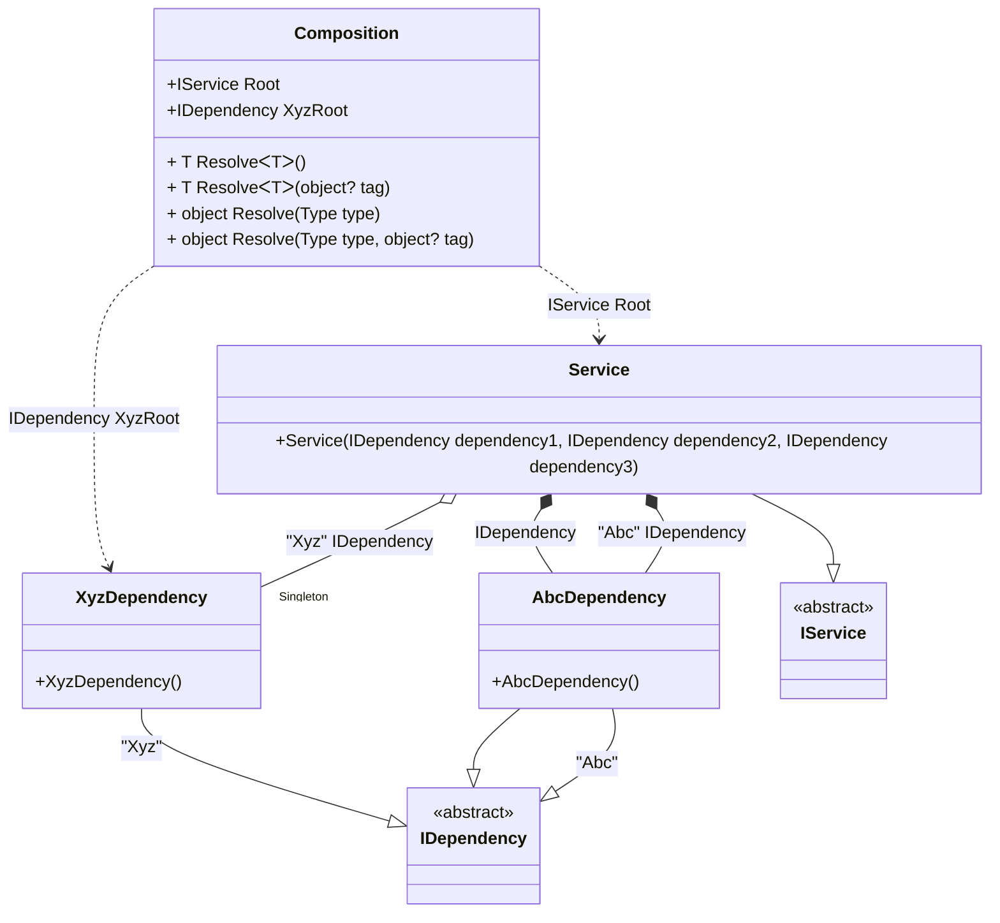

#### Tags

[](../tests/Pure.DI.UsageTests/Basics/TagsScenario.cs)

Sometimes it's important to take control of building a dependency graph. For example, when there are multiple implementations of the same contract. In this case, _tags_ will help:

```c#
interface IDependency;

class AbcDependency : IDependency;

class XyzDependency : IDependency;

class Dependency : IDependency;

interface IService
{
    IDependency Dependency1 { get; }

    IDependency Dependency2 { get; }

    IDependency Dependency3 { get; }
}

class Service(
    [Tag("Abc")] IDependency dependency1,
    [Tag("Xyz")] IDependency dependency2,
    IDependency dependency3)
    : IService
{
    public IDependency Dependency1 { get; } = dependency1;

    public IDependency Dependency2 { get; } = dependency2;

    public IDependency Dependency3 { get; } = dependency3;
}

DI.Setup(nameof(Composition))
    .Bind<IDependency>("Abc", default).To<AbcDependency>()
    .Bind<IDependency>("Xyz")
        .As(Lifetime.Singleton)
        .To<XyzDependency>()
        // "XyzRoot" is root name, "Xyz" is tag
        .Root<IDependency>("XyzRoot", "Xyz")
    .Bind<IService>().To<Service>().Root<IService>("Root");

var composition = new Composition();
var service = composition.Root;
service.Dependency1.ShouldBeOfType<AbcDependency>();
service.Dependency2.ShouldBeOfType<XyzDependency>();
service.Dependency2.ShouldBe(composition.XyzRoot);
service.Dependency3.ShouldBeOfType<AbcDependency>();
```

The tag can be a constant, a type, or a value of an enumerated type. The _default_ and _null_ tags are also supported.

<details open>
<summary>Class Diagram</summary>



</details>

<details>
<summary>Pure.DI-generated partial class Composition</summary><blockquote>

```c#
partial class Composition
{
  private readonly Composition _rootM03D17di;
  private readonly object _lockM03D17di;
  private Pure.DI.UsageTests.Basics.TagsScenario.XyzDependency _singletonM03D17di35_XyzDependency;
  
  public Composition()
  {
    _rootM03D17di = this;
    _lockM03D17di = new object();
  }
  
  internal Composition(Composition baseComposition)
  {
    _rootM03D17di = baseComposition._rootM03D17di;
    _lockM03D17di = _rootM03D17di._lockM03D17di;
  }
  
  public Pure.DI.UsageTests.Basics.TagsScenario.IDependency XyzRoot
  {
    get
    {
      if (ReferenceEquals(_rootM03D17di._singletonM03D17di35_XyzDependency, null))
      {
          lock (_lockM03D17di)
          {
              if (ReferenceEquals(_rootM03D17di._singletonM03D17di35_XyzDependency, null))
              {
                  _singletonM03D17di35_XyzDependency = new Pure.DI.UsageTests.Basics.TagsScenario.XyzDependency();
                  _rootM03D17di._singletonM03D17di35_XyzDependency = _singletonM03D17di35_XyzDependency;
              }
          }
      }
      return _rootM03D17di._singletonM03D17di35_XyzDependency;
    }
  }
  
  public Pure.DI.UsageTests.Basics.TagsScenario.IService Root
  {
    get
    {
      if (ReferenceEquals(_rootM03D17di._singletonM03D17di35_XyzDependency, null))
      {
          lock (_lockM03D17di)
          {
              if (ReferenceEquals(_rootM03D17di._singletonM03D17di35_XyzDependency, null))
              {
                  _singletonM03D17di35_XyzDependency = new Pure.DI.UsageTests.Basics.TagsScenario.XyzDependency();
                  _rootM03D17di._singletonM03D17di35_XyzDependency = _singletonM03D17di35_XyzDependency;
              }
          }
      }
      return new Pure.DI.UsageTests.Basics.TagsScenario.Service(new Pure.DI.UsageTests.Basics.TagsScenario.AbcDependency(), _rootM03D17di._singletonM03D17di35_XyzDependency, new Pure.DI.UsageTests.Basics.TagsScenario.AbcDependency());
    }
  }
  
  public T Resolve<T>()
  {
    return ResolverM03D17di<T>.Value.Resolve(this);
  }
  
  public T Resolve<T>(object? tag)
  {
    return ResolverM03D17di<T>.Value.ResolveByTag(this, tag);
  }
  
  public object Resolve(global::System.Type type)
  {
    var index = (int)(_bucketSizeM03D17di * ((uint)global::System.Runtime.CompilerServices.RuntimeHelpers.GetHashCode(type) % 4));
    var finish = index + _bucketSizeM03D17di;
    do {
      ref var pair = ref _bucketsM03D17di[index];
      if (ReferenceEquals(pair.Key, type))
      {
        return pair.Value.Resolve(this);
      }
    } while (++index < finish);
    
    throw new global::System.InvalidOperationException($"Cannot resolve composition root of type {type}.");
  }
  
  public object Resolve(global::System.Type type, object? tag)
  {
    var index = (int)(_bucketSizeM03D17di * ((uint)global::System.Runtime.CompilerServices.RuntimeHelpers.GetHashCode(type) % 4));
    var finish = index + _bucketSizeM03D17di;
    do {
      ref var pair = ref _bucketsM03D17di[index];
      if (ReferenceEquals(pair.Key, type))
      {
        return pair.Value.ResolveByTag(this, tag);
      }
    } while (++index < finish);
    
    throw new global::System.InvalidOperationException($"Cannot resolve composition root \"{tag}\" of type {type}.");
  }
  
  public override string ToString()
  {
    return
      "classDiagram\n" +
        "  class Composition {\n" +
          "    +IService Root\n" +
          "    +IDependency XyzRoot\n" +
          "    + T ResolveᐸTᐳ()\n" +
          "    + T ResolveᐸTᐳ(object? tag)\n" +
          "    + object Resolve(Type type)\n" +
          "    + object Resolve(Type type, object? tag)\n" +
        "  }\n" +
        "  AbcDependency --|> IDependency : \"Abc\" \n" +
        "  AbcDependency --|> IDependency : \n" +
        "  class AbcDependency {\n" +
          "    +AbcDependency()\n" +
        "  }\n" +
        "  XyzDependency --|> IDependency : \"Xyz\" \n" +
        "  class XyzDependency {\n" +
          "    +XyzDependency()\n" +
        "  }\n" +
        "  Service --|> IService : \n" +
        "  class Service {\n" +
          "    +Service(IDependency dependency1, IDependency dependency2, IDependency dependency3)\n" +
        "  }\n" +
        "  class IDependency {\n" +
          "    <<abstract>>\n" +
        "  }\n" +
        "  class IService {\n" +
          "    <<abstract>>\n" +
        "  }\n" +
        "  Service *--  AbcDependency : \"Abc\"  IDependency\n" +
        "  Service o--  \"Singleton\" XyzDependency : \"Xyz\"  IDependency\n" +
        "  Service *--  AbcDependency : IDependency\n" +
        "  Composition ..> XyzDependency : IDependency XyzRoot\n" +
        "  Composition ..> Service : IService Root";
  }
  
  private readonly static int _bucketSizeM03D17di;
  private readonly static global::Pure.DI.Pair<global::System.Type, global::Pure.DI.IResolver<Composition, object>>[] _bucketsM03D17di;
  
  static Composition()
  {
    var valResolverM03D17di_0000 = new ResolverM03D17di_0000();
    ResolverM03D17di<Pure.DI.UsageTests.Basics.TagsScenario.IDependency>.Value = valResolverM03D17di_0000;
    var valResolverM03D17di_0001 = new ResolverM03D17di_0001();
    ResolverM03D17di<Pure.DI.UsageTests.Basics.TagsScenario.IService>.Value = valResolverM03D17di_0001;
    _bucketsM03D17di = global::Pure.DI.Buckets<global::System.Type, global::Pure.DI.IResolver<Composition, object>>.Create(
      4,
      out _bucketSizeM03D17di,
      new global::Pure.DI.Pair<global::System.Type, global::Pure.DI.IResolver<Composition, object>>[2]
      {
         new global::Pure.DI.Pair<global::System.Type, global::Pure.DI.IResolver<Composition, object>>(typeof(Pure.DI.UsageTests.Basics.TagsScenario.IDependency), valResolverM03D17di_0000)
        ,new global::Pure.DI.Pair<global::System.Type, global::Pure.DI.IResolver<Composition, object>>(typeof(Pure.DI.UsageTests.Basics.TagsScenario.IService), valResolverM03D17di_0001)
      });
  }
  
  private sealed class ResolverM03D17di<T>: global::Pure.DI.IResolver<Composition, T>
  {
    public static global::Pure.DI.IResolver<Composition, T> Value = new ResolverM03D17di<T>();
    
    public T Resolve(Composition composite)
    {
      throw new global::System.InvalidOperationException($"Cannot resolve composition root of type {typeof(T)}.");
    }
    
    public T ResolveByTag(Composition composite, object tag)
    {
      throw new global::System.InvalidOperationException($"Cannot resolve composition root \"{tag}\" of type {typeof(T)}.");
    }
  }
  
  private sealed class ResolverM03D17di_0000: global::Pure.DI.IResolver<Composition, Pure.DI.UsageTests.Basics.TagsScenario.IDependency>
  {
    public Pure.DI.UsageTests.Basics.TagsScenario.IDependency Resolve(Composition composition)
    {
      throw new global::System.InvalidOperationException($"Cannot resolve composition root of type Pure.DI.UsageTests.Basics.TagsScenario.IDependency.");
    }
    
    public Pure.DI.UsageTests.Basics.TagsScenario.IDependency ResolveByTag(Composition composition, object tag)
    {
      switch (tag)
      {
        case "Xyz":
          return composition.XyzRoot;
      }
      throw new global::System.InvalidOperationException($"Cannot resolve composition root \"{tag}\" of type Pure.DI.UsageTests.Basics.TagsScenario.IDependency.");
    }
  }
  
  private sealed class ResolverM03D17di_0001: global::Pure.DI.IResolver<Composition, Pure.DI.UsageTests.Basics.TagsScenario.IService>
  {
    public Pure.DI.UsageTests.Basics.TagsScenario.IService Resolve(Composition composition)
    {
      return composition.Root;
    }
    
    public Pure.DI.UsageTests.Basics.TagsScenario.IService ResolveByTag(Composition composition, object tag)
    {
      switch (tag)
      {
        case null:
          return composition.Root;
      }
      throw new global::System.InvalidOperationException($"Cannot resolve composition root \"{tag}\" of type Pure.DI.UsageTests.Basics.TagsScenario.IService.");
    }
  }
}
```

</blockquote></details>

