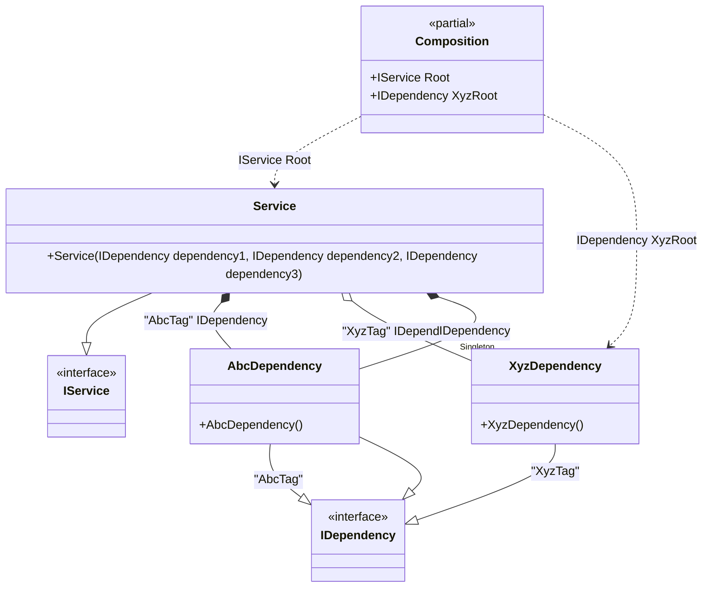

#### Tags

[](../tests/Pure.DI.UsageTests/Basics/TagsScenario.cs)

Sometimes it's important to take control of building a dependency graph. For example, when there are multiple implementations of the same contract. In this case, _tags_ will help:


```c#
interface IDependency;

class AbcDependency : IDependency;

class XyzDependency : IDependency;

class Dependency : IDependency;

interface IService
{
    IDependency Dependency1 { get; }

    IDependency Dependency2 { get; }

    IDependency Dependency3 { get; }
}

class Service(
    [Tag("AbcTag")] IDependency dependency1,
    [Tag("XyzTag")] IDependency dependency2,
    IDependency dependency3)
    : IService
{
    public IDependency Dependency1 { get; } = dependency1;

    public IDependency Dependency2 { get; } = dependency2;

    public IDependency Dependency3 { get; } = dependency3;
}

DI.Setup(nameof(Composition))
    .Bind<IDependency>("AbcTag", default).To<AbcDependency>()
    .Bind<IDependency>("XyzTag")
    .As(Lifetime.Singleton)
    .To<XyzDependency>()
    .Bind<IService>().To<Service>()

    // "XyzRoot" is root name, "XyzTag" is tag
    .Root<IDependency>("XyzRoot", "XyzTag")

    // Specifies to create the composition root named "Root"
    .Root<IService>("Root");

var composition = new Composition();
var service = composition.Root;
service.Dependency1.ShouldBeOfType<AbcDependency>();
service.Dependency2.ShouldBeOfType<XyzDependency>();
service.Dependency2.ShouldBe(composition.XyzRoot);
service.Dependency3.ShouldBeOfType<AbcDependency>();
```

The tag can be a constant, a type, or a value of an enumerated type. The _default_ and _null_ tags are also supported.

The following partial class will be generated:

```c#
partial class Composition
{
  private readonly Composition _root;
  private readonly object _lock;

  private XyzDependency? _singletonXyzDependency40;

  [OrdinalAttribute(20)]
  public Composition()
  {
    _root = this;
    _lock = new object();
  }

  internal Composition(Composition parentScope)
  {
    _root = (parentScope ?? throw new ArgumentNullException(nameof(parentScope)))._root;
    _lock = _root._lock;
  }

  public IDependency XyzRoot
  {
    [MethodImpl(MethodImplOptions.AggressiveInlining)]
    get
    {
      if (_root._singletonXyzDependency40 == null)
      {
        lock (_lock)
        {
          if (_root._singletonXyzDependency40 == null)
          {
            _root._singletonXyzDependency40 = new XyzDependency();
          }
        }
      }

      return _root._singletonXyzDependency40!;
    }
  }

  public IService Root
  {
    [MethodImpl(MethodImplOptions.AggressiveInlining)]
    get
    {
      if (_root._singletonXyzDependency40 == null)
      {
        lock (_lock)
        {
          if (_root._singletonXyzDependency40 == null)
          {
            _root._singletonXyzDependency40 = new XyzDependency();
          }
        }
      }

      return new Service(new AbcDependency(), _root._singletonXyzDependency40!, new AbcDependency());
    }
  }
}
```

Class diagram:



