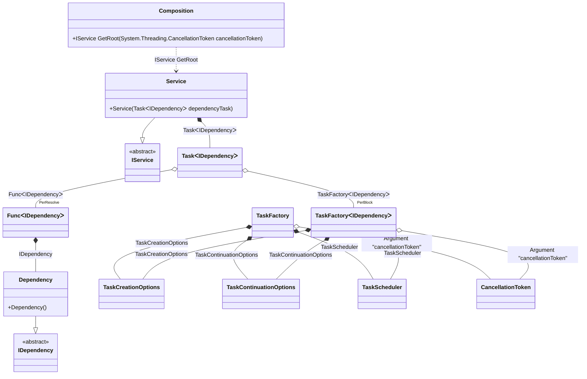

#### Task

[](../tests/Pure.DI.UsageTests/BaseClassLibrary/TaskScenario.cs)

By default, tasks are started automatically when they are injected. It is recommended to use an argument of type <c>CancellationToken</c> to the composition root to be able to cancel the execution of a task. In this case, the composition root property is automatically converted to a method with a parameter of type <c>CancellationToken</c>. To start a task, an instance of type <c>TaskFactory<T></c> is used, with default settings:

- CancellationToken.None
- TaskScheduler.Default
- TaskCreationOptions.None
- TaskContinuationOptions.None

But you can always override them, as in the example below for <c>TaskScheduler.Current</c>.

```c#
interface IDependency
{
    ValueTask DoSomething(CancellationToken cancellationToken);
}

class Dependency : IDependency
{
    public ValueTask DoSomething(CancellationToken cancellationToken) => ValueTask.CompletedTask;
}

interface IService
{
    Task RunAsync(CancellationToken cancellationToken);
}

class Service(Task<IDependency> dependencyTask) : IService
{
    public async Task RunAsync(CancellationToken cancellationToken)
    {
        var dependency = await dependencyTask;
        await dependency.DoSomething(cancellationToken);
    }
}

DI.Setup("Composition")
    .Hint(Hint.Resolve, "Off")
    // Overrides TaskScheduler.Default if necessary
    .Bind<TaskScheduler>().To(_ => TaskScheduler.Current)
    // Specifies to use CancellationToken from the composition root argument,
    // if not specified then CancellationToken.None will be used
    .RootArg<CancellationToken>("cancellationToken")
    .Bind<IDependency>().To<Dependency>()
    .Bind<IService>().To<Service>().Root<IService>("GetRoot");

var composition = new Composition();
using var cancellationTokenSource = new CancellationTokenSource();

// Creates a composition root with the CancellationToken passed to it
var service = composition.GetRoot(cancellationTokenSource.Token);
await service.RunAsync(cancellationTokenSource.Token);
```

<details open>
<summary>Class Diagram</summary>



</details>

<details>
<summary>Pure.DI-generated partial class Composition</summary><blockquote>

```c#
partial class Composition
{
  private readonly global::System.IDisposable[] _disposableSingletonsM01D18di;
  
  public Composition()
  {
    _disposableSingletonsM01D18di = new global::System.IDisposable[0];
  }
  
  internal Composition(Composition parent)
  {
    _disposableSingletonsM01D18di = new global::System.IDisposable[0];
  }
  
  #region Composition Roots
  #if NETSTANDARD2_0_OR_GREATER || NETCOREAPP || NET40_OR_GREATER || NET
  [global::System.Diagnostics.Contracts.Pure]
  #endif
  public Pure.DI.UsageTests.BCL.TaskScenario.IService GetRoot(System.Threading.CancellationToken cancellationToken)
  {
    var perResolveM01D18di38_Func = default(System.Func<Pure.DI.UsageTests.BCL.TaskScenario.IDependency>);
    System.Threading.Tasks.TaskScheduler transientM01D18di5_TaskScheduler = TaskScheduler.Current;
    System.Threading.Tasks.TaskContinuationOptions transientM01D18di4_TaskContinuationOptions = global::System.Threading.Tasks.TaskContinuationOptions.None;
    System.Threading.Tasks.TaskCreationOptions transientM01D18di3_TaskCreationOptions = global::System.Threading.Tasks.TaskCreationOptions.None;
    System.Threading.Tasks.TaskFactory<Pure.DI.UsageTests.BCL.TaskScenario.IDependency> perBlockM01D18di2_TaskFactory;
    {
        var cancellationToken_M01D18di1 = cancellationToken;
        var taskCreationOptions_M01D18di2 = transientM01D18di3_TaskCreationOptions;
        var taskContinuationOptions_M01D18di3 = transientM01D18di4_TaskContinuationOptions;
        var taskScheduler_M01D18di4 = transientM01D18di5_TaskScheduler;
        perBlockM01D18di2_TaskFactory = new global::System.Threading.Tasks.TaskFactory<Pure.DI.UsageTests.BCL.TaskScenario.IDependency>(cancellationToken_M01D18di1, taskCreationOptions_M01D18di2, taskContinuationOptions_M01D18di3, taskScheduler_M01D18di4);
    }
    perResolveM01D18di38_Func = new global::System.Func<Pure.DI.UsageTests.BCL.TaskScenario.IDependency>(
    [global::System.Runtime.CompilerServices.MethodImpl((global::System.Runtime.CompilerServices.MethodImplOptions)768)]
    () =>
    {
        var factory_M01D18di5 = new Pure.DI.UsageTests.BCL.TaskScenario.Dependency();
        return factory_M01D18di5;
    });
    System.Threading.Tasks.Task<Pure.DI.UsageTests.BCL.TaskScenario.IDependency> transientM01D18di1_Task;
    {
        var factory_M01D18di6 = perResolveM01D18di38_Func;
        var taskFactory_M01D18di7 = perBlockM01D18di2_TaskFactory;
        transientM01D18di1_Task = taskFactory_M01D18di7.StartNew(factory_M01D18di6);
    }
    return new Pure.DI.UsageTests.BCL.TaskScenario.Service(transientM01D18di1_Task);
  }
  #endregion
  
  
  public override string ToString()
  {
    return
      "classDiagram\n" +
        "  class Composition {\n" +
          "    +IService GetRoot(System.Threading.CancellationToken cancellationToken)\n" +
        "  }\n" +
        "  Service --|> IService : \n" +
        "  class Service {\n" +
          "    +Service(TaskᐸIDependencyᐳ dependencyTask)\n" +
        "  }\n" +
        "  Dependency --|> IDependency : \n" +
        "  class Dependency {\n" +
          "    +Dependency()\n" +
        "  }\n" +
        "  class TaskCreationOptions\n" +
        "  class TaskContinuationOptions\n" +
        "  class TaskFactory\n" +
        "  class TaskScheduler\n" +
        "  class CancellationToken\n" +
        "  class TaskᐸIDependencyᐳ\n" +
        "  class FuncᐸIDependencyᐳ\n" +
        "  class TaskFactoryᐸIDependencyᐳ\n" +
        "  class IService {\n" +
          "    <<abstract>>\n" +
        "  }\n" +
        "  class IDependency {\n" +
          "    <<abstract>>\n" +
        "  }\n" +
        "  Service *--  TaskᐸIDependencyᐳ : TaskᐸIDependencyᐳ\n" +
        "  TaskFactory o-- CancellationToken : Argument \"cancellationToken\"\n" +
        "  TaskFactory *--  TaskCreationOptions : TaskCreationOptions\n" +
        "  TaskFactory *--  TaskContinuationOptions : TaskContinuationOptions\n" +
        "  TaskFactory *--  TaskScheduler : TaskScheduler\n" +
        "  Composition ..> Service : IService GetRoot\n" +
        "  TaskᐸIDependencyᐳ o--  \"PerResolve\" FuncᐸIDependencyᐳ : FuncᐸIDependencyᐳ\n" +
        "  TaskᐸIDependencyᐳ o--  \"PerBlock\" TaskFactoryᐸIDependencyᐳ : TaskFactoryᐸIDependencyᐳ\n" +
        "  FuncᐸIDependencyᐳ *--  Dependency : IDependency\n" +
        "  TaskFactoryᐸIDependencyᐳ o-- CancellationToken : Argument \"cancellationToken\"\n" +
        "  TaskFactoryᐸIDependencyᐳ *--  TaskCreationOptions : TaskCreationOptions\n" +
        "  TaskFactoryᐸIDependencyᐳ *--  TaskContinuationOptions : TaskContinuationOptions\n" +
        "  TaskFactoryᐸIDependencyᐳ *--  TaskScheduler : TaskScheduler";
  }
}
```

</blockquote></details>

