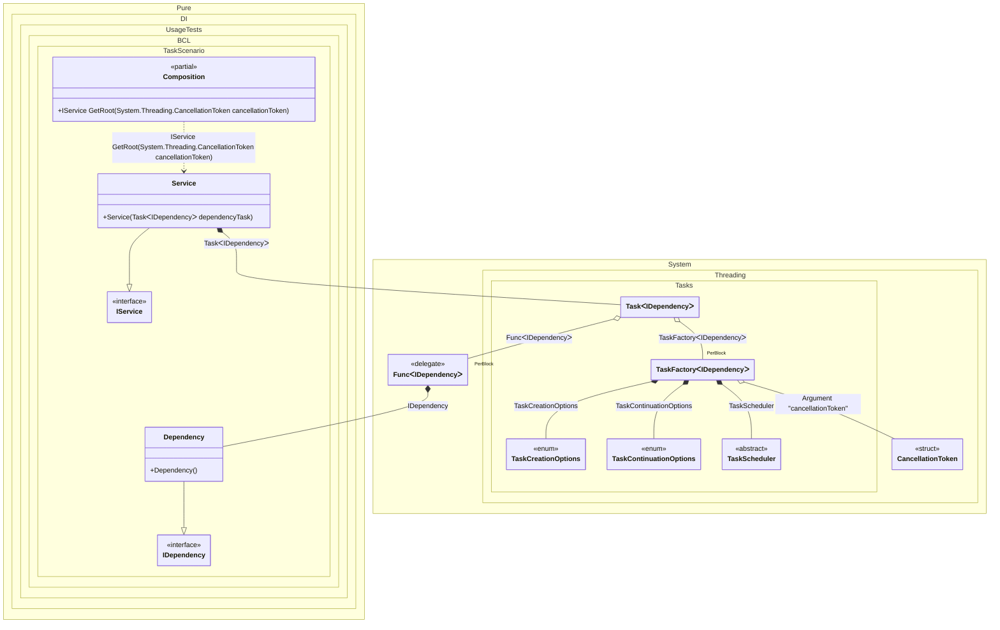

#### Task

[](../tests/Pure.DI.UsageTests/BaseClassLibrary/TaskScenario.cs)

By default, tasks are started automatically when they are injected. It is recommended to use an argument of type <c>CancellationToken</c> to the composition root to be able to cancel the execution of a task. In this case, the composition root property is automatically converted to a method with a parameter of type <c>CancellationToken</c>. To start a task, an instance of type <c>TaskFactory<T></c> is used, with default settings:

- CancellationToken.None
- TaskScheduler.Default
- TaskCreationOptions.None
- TaskContinuationOptions.None

But you can always override them, as in the example below for <c>TaskScheduler.Current</c>.


```c#
interface IDependency
{
    ValueTask DoSomething(CancellationToken cancellationToken);
}

class Dependency : IDependency
{
    public ValueTask DoSomething(CancellationToken cancellationToken) => ValueTask.CompletedTask;
}

interface IService
{
    Task RunAsync(CancellationToken cancellationToken);
}

class Service(Task<IDependency> dependencyTask) : IService
{
    public async Task RunAsync(CancellationToken cancellationToken)
    {
        var dependency = await dependencyTask;
        await dependency.DoSomething(cancellationToken);
    }
}

DI.Setup(nameof(Composition))
    .Hint(Hint.Resolve, "Off")
    // Overrides TaskScheduler.Default if necessary
    .Bind<TaskScheduler>().To(_ => TaskScheduler.Current)
    // Specifies to use CancellationToken from the composition root argument,
    // if not specified then CancellationToken.None will be used
    .RootArg<CancellationToken>("cancellationToken")
    .Bind<IDependency>().To<Dependency>()
    .Bind<IService>().To<Service>()

    // Composition root
    .Root<IService>("GetRoot");

var composition = new Composition();
using var cancellationTokenSource = new CancellationTokenSource();

// Creates a composition root with the CancellationToken passed to it
var service = composition.GetRoot(cancellationTokenSource.Token);
await service.RunAsync(cancellationTokenSource.Token);
```

The following partial class will be generated:

```c#
partial class Composition
{
  private readonly Composition _root;

  [OrdinalAttribute(128)]
  public Composition()
  {
    _root = this;
  }

  internal Composition(Composition parentScope)
  {
    _root = (parentScope ?? throw new ArgumentNullException(nameof(parentScope)))._root;
  }

  [MethodImpl(MethodImplOptions.AggressiveInlining)]
  public IService GetRoot(CancellationToken cancellationToken)
  {
    TaskFactory<IDependency> perBlockTaskFactory3;
    CancellationToken localCancellationToken59 = cancellationToken;
    TaskCreationOptions transientTaskCreationOptions4 = TaskCreationOptions.None;
    TaskCreationOptions localTaskCreationOptions60 = transientTaskCreationOptions4;
    TaskContinuationOptions transientTaskContinuationOptions5 = TaskContinuationOptions.None;
    TaskContinuationOptions localTaskContinuationOptions61 = transientTaskContinuationOptions5;
    TaskScheduler transientTaskScheduler6 = TaskScheduler.Current;
    TaskScheduler localTaskScheduler62 = transientTaskScheduler6;
    perBlockTaskFactory3 = new TaskFactory<IDependency>(localCancellationToken59, localTaskCreationOptions60, localTaskContinuationOptions61, localTaskScheduler62);
    Func<IDependency> perBlockFunc2 = new Func<IDependency>([MethodImpl(MethodImplOptions.AggressiveInlining)] () =>
    {
      IDependency localValue63 = new Dependency();
      return localValue63;
    });
    Task<IDependency> transientTask1;
    // Injects an instance factory
    Func<IDependency> localFactory64 = perBlockFunc2;
    // Injects a task factory creating and scheduling task objects
    TaskFactory<IDependency> localTaskFactory65 = perBlockTaskFactory3;
    // Creates and starts a task using the instance factory
    transientTask1 = localTaskFactory65.StartNew(localFactory64);
    return new Service(transientTask1);
  }
}
```

Class diagram:



