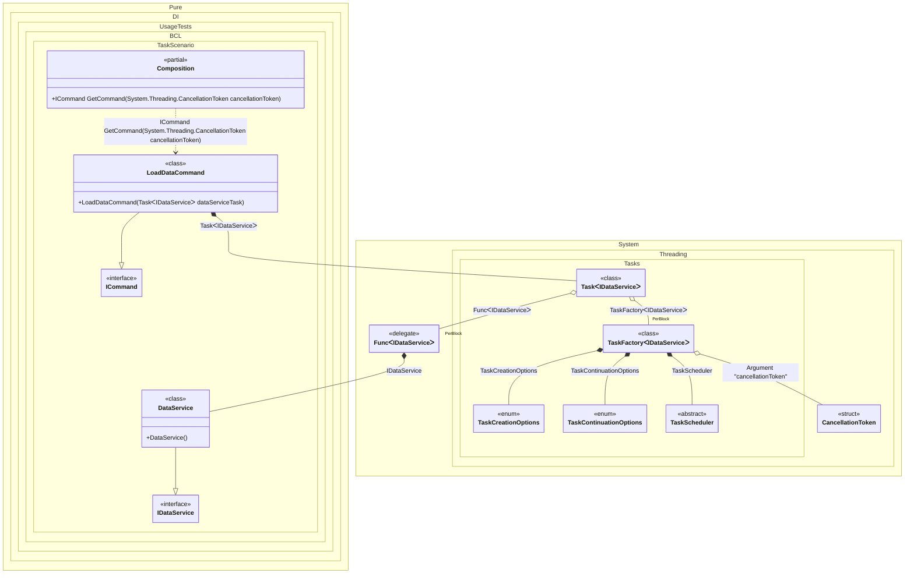

#### Task

By default, tasks are started automatically when they are injected. It is recommended to use an argument of type <c>CancellationToken</c> to the composition root to be able to cancel the execution of a task. In this case, the composition root property is automatically converted to a method with a parameter of type <c>CancellationToken</c>. To start a task, an instance of type <c>TaskFactory<T></c> is used, with default settings:

- CancellationToken.None
- TaskScheduler.Default
- TaskCreationOptions.None
- TaskContinuationOptions.None

But you can always override them, as in the example below for <c>TaskScheduler.Current</c>.


```c#
using Shouldly;
using Pure.DI;

DI.Setup(nameof(Composition))
    .Hint(Hint.Resolve, "Off")
    // Overrides TaskScheduler.Default if necessary
    .Bind<TaskScheduler>().To(_ => TaskScheduler.Current)
    // Specifies to use CancellationToken from the composition root argument,
    // if not specified, then CancellationToken.None will be used
    .RootArg<CancellationToken>("cancellationToken")
    .Bind<IDataService>().To<DataService>()
    .Bind<ICommand>().To<LoadDataCommand>()

    // Composition root
    .Root<ICommand>("GetCommand");

var composition = new Composition();
using var cancellationTokenSource = new CancellationTokenSource();

// Creates a composition root with the CancellationToken passed to it
var command = composition.GetCommand(cancellationTokenSource.Token);
await command.ExecuteAsync(cancellationTokenSource.Token);

interface IDataService
{
    ValueTask<string[]> GetItemsAsync(CancellationToken cancellationToken);
}

class DataService : IDataService
{
    public ValueTask<string[]> GetItemsAsync(CancellationToken cancellationToken) =>
        new(["Item1", "Item2"]);
}

interface ICommand
{
    Task ExecuteAsync(CancellationToken cancellationToken);
}

class LoadDataCommand(Task<IDataService> dataServiceTask) : ICommand
{
    public async Task ExecuteAsync(CancellationToken cancellationToken)
    {
        // Simulating some processing before needing the dependency
        await Task.Delay(1, cancellationToken);

        // The dependency is resolved asynchronously, so we await it here.
        // This allows the dependency to be created in parallel with the execution of this method.
        var dataService = await dataServiceTask;
        var items = await dataService.GetItemsAsync(cancellationToken);
    }
}
```

<details>
<summary>Running this code sample locally</summary>

- Make sure you have the [.NET SDK 10.0](https://dotnet.microsoft.com/en-us/download/dotnet/10.0) or later is installed
```bash
dotnet --list-sdk
```
- Create a net10.0 (or later) console application
```bash
dotnet new console -n Sample
```
- Add references to NuGet packages
  - [Pure.DI](https://www.nuget.org/packages/Pure.DI)
  - [Shouldly](https://www.nuget.org/packages/Shouldly)
```bash
dotnet add package Pure.DI
dotnet add package Shouldly
```
- Copy the example code into the _Program.cs_ file

You are ready to run the example 🚀
```bash
dotnet run
```

</details>

The following partial class will be generated:

```c#
partial class Composition
{
#if NET9_0_OR_GREATER
  private readonly Lock _lock = new Lock();
#else
  private readonly Object _lock = new Object();
#endif

  [MethodImpl(MethodImplOptions.AggressiveInlining)]
  public ICommand GetCommand(CancellationToken cancellationToken)
  {
    Task<IDataService> transientTask1;
    // Injects an instance factory
    Func<IDataService> transientFunc2 = new Func<IDataService>(
    [MethodImpl(MethodImplOptions.AggressiveInlining)]
    () =>
    {
      IDataService localValue24 = new DataService();
      return localValue24;
    });
    Func<IDataService> localFactory5 = transientFunc2;
    // Injects a task factory creating and scheduling task objects
    TaskFactory<IDataService> transientTaskFactory3;
    CancellationToken localCancellationToken2 = cancellationToken;
    TaskCreationOptions transientTaskCreationOptions6 = TaskCreationOptions.None;
    TaskCreationOptions localTaskCreationOptions1 = transientTaskCreationOptions6;
    TaskContinuationOptions transientTaskContinuationOptions7 = TaskContinuationOptions.None;
    TaskContinuationOptions localTaskContinuationOptions1 = transientTaskContinuationOptions7;
    TaskScheduler transientTaskScheduler8 = TaskScheduler.Current;
    TaskScheduler localTaskScheduler1 = transientTaskScheduler8;
    transientTaskFactory3 = new TaskFactory<IDataService>(localCancellationToken2, localTaskCreationOptions1, localTaskContinuationOptions1, localTaskScheduler1);
    TaskFactory<IDataService> localTaskFactory1 = transientTaskFactory3;
    // Creates and starts a task using the instance factory
    transientTask1 = localTaskFactory1.StartNew(localFactory5);
    return new LoadDataCommand(transientTask1);
  }
}
```

Class diagram:



